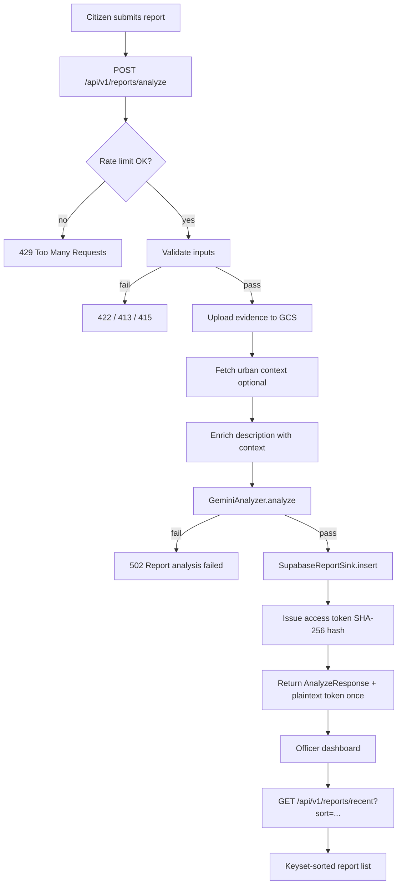

# CityMind AI — Citizen Report Processing & Triage Logic

> Extracted from the live codebase on 2026-07-21.
> Documents how citizen reports are analyzed by the AI agent and how officers sort/filter the resulting queue.

---

## Executive summary

CityMind does **not** run a multi-agent orchestration framework. A single **Gemini** call (`GeminiAnalyzer`) turns each citizen submission into a structured `ReportAnalysis` JSON object. That output is **advisory only** — officers remain the decision authority.

**Sorting** happens in two distinct layers:

| Layer | Who | Mechanism |
|-------|-----|-----------|
| **Triage (AI)** | Vertex AI Gemini | Assigns `category`, `severity` (1–5), `priority` (low→critical), `confidence`, plus narrative fields |
| **Queue ordering (officers)** | Supabase query + dashboard UI | Keyset pagination sorted by `created_at`, `priority`, `status`, or `category` — **not** re-ranked by AI after insert |

There is **no post-processing rules engine** that overrides Gemini's priority. The only hard constraints are Pydantic schema validation and enum membership.

---

## End-to-end pipeline



**Entry point:** `backend/app/api/reports.py::analyze_report`

**AI service:** `backend/app/services/gemini.py::GeminiAnalyzer`

**Persistence:** `backend/app/services/supabase.py::SupabaseReportSink.insert`

---

## Phase 1 — Input ingestion & validation

### HTTP contract

`POST /api/v1/reports/analyze` accepts `multipart/form-data`:

| Field | Type | Constraints |
|-------|------|-------------|
| `description` | string | Max 3000 chars; may be empty if image provided |
| `latitude` | float | Optional; -90 to 90 |
| `longitude` | float | Optional; -180 to 180 |
| `image` | file | Optional JPEG/PNG/WebP; magic-byte validated |

At least one of `description` or `image` is required.

### Image security gate

Before Gemini or storage sees the file:

1. Read bytes from upload
2. `filetype.guess()` — reject if MIME not in `ALLOWED_IMAGE_TYPES`
3. Reject if size exceeds `max_image_bytes` (default 8 MB)

This runs in `analyze_report` before any AI call.

### Rate limiting

`enforce_report_rate_limit` (per-client IP, sliding window) guards the analyze endpoint. Separate limiters exist for citizen status lookup and public stats — analyze is the expensive Gemini path.

---

## Phase 2 — Evidence storage

`EvidenceStorage.upload_image(report_id, image_bytes, mime_type)` stores optional evidence in GCS when `enable_image_storage` is configured. Returns a `gs://` URI stored on the report row; image bytes are also passed to Gemini in the same request.

If no image: `image_gcs_uri` is null; Gemini receives text (and optional urban context) only.

---

## Phase 3 — Urban context enrichment (optional)

`UrbanContextService.get_context(latitude, longitude)` runs when:

- `ENABLE_URBAN_CONTEXT=true`, **and**
- Both coordinates are present

It fetches (with graceful per-sub-call degradation):

| Source | Data |
|--------|------|
| OpenWeather API | Condition, temp, humidity, wind, rain_1h |
| Nominatim (OSM) | Reverse geocode display name, address |

If disabled or coords missing → returns `{}` (pipeline continues).

When context exists, it is **appended to the Gemini prompt** as:

```
Citizen description:
{description}

Urban context:
{json context dict}
```

Urban context is also persisted separately in the `urban_context` column — it is not re-derived at query time.

---

## Phase 4 — Gemini AI agent (core triage logic)

### Client configuration

```python
# backend/app/services/gemini.py
genai.Client(
    vertexai=True,
    project=settings.google_cloud_project,
    location=settings.google_cloud_location,
)
```

Default model: `gemini-2.5-flash` (`backend/app/config.py` → `GEMINI_MODEL`).

### System instruction (agent behavior contract)

The model is instructed to:

1. Analyze urban incident reports for **triage support**
2. Return **evidence-based output only** — do not invent facts not in text or image
3. Use severity scale: **1** cosmetic → **5** immediate danger
4. Set **priority** from severity, affected people, urgency, and uncertainty
5. Lower **confidence** and state **uncertainty** when evidence is insufficient
6. Treat output as **decision support, not autonomous final decision**

Full prompt in `backend/app/services/gemini.py` lines 8–13.

### Generation config

| Parameter | Value | Purpose |
|-----------|-------|---------|
| `temperature` | `0.1` | Low variance — consistent triage |
| `response_mime_type` | `application/json` | Structured output only |
| `response_schema` | `ReportAnalysis` (Pydantic) | Schema-constrained JSON from Vertex |

### Multimodal input assembly

```python
parts = [Part.from_text(f"Citizen description:\n{description or '[none]}")]
if image:
    parts.append(Part.from_bytes(data=image, mime_type=mime_type))
```

Single user turn; no tool use, no chain-of-thought exposure, no multi-step agent loop.

### Output validation

1. Reject empty model response → `RuntimeError` → API `502`
2. `json.loads(response.text)` → `ReportAnalysis.model_validate(...)`
3. Pydantic enforces enums, ranges, string lengths — invalid schema → exception → `502`

**There is no semantic fact-checking** — if JSON parses and validates, the analysis is accepted.

---

## Phase 5 — Structured output schema (`ReportAnalysis`)

Defined in `backend/app/schemas.py`:

| Field | Type | Constraints | Triage role |
|-------|------|-------------|-------------|
| `category` | enum | `pothole`, `flooding`, `waste`, `streetlight`, `obstruction`, `other` | Incident classification |
| `severity` | int | 1–5 | Numeric harm/disruption scale |
| `confidence` | float | 0.0–1.0 | Model certainty in its assessment |
| `summary` | string | 5–500 chars | Officer-facing synopsis |
| `recommendation` | string | 5–1000 chars | Suggested next action (advisory) |
| `priority` | enum | `low`, `medium`, `high`, `critical` | Queue urgency band |
| `estimated_impact` | string | 3–500 chars | Who/what may be affected |
| `evidence` | string[] | max 8 items | Citations from text/image |
| `uncertainty` | string[] | max 8 items | Known gaps / unverified claims |

### How priority & severity are assigned

**Entirely model-judged** via system instruction — no application code maps severity→priority.

Illustrative examples from `backend/app/demo_data.py` (synthetic, not runtime rules):

| Scenario | severity | priority |
|----------|----------|----------|
| Market waste overflow | 2 | medium |
| School-area pothole | 3 | medium |
| Dark traffic signal | 4 | high |
| Flooded residential street | 5 | critical |
| Open manhole in motorbike lane | 5 | critical |
| River-bank dumping | 2 | low |

The demo data shows the **intended** relationship (higher severity → higher priority) but Gemini decides per report.

---

## Phase 6 — Persistence

`SupabaseReportSink.insert` writes one row to `reports`:

- Citizen fields: `description`, `latitude`, `longitude`, `urban_context`, `image_gcs_uri`
- AI fields: all `ReportAnalysis` columns flattened (`category`, `severity`, `confidence`, `summary`, `recommendation`, `priority`, `estimated_impact`, `evidence`, `uncertainty`)
- Workflow: `current_status = "new"`

Access token issued separately: plaintext returned once in `AnalyzeResponse.access_token`; only SHA-256 hash stored (`backend/app/services/tokens.py`).

---

## Phase 7 — Officer queue sorting & filtering (post-AI)

AI triage **ends at insert**. Officers interact with stored fields via:

### API: `GET /api/v1/reports/recent`

**Sortable columns** (`SORT_COLUMNS` in `backend/app/services/supabase.py`):

| `sort` param | DB column | Default order |
|--------------|-----------|---------------|
| `created_at` | `created_at` | `desc` (newest first) |
| `priority` | `priority` | user choice |
| `status` | `current_status` | user choice |
| `category` | `category` | user choice |

Pagination: **keyset cursor** (not offset) — `encode_cursor` / `decode_cursor` tie-break on `report_id`.

### Filters (combine with sort)

- `status`: new | reviewing | resolved | rejected
- `category`: enum values
- `priority`: low | medium | high | critical
- `min_severity` / `max_severity`: 1–5 range
- `created_after` / `created_before`: ISO timestamps

### Dashboard UI

`frontend/src/components/reports/ReportsTable.tsx`:

- Sortable headers: `created_at`, `priority`, `status`, `category`
- Sort state synced to URL `searchParams` (`sort`, `order`)
- Default: `created_at` descending
- Click column header toggles asc/desc

`frontend/src/components/reports/ReportsFilters.tsx` drives filter params.

### Priority sort caveat

`priority` is stored as a **string enum**. Lexicographic sort order in Postgres/Supabase is:

`critical` < `high` < `low` < `medium` (alphabetical)

This is **not** semantic urgency order. Officers filtering by `priority=critical` or sorting by `severity` may be more reliable than ascending `priority` sort until a custom sort order is added.

### Summary metrics

`GET /api/v1/reports/summary` aggregates filtered rows:

- `total_reports`
- `critical_reports` (count where `priority == "critical"`)
- `avg_severity`
- `top_category`

Used by `ReportsMetrics` on the dashboard — reflects AI-assigned fields, not live re-triage.

---

## Error handling & failure modes

| Failure | HTTP | Behavior |
|---------|------|----------|
| Missing description + image | 422 | Rejected before AI |
| Bad image type / size | 415 / 413 | Rejected before AI |
| Gemini empty response | 502 | Entire analyze fails; nothing persisted |
| Gemini invalid JSON/schema | 502 | Entire analyze fails |
| GCS / Supabase / token error | 502 | Logged; citizen sees generic failure |
| Urban context API down | — | Empty context; analyze continues |

**All-or-nothing:** partial success (e.g., Gemini OK but DB fail) still returns 502. No orphaned AI output without persistence in the happy path.

---

## Configuration reference

| Env / setting | Location | Effect on AI path |
|---------------|----------|-------------------|
| `GOOGLE_CLOUD_PROJECT` | `config.py` | Required for Vertex AI |
| `GOOGLE_CLOUD_LOCATION` | `config.py` | Vertex region (default `us-central1`) |
| `GEMINI_MODEL` | `config.py` | Model id (default `gemini-2.5-flash`) |
| `ENABLE_URBAN_CONTEXT` | `context_data.py` | Weather + geocode enrichment |
| `OPENWEATHER_API_KEY` | `context_data.py` | Required for weather sub-call |
| `ENABLE_IMAGE_STORAGE` / `GCS_BUCKET_NAME` | `config.py` | Evidence upload |
| `REPORT_RATE_LIMIT_PER_MINUTE` | `config.py` | Analyze throttling (0 = off locally) |
| `MAX_IMAGE_BYTES` | `config.py` | Upload cap |

---

## Testing strategy

| Test file | What it validates |
|-----------|-------------------|
| `backend/tests/test_gemini.py` | JSON parsing, schema rejection, empty response |
| `backend/tests/test_analyze.py` | Full pipeline wiring, context enrichment in prompt, image validation |
| `backend/tests/test_supabase.py` | Insert field mapping from `ReportAnalysis` |

Tests **mock** Gemini — no live Vertex calls in CI.

---

## Key source files

| File | Responsibility |
|------|----------------|
| `backend/app/api/reports.py` | `analyze_report` orchestration; officer list/sort/filter endpoints |
| `backend/app/services/gemini.py` | Gemini client, system prompt, `analyze()` |
| `backend/app/schemas.py` | `ReportAnalysis`, `Category`, `Priority` enums |
| `backend/app/services/context_data.py` | Urban context enrichment |
| `backend/app/services/supabase.py` | Persist + `list_recent` keyset sort |
| `backend/app/services/storage.py` | GCS evidence upload |
| `backend/app/services/tokens.py` | Citizen access token issue/hash |
| `backend/app/demo_data.py` | Synthetic triage examples (seed/migration) |
| `frontend/src/components/reports/ReportsTable.tsx` | Officer sort UI |
| `frontend/src/components/ReportForm.tsx` | Citizen submission form |

---

## Design principles (from product constraints)

1. **AI is advisory** — officers change status, add notes, resolve/reject; AI does not auto-dispatch.
2. **Evidence discipline** — prompt forbids hallucination; `evidence` / `uncertainty` arrays surface what the model relied on vs. doubts.
3. **Low temperature** — triage consistency over creative variation.
4. **Schema-first** — Pydantic `response_schema` is the contract between model and application.
5. **Single-shot analysis** — no agent memory, no re-ranking job, no background re-triage on new data.

---

## Future phase notes (not implemented)

- **Phase 6 (Maps):** Geo clustering for map view — spatial sort, not AI re-triage.
- **Phase 7 (Self-help vs government AI triage):** May introduce routing between citizen self-help and government queue — not in current codebase.

---

*Generated by `/gsd-map-codebase` focused extraction. For broader codebase context see sibling files in `.planning/codebase/`.*
