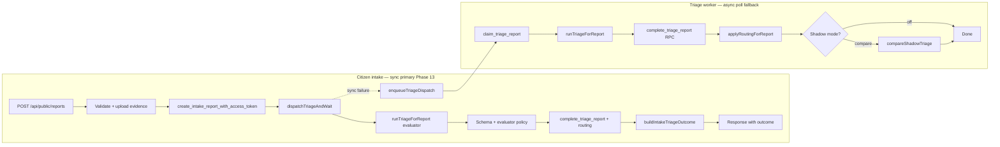
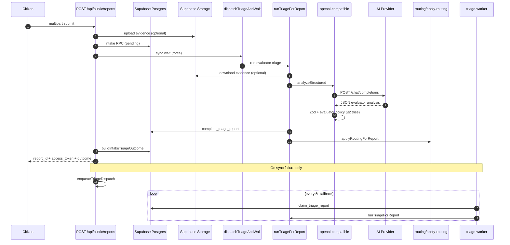

# CityMind AI — Processing Logic

> Updated 2026-07-22 from the live Next.js monorepo (Milestone v2).
> Describes how citizen reports are analyzed, validated, routed, and evaluated.

---

## Executive summary

CityMind uses a **single-shot, provider-neutral AI call** — not a multi-agent framework. Production flow is **path-dependent**:

### Citizen intake — sync-primary (Phase 13)

1. `POST /api/public/reports` persists intake, then **blocks** on `dispatchTriageAndWait` → `runTriageForReport` (evaluator spec).
2. Triage output is validated (evaluator Zod schema + `validateEvaluatorPolicy`), persisted, **routed** (self-help vs government), and returned via `buildIntakeTriageOutcome` in the same response.
3. On sync failure only, `enqueueTriageDispatch` queues async fallback (`POST /api/internal/triage/{reportId}`). `SuccessTriagePanel` poll on the success page is **fallback only** when sync returns `pending`/`processing` (D-13-02).

### Officer / internal / recovery — async

1. Officer **Run triage now** and sync-failure recovery use push dispatch (`dispatchTriage` fire-and-forget).
2. Poll worker (`npm run triage:worker`) claims `pending` and `retry` rows every 5 seconds.

Output is optionally **shadow-compared** against a candidate model when `TRIAGE_SHADOW_MODE=compare`.

**AI is advisory only.** Officers retain decision authority. Legacy `POST /api/public/reports/analyze` returns **410 Gone**. Phase 11 push-primary citizen intake description is **superseded** for the happy path by Phase 13 sync wait.

---

## High-level architecture



---

## Phase 1 — Citizen intake (sync triage)

### Entry points

| Route | Handler |
|-------|---------|
| `POST /api/public/reports` | `handleSubmitReportRequest` → `submitReport` |
| `POST /api/v1/reports` | Same handler (compat) |

**Source:** `src/server/services/report-service.ts`, `src/server/triage/dispatch.ts`

### Request (multipart/form-data)

| Field | Constraints |
|-------|---------------|
| `description` | ≤ 3000 chars; optional if image present |
| `latitude` / `longitude` | Optional; validated ranges |
| `image` | Optional JPEG/PNG/WebP; magic-byte validated |

At least one of `description` or `image` is required.

### Steps

1. **Rate limit** — `enforceReportRateLimit()` (`src/server/security/rate-limit.ts`)
2. **Parse form** — `parseReportFormData()`
3. **Upload evidence** (if image) — `uploadEvidence()` → Supabase Storage bucket `evidence`
4. **Issue access token** — plaintext returned once; SHA-256 hash stored
5. **Persist** — RPC `create_intake_report_with_access_token`  
   - Migration: `supabase/migrations/20260722120001_async_triage_intake.sql`  
   - Initial row: `triage_status = 'pending'`
6. **Sync triage (primary)** — `dispatchTriageAndWait(reportId)` with `force: true, wait: true`  
   - Calls `runTriageForReport` → evaluator AI + policy + routing in-request
   - Spec reference: `prompt/citymind_ai_triage_structured_output_evaluator.json`
7. **On sync failure** — log error, `enqueueTriageDispatch(reportId)` for async recovery (D-13-03)
8. **Project outcome** — `buildIntakeTriageOutcome()` via `getCitizenStatus` + `projectCitizenTriageView`

### Response (happy path — terminal triage)

```json
{
  "report_id": "...",
  "access_token": "...",
  "intake_status": "received",
  "triage_status": "completed",
  "service_step": "self_help_guidance",
  "routing_destination": "self_help",
  "category": "waste",
  "severity": 2,
  "priority": "low",
  "summary": "...",
  "recommendation": "...",
  "playbook_id": "...",
  "can_escalate": true
}
```

When sync fails or AI is unavailable, `triage_status` may remain `pending`/`processing`/`failed` — success page uses `SuccessTriagePanel` poll fallback (D-13-02).

### Failure behavior

| Condition | HTTP |
|-----------|------|
| Rate limited | 429 |
| Invalid form / coords | 422 |
| Bad image type / size | 415 / 413 |
| DB / storage failure | 502 (best-effort evidence delete) |
| AI provider failure during sync | 200 — intake succeeds; async fallback enqueued |

**Provider outage does not block intake** — sync failure enqueues push dispatch; poll worker retries later.

---

## Phase 2 — Triage worker (async fallback + officer path)

Poll worker remains the **production fallback** for sync-failure enqueue and `retry` rows. Officer/internal push dispatch (`POST /api/internal/triage/{reportId}`) uses fire-and-forget `dispatchTriage` — unchanged from Phase 11 (D-13-04).

### Bootstrap

```bash
npm run triage:worker
```

- Script: `scripts/triage-worker.mjs` → `src/server/triage/worker-main.ts`
- Requires: `SUPABASE_DB_URL`, `SUPABASE_URL`, `SUPABASE_SERVICE_ROLE_KEY`, `THIRD_PARTY_API_KEY`, `AI_BASE_URL`, `AI_MODEL`

### Poll loop

`runWorkerLoop()` in `src/server/triage/worker.ts` — every **5 seconds**.

1. **Reclaim stuck** — `processing` > 15 min → back to `pending`
2. **Claim** — `claim_triage_report()` sets `processing` on next due report
3. **Run** — `runTriageForReport()` in `src/server/triage/service.ts`

### Triage orchestration (`runTriageForReport`)

| Step | Module | Action |
|------|--------|--------|
| 1 | `audit.ts` | `startTriageRun()` → `triage_runs` row (`prompt_version: phase8-mvp-v1`) |
| 2 | `service.ts` | Load description + download evidence from `evidence_path` |
| 3 | `openai-compatible.ts` | `analyzeStructured()` → evaluator provider call |
| 4 | `evaluator-analysis.ts` | Zod `EvaluatorAnalysisSchema` (11-key spec) |
| 5 | `evaluator-policy.ts` | `validateEvaluatorPolicy()` — up to **2 attempts** with retry instruction |
| 6 | `audit.ts` | `recordTriageAttempt()` → RPC `complete_triage_report` |
| 7 | `apply-routing.ts` | `evaluateRoutingPolicy()` → update routing columns |
| 8 | `shadow-service.ts` | Optional `compareShadowTriage()` (non-mutating) |

### Triage dispositions

| Status | Meaning |
|--------|---------|
| `completed` | Analysis persisted on report row |
| `manual_review` | Policy failed twice, or infra exhausted |
| `failed` | Non-recoverable (e.g. empty input) |
| `retry` | Infra failure; `triage_next_attempt_at` set (+30s in SQL) |

**Infra retry:** `MAX_INFRA_ATTEMPTS = 3` (`src/server/triage/config.ts`). After 3 provider/infra failures → `manual_review`.

---

## Phase 3 — AI provider (OpenAI-compatible)

### Adapter

**Source:** `src/server/ai/openai-compatible.ts`

- Endpoint: `POST {AI_BASE_URL}/chat/completions`
- Auth: `Bearer {THIRD_PARTY_API_KEY}`
- Model: `AI_MODEL`
- Temperature: `0.1`
- `response_format: { type: "json_object" }`
- Supports **SSE responses** (some proxies return `data: {...}` instead of plain JSON)
- Optional vision when `AI_SUPPORTS_VISION=true`

### System instruction (runtime prompt)

Instructs the model to:

- Return evidence-based output only; no invented facts
- Use severity 1–5 and priority low→critical
- Lower confidence and list uncertainty when evidence is weak
- Respond with **one JSON object** matching the schema below
- Treat output as **decision support, not autonomous authority**

**Categories in prompt:** `pothole|flooding|waste|streetlight|obstruction|other`  
**Zod schema also allows:** `graffiti` (used by routing self-help policy)

### Provider errors (`AnalysisProviderError`)

| Code | Typical cause |
|------|---------------|
| `timeout` | `AI_TIMEOUT_MS` exceeded |
| `http_error` | Non-2xx from provider |
| `invalid_response` | Bad JSON / SSE parse / empty content |
| `schema_invalid` | Zod rejection |
| `policy_invalid` | Policy fail (sync provider wrapper only) |
| `refused` | Model refusal |
| `oversized_response` | > 256 KiB |
| `redirect` | Unexpected redirect |
| `unsupported_image` | Bad mime with vision enabled |

Citizen-facing messages are generic: `"Report analysis failed"`.

---

## Phase 4 — Structured output schema (evaluator)

**Spec:** `prompt/citymind_ai_triage_structured_output_evaluator.json`  
**Runtime Zod:** `src/server/domain/evaluator-analysis.ts`

Evaluator analysis includes 11 keys (category, severity, confidence, priority, observed_facts, reasoning, recommended_action, uncertainty_notes, etc.) — see spec file for authoritative field list. Legacy `report-analysis.ts` schema remains for compatibility layers only.

### Lineage (audit metadata)

```typescript
{
  providerLabel: string;   // AI_PROVIDER_LABEL
  responseModel: string;   // from provider response
  requestId: string | null;
  latencyMs: number;
}
```

Stored in `triage_attempts` / `triage_runs` for reproducibility.

---

## Phase 5 — Semantic policy validation (evaluator)

**Source:** `src/server/validation/evaluator-policy.ts`

Runs **after** evaluator Zod schema, **before** persisting as `completed`. Rules include critical severity alignment, observed_facts grounding, reason-field traceability, and no autonomous authority language.

**Retry:** First policy failure → second AI call with retry instruction. Second failure → `manual_review`.

---

## Phase 6 — Post-triage routing

**Source:** `src/server/routing/policy.ts`, `apply-routing.ts`

Deterministic rules (not AI). Policy version: **`1.0.0`**.

| Condition | Destination | Reason code |
|-----------|-------------|---------------|
| `triage_status` manual_review or failed | `government` | `triage_manual_or_failed` |
| Severity ≥ 4 or priority high/critical | `government` | `severity_or_priority` |
| Confidence < 0.65 | `government` | `low_confidence` |
| Category in `{graffiti, waste, pothole, streetlight}` AND severity ≤ 2 | `self_help` | `eligible_category_low_severity` |
| Default | `government` | `default_government` |

Citizens see self-help playbooks on the status page; can **escalate** to government via `POST /api/public/reports/escalate`. Officers can override routing.

---

## Phase 7 — Shadow evaluation (optional)

### Runtime shadow compare

When `TRIAGE_SHADOW_MODE=compare` and `AI_MODEL_CANDIDATE` is set:

1. After production triage `completed` + routing applied
2. `compareShadowTriage()` runs candidate model with env overlay
3. Inserts row into `triage_shadow_comparisons` — **never mutates** production analysis
4. Officer UI shows disagreement badge/filter when category, severity, or priority differ

**Migration:** `supabase/migrations/20260722140001_triage_shadow.sql`

### Offline eval suite

| Command | Purpose |
|---------|---------|
| `npm run eval:mock` | Fixture-based metrics (CI-safe) |
| `npm run eval:live` | Live provider calls (privacy approval required) |
| `npm run eval:gate` | Threshold gate before model cutover |

**Sources:** `evals/`, `src/server/evals/`, `scripts/eval-suite.mjs`, `scripts/verify-eval-gate.mjs`

**Smoke test:** `node scripts/smoke-ai.mjs` — EN/VI text cases + optional image.

### Cutover protocol

1. `eval:live` + `eval:gate` PASS on baseline
2. Enable `TRIAGE_SHADOW_MODE=compare` with `AI_MODEL_CANDIDATE`
3. Observe disagreement rate in officer dashboard
4. Swap `AI_MODEL` only after live gate PASS

---

## Configuration reference

| Variable | Purpose |
|----------|---------|
| `THIRD_PARTY_API_KEY` | Bearer token for AI API |
| `AI_BASE_URL` | OpenAI-compatible base (HTTPS; loopback HTTP allowed in dev) |
| `AI_MODEL` | Production model id |
| `AI_PROVIDER_LABEL` | Lineage label (default `third-party`) |
| `AI_SUPPORTS_VISION` | `true`/`1` to send image parts |
| `AI_TIMEOUT_MS` | 5_000–120_000 (default 60_000) |
| `TRIAGE_SHADOW_MODE` | `off` (default) or `compare` |
| `AI_MODEL_CANDIDATE` | Candidate model for shadow |
| `AI_BASE_URL_CANDIDATE` | Optional candidate endpoint override |
| `EVAL_MANIFEST_PATH` | Eval threshold manifest path |
| `SUPABASE_DB_URL` | Direct Postgres for triage worker claim RPCs |

**Code constants:**

| Constant | Value | File |
|----------|-------|------|
| `PROMPT_VERSION` | `phase8-mvp-v1` | `src/server/triage/config.ts` |
| `MAX_INFRA_ATTEMPTS` | `3` | `src/server/triage/config.ts` |
| `ROUTING_POLICY_VERSION` | `1.0.0` | `src/server/routing/policy.ts` |
| `CONFIDENCE_GOV_THRESHOLD` | `0.65` | `src/server/routing/policy.ts` |

---

## End-to-end sequence



---

## Key source files

| File | Responsibility |
|------|----------------|
| `src/server/services/report-service.ts` | Intake, sync `dispatchTriageAndWait`, `buildIntakeTriageOutcome` |
| `src/server/triage/dispatch.ts` | `dispatchTriageAndWait`, `enqueueTriageDispatch`, internal dispatch |
| `src/server/ai/openai-compatible.ts` | Provider adapter, system prompt, SSE parse |
| `src/server/ai/provider.ts` | Types: `AnalysisInput`, `AnalysisResult`, lineage |
| `src/server/domain/evaluator-analysis.ts` | Evaluator Zod schema (11-key) |
| `src/server/validation/evaluator-policy.ts` | Evaluator semantic policy rules |
| `src/server/config/env.ts` | Env validation, shadow config |
| `src/server/triage/service.ts` | Triage orchestration |
| `src/server/triage/worker.ts` | Poll + claim loop |
| `src/server/triage/audit.ts` | `triage_runs` / `triage_attempts` |
| `src/server/routing/policy.ts` | Self-help vs government rules |
| `src/server/routing/apply-routing.ts` | Persist routing decision |
| `src/server/evals/shadow-service.ts` | Shadow dual-run |
| `scripts/triage-worker.mjs` | Worker CLI entry |
| `scripts/smoke-ai.mjs` | Live provider smoke test |
| `scripts/eval-suite.mjs` | Offline eval runner |

---

## Design principles

1. **Advisory AI** — Officers resolve/reject; AI does not auto-dispatch.
2. **Sync citizen path** — Happy-path submit blocks on evaluator triage; immediate success-page outcome (Phase 13).
3. **Async fallback** — Sync failure enqueues push dispatch; poll worker claims `pending`/`retry`.
4. **Schema + policy** — Evaluator JSON shape (Zod) plus semantic safety rules (evaluator policy).
5. **Low temperature** — Consistent triage over creative variation.
6. **Audit trail** — `triage_runs`, `triage_attempts`, lineage fields for reproducibility.
7. **Eval-gated cutover** — Model swaps require manifest thresholds + optional shadow observation.

---

## Known drift / notes

| Topic | Detail |
|-------|--------|
| **Citizen intake path** | Phase 13 sync-primary (`dispatchTriageAndWait`); Phase 8/11 push-primary intake docs superseded for happy path |
| **Success page poll** | `SuccessTriagePanel` is fallback when sync returns non-terminal status (D-13-02) |
| **Prompt vs schema categories** | Evaluator spec lists 10 categories; routing may reference additional policy gates |
| **Legacy analyze API** | `POST /api/public/reports/analyze` → 410; use `POST /api/public/reports` sync intake |
| **Infra backoff** | `INFRA_BACKOFF_MS` defined in config; SQL RPC currently hardcodes 30s retry interval |
| **Officer access (dev)** | `is_officer_or_admin()` relaxed to any authenticated user via migration `20260722150001` |

---

*Generated by `/gsd-map-codebase` focused extraction. For stack, architecture, and conventions see sibling files in `.planning/codebase/`.*
