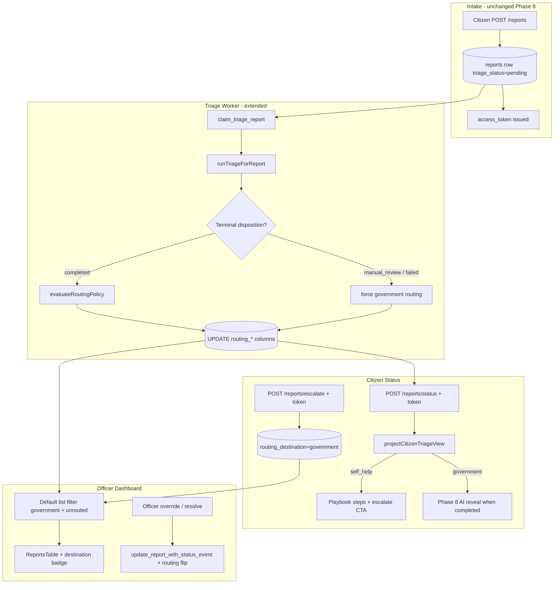

# Phase 9: Self-help vs Government Routing - Research

**Researched:** 2026-07-22
**Domain:** Post-triage deterministic routing, static bilingual playbooks, citizen escalate + officer override, officer queue filtering
**Confidence:** HIGH

## Summary

Phase 9 adds a **deterministic routing layer** on top of the Phase 8 async triage pipeline. After triage reaches a terminal disposition, the triage worker sets `routing_destination` on `reports` using an in-repo TypeScript policy module (`src/server/routing/policy.ts`) — no second AI call. Self-help reports show curated EN/VI playbook steps on the existing token status page and hide all AI triage fields; government reports follow the Phase 8 officer-review path. Citizens can escalate self-help reports to the government queue with the same access token; officers get a government-default queue, destination badges, and override actions. [VERIFIED: `09-CONTEXT.md`, live `src/server/triage/service.ts`, `src/server/services/citizen-status.ts`]

The codebase already has the right extension points: `runTriageForReport` returns terminal dispositions at multiple exit paths; `projectCitizenTriageView` centralizes citizen field gating; `ReportsFilters` chip pattern and `TriageStatusBadge` badge pattern extend cleanly; `update_report_with_status_event` RPC handles officer status mutations with audit. What is missing: **routing columns + SQL contract**, **policy module + unit tests**, **worker hook**, **citizen escalate API**, **officer routing filter/badge/override**, and **self-help status UX** on `/[locale]/status`.

**Primary recommendation:** Add `routing_destination`, `routing_reason`, `routing_policy_version`, and `routed_at` to `reports` via migration `20260722130001_routing_columns.sql` + `supabase/tests/09_routing_contract.sql`; implement `applyRoutingForReport()` called from `runTriageForReport` on every terminal disposition; default officer list filter to `routing_destination IS NULL OR = 'government'` (D-03 unrouted rows stay visible); store playbooks in `src/server/routing/playbooks.ts` with EN/VI copy in `messages/en.json` + `messages/vi.json`.

## Architectural Responsibility Map

| Capability | Primary Tier | Secondary Tier | Rationale |
|------------|-------------|----------------|-----------|
| Routing policy evaluation | Worker (`src/server/triage/service.ts` hook) | TypeScript policy module | D-20: same worker pass as triage; deterministic rules, no HTTP |
| Routing persistence + audit columns | Database (`reports` columns) | Worker writes via service-role | D-18/D-19: reproducible policy version on row |
| Static playbook content | API / Backend (`playbooks.ts` + message catalogs) | Browser (status page render) | D-05/D-07: in-repo, bilingual, not AI-generated |
| Citizen status projection | API / Backend (`projectCitizenTriageView`) | Browser (`status/page.tsx`) | D-08/D-09: hide AI on self-help; adapt `service_step` |
| Citizen escalate mutation | API / Backend (`POST /api/public/reports/escalate`) | Database (RPC or guarded update) | Token-scoped; D-11/D-12; rate-limited like status |
| Officer default queue filter | Frontend Server (dashboard loaders) + Browser (filter chips) | Database query filter | D-13: government-only default; optional self-help chip |
| Officer routing override | API / Backend (officer-authenticated route) | `status_events` audit note | D-14: escalate to government + mark resolved |
| Destination badge display | Browser (`ReportsTable`, detail page) | — | D-15: visual cue only; data from loader |

<user_constraints>
## User Constraints (from CONTEXT.md)

### Locked Decisions

#### Routing trigger
- **D-01:** Run routing **post-triage only** — evaluate destination when `triage_status=completed`. Do not route at intake or while `pending`/`processing`.
- **D-02:** Routing inputs are **deterministic policy rules on triage output** — category, severity, priority, and confidence thresholds. Do not use a separate AI routing call.
- **D-03:** While triage is pending/processing, treat reports as **government queue visible** — officers continue to see all reports (Phase 8 behavior) until routing completes.
- **D-04:** Destination may change after initial routing via **both** citizen escalate CTA and officer override actions.

#### Self-help content
- **D-05:** Self-help delivery is **static playbooks** — curated EN/VI guidance per eligible category, not AI-generated at routing time.
- **D-06:** Content depth is **short actionable steps** — 3–5 bullets plus optional external links.
- **D-07:** Content lives in an **in-repo catalog** — dedicated routing playbook module and/or `messages/en.json` + `messages/vi.json` keys (planner picks structure).
- **D-08:** On the self-help citizen path, **hide all AI triage fields** — show playbook steps only; no category/severity/summary/recommendation.

#### Citizen journey
- **D-09:** Self-help guidance appears on the **existing token status page** only (no dedicated post-submit redirect).
- **D-10:** **Adapt workflow steps** for self-help-routed reports — e.g. received → guidance available → resolved (no officer-review step in the self-help path).
- **D-11:** Provide an **escalate CTA** — *"Still need city help?"* moves the report to the government officer queue.
- **D-12:** **Keep the same access token** after escalation; do not issue a new token.

#### Officer queue visibility
- **D-13:** **Default officer view shows government-routed reports only**; optional filter chip includes self-help-routed reports.
- **D-14:** Officers have **override actions** on self-help-routed reports — escalate to government and mark resolved.
- **D-15:** Show a **destination badge** (`Self-help` vs `Government`) in the reports table.
- **D-16:** **Keep Phase 8 triage sort** within the government default queue — `manual_review`/`failed` first, then pending/processing, then completed.

#### Policy rules and audit
- **D-17:** Policy rules live in an **in-repo TypeScript module** (e.g. `src/server/routing/policy.ts`) with a `ROUTING_POLICY_VERSION` semver constant.
- **D-18:** Persist audit fields on **`reports`**: `routing_destination`, `routing_reason`, `routing_policy_version` (exact column names are planner discretion).
- **D-19:** Store **semver policy version** on every routing decision for Phase 10 reproducibility.
- **D-20:** Execute routing in the **triage worker hook** — immediately after successful triage completion in the same worker pass (no separate routing worker).

#### Government vs self-help criteria
- **D-21:** **Always government:** `severity >= 4` **OR** `priority` in (`high`, `critical`).
- **D-22:** **Self-help eligible:** categories `graffiti`, `waste`, `pothole`, `streetlight` **only when** `severity <= 2` and other gates pass.
- **D-23:** `manual_review` / `failed` triage disposition **always routes to government** — never self-help.
- **D-24:** `confidence < 0.65` **routes to government** (aligns with Phase 8 conflicting-signal cap at 0.64).

### Claude's Discretion
- Exact self-help workflow step labels and EN/VI copy.
- Playbook catalog file layout (`src/server/routing/playbooks.ts` vs message keys).
- Filter chip naming and default query param for government-only view.
- Migration column types and RPC updates for escalate/override mutations.
- Whether `routing_reason` is a machine code, human string, or both.

### Deferred Ideas (OUT OF SCOPE)
- **Cloud Tasks triage handler spike** — Phase 8 legacy; skipped during Phase 9 discuss (not relevant to routing).
- **Database-editable self-help CMS** — officers editing playbooks without deploy; future enhancement.
- **AI-personalized self-help guidance** — hybrid static + AI tailoring; rejected for MVP (D-05).
- **Eval suite / shadow rollout** — Phase 10 (TRIAGE-08).
</user_constraints>

<phase_requirements>
## Phase Requirements

Phase 9 is not yet mapped to dedicated requirement IDs in `REQUIREMENTS.md`. It extends Phase 8 triage contracts and prepares Phase 10 eval reproducibility (D-19). Map plans to locked decisions D-01..D-24 and ROADMAP Phase 9 goal.

| ID | Description | Research Support |
|----|-------------|------------------|
| D-01..D-04 | Routing trigger, inputs, pending visibility, re-routing | Worker hook after terminal triage; NULL `routing_destination` during pending/processing; escalate + officer override APIs |
| D-05..D-08 | Static playbooks, bilingual, hide AI on self-help | `playbooks.ts` + message catalogs; extend `projectCitizenTriageView` |
| D-09..D-12 | Status page UX, adapted steps, escalate CTA, same token | Extend `status/page.tsx`; `POST /api/public/reports/escalate` with token hash validation |
| D-13..D-16 | Officer default filter, override, badge, triage sort | Extend `applyReportFilters`, `ReportsFilters`, `ReportsTable`; preserve `triage_bucket` sort |
| D-17..D-20 | Policy module, audit columns, worker hook | `src/server/routing/policy.ts`; migration; call from `runTriageForReport` |
| D-21..D-24 | Government/self-help criteria | Pure function policy matrix + exhaustive unit tests |
| TRIAGE-08 (prep) | Phase 10 eval reproducibility | `routing_policy_version` + `routing_reason` machine codes on every decision |
</phase_requirements>

## Standard Stack

### Core

| Library | Version | Purpose | Why Standard |
|---------|---------|---------|--------------|
| Next.js | 16.2.10 | App Router API routes + dashboard | Project runtime [VERIFIED: `package.json`] |
| TypeScript | 5.x | Policy module, services, UI | Existing server pattern |
| Zod | 4.4.3 | Escalate request validation | Matches `citizen-status.ts` [VERIFIED: `package.json`] |
| Supabase Postgres | self-hosted | Routing columns, RPC mutations | Phase 8 pattern [VERIFIED: migrations] |
| Vitest | 4.1.10 | Policy + service unit tests | `npm run test:unit` [VERIFIED: `vitest.config.mts`] |
| next-intl | 4.13.2 | EN/VI playbook + CTA copy | Phase 2 bilingual pattern [VERIFIED: `messages/en.json`] |

### Supporting

| Library | Version | Purpose | When to Use |
|---------|---------|---------|-------------|
| `node:test` + `.test.mjs` | Node 22+ | Legacy dashboard/citizen contract tests | UI string + file-structure gates |
| `scripts/run-supabase-sql.mjs` | in-repo | Apply migration + SQL contract | Requires `SUPABASE_DB_URL` |
| Existing `enforceStatusRateLimit` | in-repo | Rate-limit citizen escalate | Reuse CIT-04 pattern |

### Alternatives Considered

| Instead of | Could Use | Tradeoff |
|------------|-----------|----------|
| TypeScript policy in worker hook | Postgres CHECK + trigger routing | Harder to version/test; contradicts D-17 |
| Separate routing worker | Hook in `runTriageForReport` | Extra process; rejected by D-20 |
| AI-generated self-help | Static playbooks | Rejected by D-05; anti-AI-theater per `PRODUCT.md` |
| Dedicated guidance page | Status page only | Rejected by D-09 |

**Installation:** No new packages required for Phase 9.

**Version verification:** Existing pins confirmed in root `package.json` (2026-07-22).

## Package Legitimacy Audit

> Phase 9 adds **no new external packages**. Existing dependencies only.

| Package | Registry | slopcheck | Disposition |
|---------|----------|-----------|-------------|
| *(none new)* | — | — | N/A |

**Packages removed due to slopcheck [SLOP] verdict:** none
**Packages flagged as suspicious [SUS]:** none

## Architecture Patterns

### System Architecture Diagram



### Recommended Project Structure

```
src/server/routing/
├── policy.ts              # ROUTING_POLICY_VERSION + evaluateRoutingPolicy()
├── policy.test.ts         # Matrix tests for D-21..D-24
├── playbooks.ts           # Category → playbook id; resolvePlaybook(locale)
└── apply-routing.ts       # applyRoutingForReport(client, reportId, context)

src/server/services/
├── citizen-status.ts      # Extend projection + playbook payload
└── citizen-escalate.ts    # Token-validated escalate (optional split)

src/app/api/public/reports/escalate/route.ts
src/app/api/officer/reports/[reportId]/routing/route.ts  # override to government

src/components/reports/RoutingDestinationBadge.tsx

supabase/migrations/20260722130001_routing_columns.sql
supabase/tests/09_routing_contract.sql
```

### Pattern 1: Deterministic routing policy (mirror `analysis-policy.ts`)

**What:** Pure function `evaluateRoutingPolicy(input) → { destination, reasonCode }` with semver `ROUTING_POLICY_VERSION`.
**When to use:** All routing decisions — worker initial route, unit tests, Phase 10 eval replay.
**Evaluation order (recommended):**

1. If `triage_status` is `manual_review` or `failed` → `government` / `reason: triage_not_completed` (D-23)
2. If `severity >= 4` OR `priority` in `high`|`critical` → `government` (D-21)
3. If `confidence < 0.65` → `government` (D-24)
4. If `category` in self-help set AND `severity <= 2` → `self_help` (D-22)
5. Else → `government` / `reason: default_government`

**Example:**

```typescript
// Source: Phase 9 CONTEXT D-21..D-24; pattern mirrors src/server/validation/analysis-policy.ts
export const ROUTING_POLICY_VERSION = "1.0.0";

const SELF_HELP_CATEGORIES = new Set(["graffiti", "waste", "pothole", "streetlight"]);
const GOVERNMENT_PRIORITIES = new Set(["high", "critical"]);
const CONFIDENCE_GOV_THRESHOLD = 0.65;

export type RoutingDecision = {
  destination: "self_help" | "government";
  reasonCode: string;
  policyVersion: typeof ROUTING_POLICY_VERSION;
};

export function evaluateRoutingPolicy(input: {
  triageStatus: string;
  category: string | null;
  severity: number | null;
  priority: string | null;
  confidence: number | null;
}): RoutingDecision {
  const base = { policyVersion: ROUTING_POLICY_VERSION };

  if (input.triageStatus === "manual_review" || input.triageStatus === "failed") {
    return { ...base, destination: "government", reasonCode: "triage_manual_or_failed" };
  }
  if ((input.severity ?? 0) >= 4 || GOVERNMENT_PRIORITIES.has(input.priority ?? "")) {
    return { ...base, destination: "government", reasonCode: "severity_or_priority" };
  }
  if ((input.confidence ?? 0) < CONFIDENCE_GOV_THRESHOLD) {
    return { ...base, destination: "government", reasonCode: "low_confidence" };
  }
  if (
    SELF_HELP_CATEGORIES.has(input.category ?? "") &&
    (input.severity ?? 99) <= 2
  ) {
    return { ...base, destination: "self_help", reasonCode: "eligible_category_low_severity" };
  }
  return { ...base, destination: "government", reasonCode: "default_government" };
}
```

### Pattern 2: Worker hook in `runTriageForReport`

**What:** After `finishTriageRun` on terminal paths, call `applyRoutingForReport`.
**When to use:** Every terminal return in `src/server/triage/service.ts` (`completed`, `manual_review`, `failed`).
**D-01 interpretation:** Self-help **eligibility** is evaluated only when `triage_status=completed`; `manual_review`/`failed` skip eligibility and force government (D-23). Pending/processing never call routing — `routing_destination` stays NULL.

```typescript
// Source: src/server/triage/service.ts exit paths (lines 315-316, 342-343, 252-253)
await finishRun(deps.client, runId, "completed");
await applyRoutingForReport(deps.client, reportId, {
  disposition: "completed",
  analysis: structured.analysis,
});
return { reportId, disposition: "completed" };
```

### Pattern 3: Officer default filter (NULL = government-visible)

**What:** Default dashboard query excludes `routing_destination = 'self_help'` unless filter chip active.
**SQL/PostgREST filter:** `.or('routing_destination.is.null,routing_destination.eq.government')`
**Rationale:** D-03 requires pending/processing (NULL routing) to appear in government default queue.

### Pattern 4: Playbook catalog + i18n

**What:** `playbooks.ts` maps `category → playbookId`; message keys hold EN/VI title/steps/links.
**Recommended split:** IDs and category mapping in TS; all citizen-facing strings in `messages/en.json` + `messages/vi.json` under `public.routing.playbooks.*` (D-07 discretion).

```typescript
// Source: PRODUCT.md civic clarity; messages/en.json public.statusWorkflow pattern
export const PLAYBOOK_BY_CATEGORY: Record<string, string> = {
  pothole: "pothole",
  waste: "waste",
  streetlight: "streetlight",
  graffiti: "graffiti",
};
```

### Pattern 5: Citizen escalate API

**What:** `POST /api/public/reports/escalate` with `{ report_id, token }` body.
**Auth:** Same as status — `hashAccessToken` + `tokenBindsReport`; uniform 401 on failure (CIT-03).
**Mutation:** `routing_destination = 'government'`, update `routing_reason` to `citizen_escalated`, append `status_events` note, **no new token** (D-12).
**Rate limit:** Reuse `enforceStatusRateLimit` or dedicated `escalate:{ip}` key.

### Pattern 6: Schema migration

```sql
-- Source: Phase 8 migration style (20260722120001_async_triage_intake.sql)
ALTER TABLE public.reports
    ADD COLUMN IF NOT EXISTS routing_destination TEXT,
    ADD COLUMN IF NOT EXISTS routing_reason TEXT,
    ADD COLUMN IF NOT EXISTS routing_policy_version TEXT,
    ADD COLUMN IF NOT EXISTS routed_at TIMESTAMPTZ;

ALTER TABLE public.reports
    DROP CONSTRAINT IF EXISTS reports_routing_destination_chk;

ALTER TABLE public.reports
    ADD CONSTRAINT reports_routing_destination_chk
    CHECK (routing_destination IS NULL OR routing_destination IN ('self_help', 'government'));

CREATE INDEX IF NOT EXISTS reports_routing_destination_idx
    ON public.reports (routing_destination)
    WHERE routing_destination IS NOT NULL;
```

Add `escalate_report_to_government` SECURITY DEFINER RPC (service_role + token-validated path) in the same migration or companion file — mirror `create_intake_report_with_access_token` grant pattern.

### Anti-Patterns to Avoid

- **Routing at intake:** Violates D-01; would expose self-help before triage completes.
- **Second AI routing call:** Violates D-02; adds cost and non-determinism.
- **Hiding pending reports from officers:** Violates D-03; breaks Phase 8 safety net.
- **Showing AI fields on self-help path:** Violates D-08 and `PRODUCT.md` anti-AI-theater.
- **New access token on escalate:** Violates D-12; breaks citizen bookmarked status links.
- **Client-side routing decisions:** Policy must run server-side in worker; client only renders persisted destination.

## Don't Hand-Roll

| Problem | Don't Build | Use Instead | Why |
|---------|-------------|-------------|-----|
| Routing rule engine | JSONLogic / custom DSL | TypeScript `evaluateRoutingPolicy` + semver constant | D-17; testable, Phase 10 reproducible |
| Citizen token validation | Ad-hoc string compare | `hashAccessToken` + `tokenBindsReport` | Existing CIT-03 anti-enumeration |
| Officer status audit trail | Custom log table | `status_events` + `update_report_with_status_event` | DATA-07 pattern already shipped |
| Bilingual playbook rendering | Runtime machine translation | `next-intl` message catalogs | PUB-02 established pattern |
| Officer auth on override | Custom session check | `requireOfficerContext()` | AUTH-04 dashboard gate |
| Schema migration apply | Raw `psql` | `scripts/run-supabase-sql.mjs` | Phase 7/8 laptop ops standard |

**Key insight:** Routing is a thin policy layer on existing triage output — reuse Phase 8 worker, citizen token, and officer status primitives rather than new infrastructure.

## Common Pitfalls

### Pitfall 1: D-01 vs D-23 tension

**What goes wrong:** Planner implements routing only on `completed`, leaving `manual_review`/`failed` with NULL `routing_destination` — they disappear from government default filter or never get a destination badge.
**Why it happens:** D-01 wording focuses on `completed` for self-help eligibility.
**How to avoid:** Run `applyRoutingForReport` on **all** terminal triage dispositions; only `completed` runs eligibility rules; `manual_review`/`failed` always set `government`.
**Warning signs:** SQL contract tests show NULL `routing_destination` after forced `manual_review`.

### Pitfall 2: Default officer filter hides unrouted reports

**What goes wrong:** Filter `routing_destination = 'government'` excludes pending/processing rows (NULL).
**Why it happens:** Treating NULL as "not government."
**How to avoid:** Default filter is `(routing_destination IS NULL OR routing_destination = 'government')` per D-03.
**Warning signs:** New intakes vanish from officer table until triage completes.

### Pitfall 3: `graffiti` category unreachable

**What goes wrong:** D-22 lists `graffiti` as self-help eligible, but `CategorySchema` in `src/server/domain/report-analysis.ts` only allows `pothole|flooding|waste|streetlight|obstruction|other` — triage can never produce `graffiti` today.
**Why it happens:** Evaluator JSON (`prompt/citymind_ai_triage_structured_output_evaluator.json`) has broader categories than runtime Zod schema.
**How to avoid:** Either extend `CategorySchema` + dashboard `VALID_CATEGORIES` in Phase 9 (if in scope) or document `graffiti` rule as forward-compatible with a unit test using injected policy input. Flag for planner checkpoint.
**Warning signs:** Zero self-help routes for graffiti in integration tests.

### Pitfall 4: Exposing routing policy internals to citizens

**What goes wrong:** API returns `routing_reason` codes like `low_confidence` — citizens infer AI uncertainty.
**Why it happens:** Reusing officer audit fields in public API.
**How to avoid:** Persist full audit on `reports` row; citizen API returns only `service_step`, playbook, and escalate availability — never `routing_reason` or confidence.
**Warning signs:** Citizen status JSON includes `routing_policy_version` or reason codes.

### Pitfall 5: Phase 8 schema not applied

**What goes wrong:** Phase 9 migration fails or routing hook never runs because `triage_status` columns absent.
**Why it happens:** `SUPABASE_DB_URL` missing from `.env.local` (documented Phase 8 blocker in `STATE.md`).
**How to avoid:** Wave 0 plan task: apply Phase 8 migrations + Phase 9 migration via `run-supabase-sql.mjs`; run `08_async_triage_contract.sql` then `09_routing_contract.sql`.
**Warning signs:** `run-supabase-sql` fails on missing `triage_status`.

### Pitfall 6: Escalate without rate limiting

**What goes wrong:** Token brute-force on escalate endpoint.
**How to avoid:** Apply same rate-limit discipline as `handleCitizenStatusRequest` (CIT-04).
**Warning signs:** No `enforceStatusRateLimit` (or sibling) in escalate handler.

## Code Examples

### Extend `projectCitizenTriageView` for self-help

```typescript
// Source: src/server/services/citizen-status.ts (extend existing function)
export type CitizenServiceStep =
  | "received"
  | "ai_review_pending"
  | "self_help_guidance"   // new
  | "officer_review"
  | "resolved"
  | "rejected"
  | "automated_review_unavailable";

// After triage completed:
if (row.routing_destination === "self_help" && row.status !== "resolved" && row.status !== "rejected") {
  return {
    ...base,
    service_step: "self_help_guidance",
    category: null,
    severity: null,
    priority: null,
    summary: null,
    recommendation: null,
    playbook_id: row.category, // resolve to localized playbook server-side or client-side
    can_escalate: true,
  };
}
```

### Officer filter extension

```typescript
// Source: src/server/officer/filters.ts + src/server/repositories/reports.ts applyReportFilters
export type ReportFilters = {
  // ...existing
  routing_destination?: "government_default" | "self_help" | "all" | null;
};

// applyReportFilters:
if (filters.routing_destination === "government_default" || filters.routing_destination == null) {
  query = query.or("routing_destination.is.null,routing_destination.eq.government");
} else if (filters.routing_destination === "self_help") {
  query = query.eq("routing_destination", "self_help");
}
// "all" → no routing filter
```

### RoutingDestinationBadge (mirror TriageStatusBadge)

```tsx
// Source: src/components/reports/TriageStatusBadge.tsx pattern
export default function RoutingDestinationBadge({
  destination,
}: {
  destination: string | null;
}) {
  if (!destination) return <span aria-hidden>—</span>;
  const variant = destination === "self_help" ? "secondary" : "outline";
  return <Badge variant={variant}>{/* t(`routing.badge_${destination}`) */}</Badge>;
}
```

## State of the Art

| Old Approach | Current Approach | When Changed | Impact |
|--------------|------------------|--------------|--------|
| All reports → officer queue | Deterministic self-help vs government | Phase 9 | Officer default queue shrinks; citizens get playbooks |
| Synchronous analyze routing | Post-triage worker hook | Phase 8 → 9 | Routing runs once triage terminalizes |
| AI narrative on citizen status | Hidden on self-help path | Phase 9 D-08 | Citizen UX is playbook-only |

**Deprecated/outdated:**
- Routing at intake or via second AI call — explicitly rejected in CONTEXT D-01/D-02.

## Assumptions Log

| # | Claim | Section | Risk if Wrong |
|---|-------|---------|---------------|
| A1 | D-01 applies to self-help eligibility only; D-23 still requires government routing on `manual_review`/`failed` | Pitfall 1 | Reports stuck without destination |
| A2 | `graffiti` self-help rule is forward-compatible until `CategorySchema` expands | Pitfall 3 | Graffiti never routes self-help until schema fix |
| A3 | `routing_reason` stored as machine code (e.g. `severity_or_priority`); human text only in officer UI if needed | Claude's discretion | Planner may prefer composite string |
| A4 | Citizen escalate does not auto-set `current_status` to `reviewing` — only flips routing | Pattern 5 | UX may expect immediate officer pickup label |
| A5 | Phase 8 migrations must be applied before Phase 9 SQL contract | Environment | Blocked execution |

## Open Questions

1. **Extend `CategorySchema` for `graffiti` in Phase 9?**
   - What we know: Evaluator JSON includes `graffiti`; runtime Zod schema does not [VERIFIED: `report-analysis.ts`, evaluator JSON].
   - What's unclear: Whether Phase 9 scope includes triage schema alignment or only routing policy.
   - Recommendation: Add small schema expansion task OR accept dormant `graffiti` rule with policy unit test; planner checkpoint.

2. **Citizen-initiated resolve on self-help path?**
   - What we know: D-10 shows resolved as final step without officer review.
   - What's unclear: Whether citizens can self-mark resolved or only officers via D-14 override.
   - Recommendation: MVP — resolved only via officer `markResolved` on self-help reports; citizen path shows guidance until resolved/escalated.

3. **Phase 8 `SUPABASE_DB_URL` still missing?**
   - What we know: `STATE.md` documents blocker (2026-07-22).
   - Recommendation: Wave 0 human checkpoint before migration tasks.

## Environment Availability

| Dependency | Required By | Available | Version | Fallback |
|------------|------------|-----------|---------|----------|
| Node.js | Worker + Next.js | ✓ | v25.2.1 | Meets 22+ requirement |
| npm | test/build scripts | ✓ | 11.6.2 | — |
| Vitest | Policy unit tests | ✓ | 4.1.10 | `npm run test:unit` |
| Supabase Postgres | Routing columns + RPC | ✗ (likely) | — | Blocked without `SUPABASE_DB_URL` |
| Phase 8 triage schema | Routing hook | ✗ (likely) | — | Apply `20260722120001/02` first |
| `scripts/run-supabase-sql.mjs` | Migration + SQL gate | ✓ | in-repo | Requires env keys |

**Missing dependencies with no fallback:**
- `SUPABASE_DB_URL` in `.env.local` — blocks migration apply and SQL contract tests (same Phase 8 blocker).

**Missing dependencies with fallback:**
- None for core routing logic — unit tests run without DB; integration/SQL gates need Postgres.

## Validation Architecture

### Test Framework

| Property | Value |
|----------|-------|
| Framework | Vitest 4.1.10 + node:test legacy |
| Config file | `vitest.config.mts` |
| Quick run command | `npm run test:unit -- src/server/routing/policy.test.ts` |
| Full suite command | `npm run test` |

### Phase Requirements → Test Map

| Req ID | Behavior | Test Type | Automated Command | File Exists? |
|--------|----------|-----------|-------------------|-------------|
| D-21 | severity≥4 → government | unit | `npm run test:unit -- src/server/routing/policy.test.ts -t "severity"` | ❌ Wave 0 |
| D-21 | high/critical priority → government | unit | same | ❌ Wave 0 |
| D-22 | eligible category + severity≤2 → self_help | unit | same | ❌ Wave 0 |
| D-23 | manual_review/failed → government | unit | same | ❌ Wave 0 |
| D-24 | confidence<0.65 → government | unit | same | ❌ Wave 0 |
| D-20 | worker calls routing after terminal triage | unit | `npm run test:unit -- src/server/triage/service.test.ts` | ❌ extend existing |
| D-08 | self-help hides AI fields in citizen API | unit | `npm run test:unit -- src/server/services/citizen-status.test.ts` | ❌ extend existing |
| D-11/D-12 | escalate flips destination, same token | unit + SQL | escalate service test + `09_routing_contract.sql` | ❌ Wave 0 |
| D-13 | default officer filter excludes self_help | unit | `npm run test:unit -- src/server/repositories/reports.test.ts` | ❌ extend existing |
| D-15 | destination badge in table | legacy | `npm run test:legacy -- tests/dashboard-table.test.mjs` | ❌ extend |
| D-09/D-10 | status page playbook + workflow | legacy | `npm run test:legacy -- tests/citizen-status.test.mjs` | ❌ extend |
| Schema | routing columns + RPC invariants | SQL contract | `node scripts/run-supabase-sql.mjs -f supabase/tests/09_routing_contract.sql` | ❌ Wave 0 |
| CIT-03 | escalate 401 uniform | unit | escalate handler test | ❌ Wave 0 |

### Sampling Rate

- **Per task commit:** `npm run test:unit -- src/server/routing/policy.test.ts`
- **Per wave merge:** `npm run test`
- **Phase gate:** `npm run test` + `09_routing_contract.sql` green (after `SUPABASE_DB_URL` set) before `/gsd-verify-work`

### Wave 0 Gaps

- [ ] `src/server/routing/policy.ts` + `policy.test.ts` — covers D-21..D-24 matrix
- [ ] `supabase/migrations/20260722130001_routing_columns.sql` — routing columns + escalate RPC
- [ ] `supabase/tests/09_routing_contract.sql` — mirrors `08_async_triage_contract.sql` style
- [ ] Extend `src/server/triage/service.test.ts` — assert `applyRoutingForReport` called on terminal paths
- [ ] Extend `src/server/services/citizen-status.test.ts` — self-help projection + AI field suppression
- [ ] Extend `src/server/repositories/reports.test.ts` — government-default filter
- [ ] `tests/citizen-status.test.mjs` — playbook/escalate catalog strings
- [ ] Phase 8 schema checkpoint — apply `08_async_triage` migrations if not yet on target DB

## Security Domain

### Applicable ASVS Categories

| ASVS Category | Applies | Standard Control |
|---------------|---------|-----------------|
| V2 Authentication | yes (officer override) | `requireOfficerContext()` |
| V3 Session Management | no new surface | Existing Supabase session cookies |
| V4 Access Control | yes | Token hash binding on escalate; officer JWT on override; default officer filter |
| V5 Input Validation | yes | Zod on escalate body; validate routing filter enum server-side |
| V6 Cryptography | yes (existing) | `hashAccessToken` SHA-256 — never store plaintext token on escalate |

### Known Threat Patterns for Next.js + Supabase stack

| Pattern | STRIDE | Standard Mitigation |
|---------|--------|---------------------|
| Cross-report escalate via token guess | Spoofing | Uniform 401; rate limit; hashed tokens at rest (DATA-03) |
| Citizen infers report existence via routing errors | Information disclosure | Same anti-enumeration as status lookup (CIT-03) |
| Officer views self-help PII without cause | Elevation | Default government filter; badge only when chip includes self-help |
| Policy tampering via client | Tampering | Routing only in worker service-role path; citizens cannot set destination |
| SQL injection via filter params | Tampering | `validateReportFilters` + PostgREST parameterized queries |

## Project Constraints (from .cursor/rules/)

No `.cursor/rules/` directory found in workspace. Enforce via `AGENTS.md` and GSD workflow:

- GSD workflow: use `/gsd-execute-phase` or `/gsd-quick` before repo edits during execution.
- AI advisory-only: self-help path must not surface AI triage narrative (D-08, `PRODUCT.md`).
- Access tokens hashed at rest; plaintext shown once on submit.
- Bilingual EN/VI for all citizen-facing playbook and CTA copy.
- Loopback-first laptop runtime; no new external services.

## Sources

### Primary (HIGH confidence)
- `.planning/phases/09-self-help-vs-government-routing/09-CONTEXT.md` — locked decisions D-01..D-24
- `src/server/triage/service.ts` — worker hook insertion points
- `src/server/services/citizen-status.ts` — citizen projection extension point
- `src/server/validation/analysis-policy.ts` — deterministic policy module pattern
- `src/server/repositories/reports.ts` — officer list filters and `triage_bucket` sort
- `supabase/migrations/20260722120001_async_triage_intake.sql` — migration style reference
- `supabase/tests/08_async_triage_contract.sql` — SQL contract test pattern
- `package.json`, `vitest.config.mts` — test infrastructure

### Secondary (MEDIUM confidence)
- `.planning/phases/08-async-triage-platform-refactor/08-05-SUMMARY.md` — UX contracts ready for extension
- `prompt/citymind_ai_triage_structured_output_evaluator.json` — category enum vs runtime schema gap
- `.planning/STATE.md` — `SUPABASE_DB_URL` blocker

### Tertiary (LOW confidence)
- None asserted as fact without codebase verification

## Metadata

**Confidence breakdown:**
- Standard stack: HIGH — no new packages; extends Phase 8 patterns
- Architecture: HIGH — clear hook points verified in live code
- Pitfalls: MEDIUM — category schema gap and D-01/D-23 wording need planner checkpoint

**Research date:** 2026-07-22
**Valid until:** 2026-08-21 (30 days — stable domain)

## RESEARCH COMPLETE
