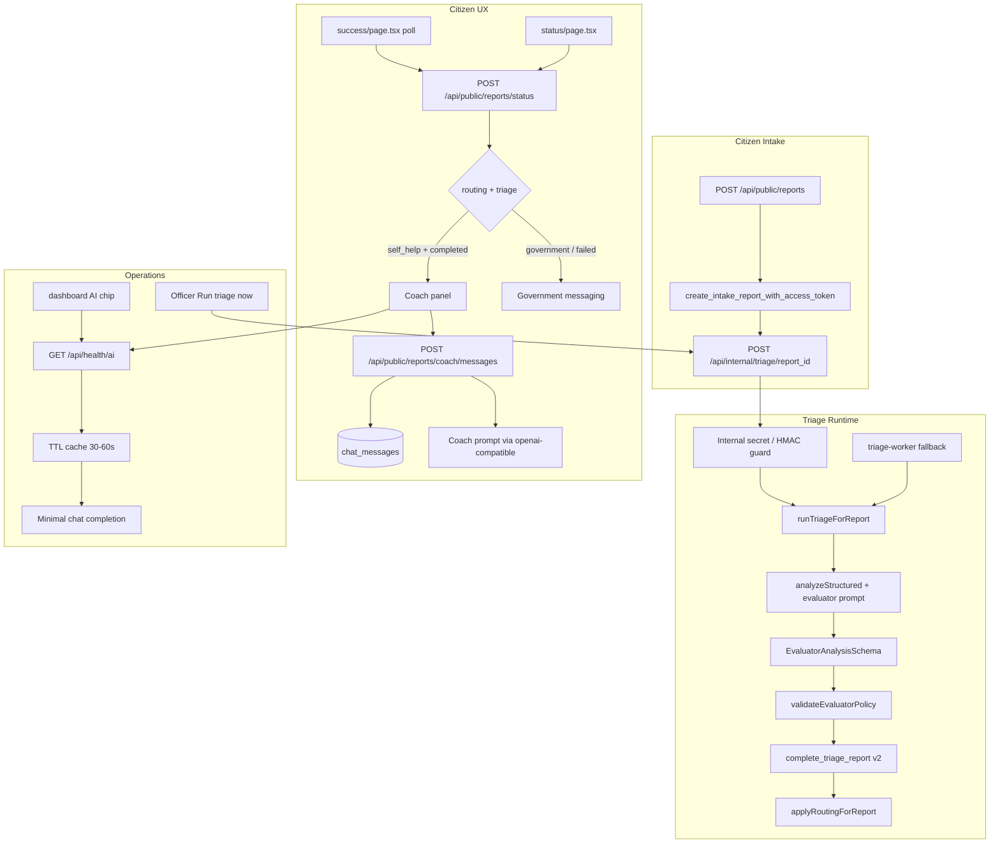

# Phase 11: Triage Spec & Guided Self-Help - Research

**Researched:** 2026-07-22
**Domain:** Evaluator 11-key schema migration, internal triage dispatch, coach chat API, AI health probe, citizen success-page polling, officer quick actions
**Confidence:** HIGH

## Summary

Phase 11 closes the gap between `prompt/citymind_ai_triage_structured_output_evaluator.json` and the live triage runtime, then delivers **guided self-help** (coach chat on success + status) and **operations visibility** (AI health chip, officer triage triggers). The codebase already has the right seams: async intake (`submitReport` → `create_intake_report_with_access_token`), triage orchestration (`runTriageForReport`), token-scoped citizen APIs (`citizen-status.ts`, `citizen-escalate.ts`), routing (`evaluateRoutingPolicy`), readiness pattern (`checkReadiness`), and Phase 10 eval/shadow infrastructure. [VERIFIED: `src/server/services/report-service.ts`, `src/server/triage/service.ts`, `src/server/services/citizen-status.ts`, `src/server/health/readiness.ts`]

The largest shift is **schema migration**: production still persists the Phase 8 **9-field `ReportAnalysis`** (`summary`, `recommendation`, `estimated_impact`, `evidence`, `uncertainty`) via `complete_triage_report` RPC and `updateTriageTerminalState`, while the evaluator contract requires **11 keys** (`observed_facts`, `inferences`, `unknowns`, `severity_reason`, `priority_reason`, `recommended_action`, `requires_human_review`, plus shared scalars). Phase 10 explicitly deferred this migration; Phase 11 implements it with a **dual-read adapter** (D-11): write 11-key shape, read through a projection layer that still feeds legacy citizen/officer fields until cutover. [VERIFIED: `src/server/domain/report-analysis.ts`, `supabase/migrations/20260722120002_async_triage_audit.sql`, `10-RESEARCH.md` Pitfall 1]

Dispatch moves from **poll-primary** (`scripts/triage-worker.mjs`, 5s loop) to **push-primary** (`POST /api/internal/triage/{report_id}` on intake) with the worker retained as a safety net for stuck `pending` rows (D-09). Internal route auth should **not** use officer session (wrong principal) or expose service-role on HTTP; use a **shared-secret HMAC or constant-time header** plus loopback binding for laptop self-host (see §Internal triage auth). Coach chat reuses the same provider env (`AI_MODEL`, `AI_BASE_URL`, `THIRD_PARTY_API_KEY`) with a **separate system prompt** (D-06/D-07), persists messages in Postgres (D-03), and gates on `GET /api/health/ai` (D-05/D-08).

**Primary recommendation:** Ship schema + policy first (migration + `EvaluatorAnalysisSchema` + `validateEvaluatorPolicy` wired from evaluator JSON), then internal dispatch + AI health, then citizen coach UX + dashboard quick actions — matching the gap-analysis wave order A+B → C → F → G+H.

## Architectural Responsibility Map

| Capability | Primary Tier | Secondary Tier | Rationale |
|------------|-------------|----------------|-----------|
| 11-key schema persist + dual-read projection | Database + repository (`src/server/repositories/`) | Domain adapter (`src/server/domain/`) | Canonical storage in Postgres; UI/API consume projection |
| Evaluator prompt + Zod source of truth | Server AI layer (`src/server/ai/`) | `prompt/citymind_ai_triage_structured_output_evaluator.json` | Single JSON file drives prompt, schema, policy rules (D-12) |
| Policy assertions (`policy_evaluator`, `cross_field_rules`) | API / validation (`src/server/validation/`) | Triage service retry loop | Runs server-side before persist; same pattern as `validateAnalysisPolicy` |
| Push triage dispatch | API route (`/api/internal/triage/[reportId]`) | Intake handler fire-and-forget | HTTP boundary for officer + intake; shared `dispatchTriage()` core |
| Poll worker fallback | CLI worker (`scripts/triage-worker.mjs`) | `claim_triage_report` RPC | Safety net only after push path ships |
| AI health probe + cache | API (`GET /api/health/ai`) | `src/server/health/ai-readiness.ts` | Lightweight probe separate from Supabase `/api/ready` (D-08) |
| Coach chat (messages, inference) | API (`/api/public/reports/coach/*`) | Postgres `chat_messages` | Token-scoped like status; no direct DB access from browser |
| Success/status polling UI | Browser (client components) | Citizen status API | Poll existing status projection; branch on `triage_status` + routing |
| Officer quick triage + AI chip | Browser (dashboard) | Officer API routes + `/api/health/ai` | `requireOfficerContext` for mutations; health is read-only |
| Rate limits (coach, status, intake) | API / security (`src/server/security/rate-limit.ts`) | In-memory sliding window | Matches existing citizen API pattern |

<user_constraints>
## User Constraints (from CONTEXT.md)

### Locked Decisions

#### Coach UX (citizen)

- **D-01:** Coach chat on **both** success page and status page — citizen can start on success after triage completes and **resume** on status with the same token-scoped thread.
- **D-02:** **Wait on success page** — poll triage until `completed` or `failed`, then branch UI (do not redirect immediately to status for routing).
- **D-03:** **Persist coach messages in Postgres** — report-scoped `chat_messages` (or equivalent); survives refresh and status-page resume; audit-friendly.
- **D-04:** **Government path** — when `routing_destination=government`, triage `failed`/`manual_review`, or hard routing signals: show government-queue messaging; **no coach-first** panel. Escalate CTA remains available on status (Phase 9).
- **D-05:** When **`GET /api/health/ai`** is `down`, coach UI is **disabled** with calm warning; ID/token copy and status link still work.

#### Coach vs triage AI

- **D-06:** **Same provider config** — use `AI_MODEL`, `AI_BASE_URL`, `THIRD_PARTY_API_KEY` for both roles; **separate system prompts** (triage = 11-key evaluator JSON; coach = conversational self-help grounded in report + playbook).
- **D-07:** Coach must **not contradict** routing or triage output; advisory only; cannot change report status or routing.

#### AI health & triage dispatch

- **D-08:** **`GET /api/health/ai`** — lightweight minimal JSON completion probe (not full smoke suite); returns `up`/`degraded`/`down`, latency, model id; no secrets.
- **D-09:** **Push-primary triage** — intake enqueues via authenticated `POST /internal/triage/{report_id}`; existing **poll worker remains fallback** safety net for stuck `pending` rows.
- **D-10:** Dashboard **AI status chip** consumes `/api/health/ai` (green/amber/red).

#### Evaluator schema & policy (Tracks A–B)

- **D-11:** **Dual-read adapter** during migration — persist 11-key evaluator shape; UI/services read through adapter mapping legacy columns until full cutover; avoid big-bang breakage.
- **D-12:** Wire **`prompt/citymind_ai_triage_structured_output_evaluator.json`** as triage prompt + Zod source of truth (11 keys, 10 categories).
- **D-13:** Policy must enforce **`critical` requires `severity == 5`** and evaluator `policy_assertions` (not legacy min-severity-4 for critical).

#### API compatibility

- **D-14:** **`POST /api/public/reports/analyze`** stays **410 Gone** — document intake path; no compatibility shim in Phase 11.

#### Officer quick actions (Track H)

- **D-15:** **Per-row** “Run triage now” for `pending` / `failed` / `retry` — calls internal triage dispatch.
- **D-16:** **Bulk retry** for selected failed/pending rows on dashboard table.

### Claude's Discretion

- Exact `chat_messages` schema, polling interval on success page, coach message rate limits, and dual-read adapter field mapping — planner/researcher to propose within D-03/D-11 constraints.
- EN/VI copy tone for coach vs government branches — follow existing `messages/en.json` / `vi.json` patterns.

### Deferred Ideas (OUT OF SCOPE)

- **WebSocket streaming coach** — polling/SSE acceptable for Phase 11 (per ROADMAP out of scope).
- **Officer coach preview** — optional; not selected in discussion; defer unless planner finds low cost.
- **Separate coach model** — user chose same endpoint; revisit if latency/cost issues in eval.
- **`/analyze` compatibility shim** — explicitly rejected (D-14).
</user_constraints>

<phase_requirements>
## Phase Requirements

| ID | Description | Research Support |
|----|-------------|------------------|
| TRIAGE-09 | Persist 11-key evaluator schema at persistence boundary | Additive DB columns + `complete_triage_report` v2; `EvaluatorAnalysisSchema`; dual-read adapter |
| TRIAGE-10 | Prompt + Zod 10 categories aligned with evaluator JSON | Load `system_prompt` + `output_schema` from evaluator JSON; extend `CategorySchema` |
| TRIAGE-11 | Policy assertions incl. `critical` ↔ `severity == 5`, reason traceability | `validateEvaluatorPolicy` from `policy_evaluator` + `cross_field_rules` |
| TRIAGE-12 | Push dispatch `POST /internal/triage/{report_id}` on intake | `/api/internal/triage/[reportId]` + shared secret auth; intake fire-and-forget |
| TRIAGE-13 | UX contracts: failed copy, triage_bucket elevation, sort tests | Extend citizen projection tests + dashboard sort contract |
| TRIAGE-14 | Eval/shadow on 11-key snapshots; `/analyze` documented 410 | Migrate `src/server/evals/*` types; document 410 in ai-logic |
| SHELP-01 | Success page branches self_help coach vs government queue | Poll status → branch on `service_step` / `routing_destination` |
| SHELP-02 | Token-scoped coach API grounded in report + playbook | Mirror `citizen-status.ts` auth; coach service with playbook context |
| SHELP-03 | Distinct coach prompt/role from triage | Separate `COACH_SYSTEM_PROMPT`; **same provider env per D-06** (overrides REQUIREMENTS optional coach model) |
| SHELP-04 | Escalate CTA in coach + status flows | Reuse `citizen-escalate.ts`; coach panel includes escalate link |
| SHELP-05 | Bilingual coach UI + polling on success | `messages/en.json` / `vi.json`; 2s poll with backoff |
| OPS-01 | `GET /api/health/ai` probe + consumers | `checkAiHealth()` with TTL cache; dashboard + citizen gate |
| DASH-09 | AI status chip + per-row/bulk triage actions | Chip polls health; row action → officer route → internal dispatch |
</phase_requirements>

## Standard Stack

### Core

| Library | Version | Purpose | Why Standard |
|---------|---------|---------|--------------|
| Node.js | 22+ (v25.2.1 on dev machine) | Triage dispatch, health probe, coach API | Project runtime [VERIFIED: `node --version`] |
| Next.js | 16.2.10 | App Router API routes + citizen pages | Existing stack [VERIFIED: `package.json`] |
| TypeScript | 5.x | Schema, policy, services | Matches `src/server/*` |
| Zod | 4.4.3 | `EvaluatorAnalysisSchema` generated from evaluator JSON | Already used; `z.toJSONSchema` in domain [VERIFIED: `package.json`] |
| `prompt/citymind_ai_triage_structured_output_evaluator.json` | config v1.0.0 | Prompt, 11-key schema, policy evaluator, thresholds | Authoritative contract [VERIFIED: file] |
| Supabase Postgres + service role | pg 8.22.0 | `reports`, `chat_messages`, triage audit | Existing pattern [VERIFIED: migrations, `getAdminClient`] |
| Vitest | 4.1.10 | Policy, adapter, coach auth unit tests | `npm run test:unit` [VERIFIED: `package.json`] |
| `next-intl` | 4.13.2 | EN/VI coach + branch copy | Phase 2+ convention [VERIFIED: success/status pages] |
| Existing `openai-compatible.ts` | in-repo | Triage + coach + health probe calls | Same adapter, different system prompts (D-06) |

### Supporting

| Library | Version | Purpose | When to Use |
|---------|---------|---------|-------------|
| `node:crypto` | Node built-in | HMAC internal auth, `timingSafeEqual` | Internal triage route verification |
| `scripts/triage-worker.mjs` | in-repo | Fallback poll for stuck `pending` | Keep running after push dispatch ships |
| `scripts/smoke-ai.mjs` | in-repo | Operator reference only | **Not** per-request health (D-08) |
| `scripts/run-supabase-sql.mjs` | in-repo | Migration + SQL contract gates | Schema + `chat_messages` contract |

### Alternatives Considered

| Instead of | Could Use | Tradeoff |
|------------|-----------|----------|
| Additive columns + JSONB arrays | Single `evaluator_analysis JSONB` column | JSONB-only simpler migration but weaker indexing; hybrid keeps scalar filters on `category`/`severity`/`priority` |
| HMAC internal secret | Officer session for intake dispatch | Officer session wrong principal; intake has no session |
| Service-role bearer on internal HTTP | Shared secret header | Exposing service role over HTTP expands blast radius |
| Direct `runTriageForReport()` from intake (no HTTP) | Push HTTP route per D-09 | Violates locked D-09 unless route is thin wrapper around same function |
| SSE coach streaming | Request/response poll | Deferred per CONTEXT; poll matches status API style |
| Extend `/api/ready` with AI | Separate `/api/health/ai` | D-08 locks separate route; ready stays Supabase-only |
| Big-bang column drop | Dual-read adapter (D-11) | Big-bang breaks dashboard, status, eval, shadow |

**Installation:** None required — Phase 11 ships with existing dependencies.

**Version verification:**

```bash
npm view zod version          # 4.4.3
npm view next version         # 16.2.10
npm view vitest version       # 4.1.10
```

## Package Legitimacy Audit

> No new external packages recommended. slopcheck ran for `zod` (existing dependency) — CLI `slopcheck install zod --json` unsupported in installed slopcheck v0.6.1; registry presence confirmed via `npm view zod version`.

| Package | Registry | Age | Downloads | Source Repo | slopcheck | Disposition |
|---------|----------|-----|-----------|-------------|-----------|-------------|
| (none new) | — | — | — | — | — | Phase 11 uses in-repo stack only |

**Packages removed due to slopcheck [SLOP] verdict:** none

**Packages flagged as suspicious [SUS]:** none

## Architecture Patterns

### System Architecture Diagram



### Recommended Project Structure

```
src/server/domain/
├── report-analysis.ts              # legacy — deprecate gradually
├── evaluator-analysis.ts           # NEW: 11-key Zod + types from evaluator JSON
└── analysis-projection.ts          # NEW: dual-read adapter (11-key → citizen/officer view)

src/server/validation/
├── analysis-policy.ts              # legacy — keep until cutover
└── evaluator-policy.ts             # NEW: policy_evaluator + cross_field_rules

src/server/ai/
├── openai-compatible.ts            # extend: load evaluator system prompt
└── coach-provider.ts               # NEW: conversational coach calls

src/server/triage/
├── service.ts                      # wire EvaluatorAnalysis + new policy
├── dispatch.ts                     # NEW: idempotent dispatch entry
└── config.ts                       # bump PROMPT_VERSION → evaluator v1.0.0

src/server/health/
├── readiness.ts                    # unchanged (Supabase)
└── ai-readiness.ts                 # NEW: probe + TTL cache

src/server/services/
├── citizen-coach.ts                # NEW: token-scoped chat
├── citizen-status.ts               # extend projection if needed
└── report-service.ts               # fire-and-forget push after intake

src/app/api/
├── health/ai/route.ts              # NEW
├── internal/triage/[reportId]/route.ts  # NEW
├── officer/reports/[reportId]/triage/route.ts  # NEW (D-15)
├── officer/reports/triage/bulk/route.ts        # NEW (D-16)
└── public/reports/coach/messages/route.ts    # NEW

supabase/migrations/
├── 20260722160001_evaluator_analysis_columns.sql
├── 20260722160002_complete_triage_report_v2.sql
└── 20260722160003_chat_messages.sql

supabase/tests/
└── 11_phase11_contract.sql
```

### Pattern 1: 11-Key Schema Migration + Dual-Read Adapter

**What:** Add evaluator columns to `reports`, update `complete_triage_report` to persist 11-key JSON, expose `projectReportAnalysis(row)` that returns both `EvaluatorAnalysis` (canonical) and legacy fields (computed).

**When to use:** Every read path (citizen status, officer dashboard, eval export) during migration window.

**DB column design (additive, backward compatible):**

| Column | Type | Notes |
|--------|------|-------|
| `observed_facts` | `JSONB NOT NULL DEFAULT '[]'` | Replaces semantic role of `evidence` |
| `inferences` | `JSONB NOT NULL DEFAULT '[]'` | New |
| `unknowns` | `JSONB NOT NULL DEFAULT '[]'` | Replaces semantic role of `uncertainty` |
| `severity_reason` | `TEXT` | New |
| `priority_reason` | `TEXT` | New |
| `recommended_action` | `TEXT` | Replaces `recommendation` |
| `requires_human_review` | `BOOLEAN NOT NULL DEFAULT true` | Evaluator const `true` |
| `category`, `severity`, `confidence`, `priority` | existing scalars | Unchanged — shared |
| `summary`, `recommendation`, `estimated_impact`, `evidence`, `uncertainty` | **legacy** | **Write-through from adapter on persist**; stop reading after cutover flag |

**Dual-read adapter mapping (read time):**

```typescript
// src/server/domain/analysis-projection.ts
export function projectLegacyCitizenFields(row: ReportRow): {
  summary: string | null;
  recommendation: string | null;
} {
  if (row.observed_facts?.length) {
    return {
      summary: row.severity_reason ?? row.observed_facts.join(" "),
      recommendation: row.recommended_action ?? null,
    };
  }
  // Fallback for pre-migration rows
  return { summary: row.summary, recommendation: row.recommendation };
}
```

**Backward compat rules:**
- **Read:** Prefer 11-key columns when `severity_reason IS NOT NULL` OR `observed_facts != '[]'`; else legacy columns.
- **Write (new triage):** Always persist 11-key; adapter **also** populates legacy columns for officer dashboards not yet updated.
- **RPC:** Version `complete_triage_report` to map `p_analysis` 11-key fields; keep accepting legacy keys one release via COALESCE in SQL.
- **Cutover:** Env `EVALUATOR_SCHEMA_WRITE_MODE= dual|canonical` — planner sets `dual` for Phase 11. [ASSUMED] flag name; default dual.

### Pattern 2: Internal Triage Push Route Auth (Self-Hosted)

**What:** Authenticated server-to-server dispatch without Cloud Tasks/OIDC.

**Recommendation (prescriptive):**

| Caller | Auth mechanism | Route |
|--------|----------------|-------|
| Intake (`submitReport`) | `INTERNAL_TRIAGE_SECRET` header + loopback-only optional guard | `POST /api/internal/triage/[reportId]` |
| Officer “Run triage now” | `requireOfficerContext()` → server calls shared `dispatchTriage(reportId)` | `POST /api/officer/reports/[reportId]/triage` |
| Poll worker | In-process `runTriageForReport` (no HTTP) | N/A |

**Do not use:**
- **Officer session** for intake-triggered dispatch (no session at intake time).
- **Supabase service role** as HTTP bearer (too powerful if leaked).

**HMAC vs shared secret:**

| Approach | Pros | Cons |
|----------|------|------|
| **Constant-time shared secret** (`X-CityMind-Internal-Key`) | Simple; matches laptop self-host | No replay protection |
| **HMAC-SHA256** (`X-CityMind-Signature` over `reportId|timestamp`) | Replay window via timestamp skew | More code |

**Prescription:** Start with **shared secret + `timingSafeEqual`** (mirror `tokenBindsReport` pattern in `access-tokens.ts`). Add HMAC timestamp only if internal route is ever exposed beyond loopback. [VERIFIED: `src/server/security/access-tokens.ts` timing-safe compare pattern]

**Intake enqueue (non-blocking):**

```typescript
// After successful submitReport — do not block citizen response on triage
void fetch(`${getInternalBaseUrl()}/api/internal/triage/${reportId}`, {
  method: "POST",
  headers: { "X-CityMind-Internal-Key": env.INTERNAL_TRIAGE_SECRET },
  signal: AbortSignal.timeout(5_000),
}).catch(() => {
  /* worker fallback picks up pending */
});
```

**Idempotency:** Route returns `202` if `triage_status` is `processing` or `completed`; only dispatches when `pending`, `failed`, or `retry` (and due).

### Pattern 3: Coach Chat API (Token-Scoped, Poll-Based)

**What:** Report-bound conversational coach; distinct from triage classifier.

**Endpoints:**

| Method | Path | Purpose |
|--------|------|---------|
| `GET` | `/api/public/reports/coach/messages` | List messages (`report_id`, `token` query or body) |
| `POST` | `/api/public/reports/coach/messages` | Append user message; **return full assistant reply** (no streaming) |

**Auth:** Identical to status — `hashAccessToken` + `tokenBindsReport` + report exists. [VERIFIED: `citizen-status.ts`]

**Preconditions (gate before coach):**
- `triage_status === 'completed'`
- `routing_destination === 'self_help'`
- `GET /api/health/ai` status ≠ `down` (client-side disable per D-05; server returns 503 if down)

**Postgres schema:**

```sql
CREATE TABLE public.chat_messages (
    message_id UUID PRIMARY KEY DEFAULT gen_random_uuid(),
    report_id TEXT NOT NULL REFERENCES public.reports(report_id) ON DELETE CASCADE,
    role TEXT NOT NULL CHECK (role IN ('user', 'assistant', 'system')),
    content TEXT NOT NULL CHECK (char_length(content) BETWEEN 1 AND 4000),
    created_at TIMESTAMPTZ NOT NULL DEFAULT timezone('utc', now()),
    model TEXT,
    latency_ms INTEGER
);
CREATE INDEX chat_messages_report_created_idx
    ON public.chat_messages (report_id, created_at ASC);
ALTER TABLE public.chat_messages ENABLE ROW LEVEL SECURITY;
REVOKE ALL ON public.chat_messages FROM PUBLIC, anon, authenticated;
GRANT ALL ON public.chat_messages TO service_role;
```

**Rate limits (discretion proposal):**
- `COACH_RATE_LIMIT_PER_MINUTE` default **10** per `report_id` + IP (new limiter alongside `statusLimiter`).
- Max **50** messages per report per 24h (DB count check) to bound cost.
- Reuse `Retry-After: 60` pattern from `rate-limit.ts`. [VERIFIED: `src/server/security/rate-limit.ts`]

**Coach context assembly:** System prompt includes routing playbook steps (`resolvePlaybookId`), `observed_facts`, `recommended_action`, and explicit guardrail: *do not contradict routing or change report status* (D-07).

**Streaming vs poll:** **Poll/request-response only** — POST returns `{ assistant_message, messages }`. Matches deferred WebSocket scope.

### Pattern 4: AI Health Lightweight Probe

**What:** Separate from `/api/ready` (Supabase-only). [VERIFIED: `readiness.ts` probes `reports` head query only]

**Response shape:**

```typescript
type AiHealthResponse = {
  status: "up" | "degraded" | "down";
  model: string;
  latency_ms: number;
  checked_at: string; // ISO UTC
};
```

**Probe:** Single chat completion — system: `"Reply with OK"`, user: `"ping"`, `max_tokens: 5`, `temperature: 0`, `response_format: json_object` optional skip. Reuse `buildChatCompletionsUrl` + bounded timeout (`min(AI_TIMEOUT_MS, 10_000)` for probe).

**Cache TTL:** Module-level cache **45 seconds** (planner discretion: 30–60s). Return cached body with `X-Cache: HIT`. Prevents dashboard chip + every success page mount from hammering provider.

**Thresholds:**

| Status | Condition |
|--------|-----------|
| `up` | HTTP 2xx, parseable response, latency **< 5_000 ms** |
| `degraded` | HTTP 2xx but latency **5_000–15_000 ms**, or empty content recovered |
| `down` | Timeout, HTTP error, unparseable body, missing env |

**Never return:** API keys, base URL, raw provider errors (map to generic `"down"`).

### Pattern 5: Evaluator `policy_assertions` Implementation

**What:** Replace/extend legacy `validateAnalysisPolicy` with evaluator-driven rules from JSON `policy_evaluator` + `consistency_evaluator.cross_field_rules`.

**Approach:**
1. Add `EvaluatorAnalysis` type + `EvaluatorAnalysisSchema` — 11 keys, 10 categories from `output_schema.properties.category.enum`. [VERIFIED: evaluator JSON]
2. Create `validateEvaluatorPolicy(analysis, context)` returning `{ ok, violations, error_type }` aligned with evaluator `error_taxonomy`.
3. Implement rule modules matching JSON sections:

| JSON section | Implementation |
|--------------|----------------|
| `evidence_grounding` | Trace `severity_reason`/`priority_reason` claims to `observed_facts` (word overlap + phrase checks, stricter than legacy `evidence`) |
| `occurred_injury_claim_check` | Regex/list from JSON; allow prospective risk phrases |
| `unsupported_cause_check` | Trigger phrases only when causal claim lacks evidence support |
| `unsupported_occurred_event_check` | Event list vs `observed_facts` |
| `hidden_property_check` | Property list unless explicitly in facts |
| `action_claim_check` | Forbid dispatch/completion claims |
| `conflict_confidence_check` | Conflict in `unknowns` → cap confidence 0.64 |
| `cross_field_rules` | `critical_requires_severity_5`, `severity_5_requires_immediate_danger_evidence`, etc. |

4. **Retry policy:** Match evaluator — retry on `json_parse_error` / `schema_validation_error` only; **not** on `policy_violation`. [VERIFIED: evaluator JSON `validation_pipeline.retry`]
5. **Fix `MIN_SEVERITY_BY_PRIORITY.critical`:** Legacy policy has `critical: 4` in `MIN_SEVERITY_BY_PRIORITY` while also checking `critical_requires_severity_5` — evaluator path must use **severity == 5** exclusively (D-13). [VERIFIED: `analysis-policy.ts` lines 19–24 vs 122–128]

6. **Severity 5 danger evidence:** Move check from `evidence` array to **`observed_facts`** per evaluator.

### Pattern 6: Success Page Triage Polling

**What:** D-02 — stay on success page until terminal triage state, then branch.

**Poll target:** Reuse `POST /api/public/reports/status` (already returns `triage_status`, `service_step`, routing-derived fields). **Do not** add a separate triage poll endpoint unless payload size becomes an issue.

**Timing (discretion proposal):**
- Initial interval: **2s** for first 30s
- Backoff: **5s** until 120s max
- Stop when `triage_status ∈ { completed, failed, manual_review }`
- After timeout: show “still processing” + status link (ID/token copy remains)

**UI branches after poll:**

| Condition | UI |
|-----------|-----|
| `completed` + `service_step === self_help_guidance` | Coach panel + playbook hints |
| `completed` + government path | Queue messaging, no coach |
| `failed` / `manual_review` | Calm notice (`automated_review_unavailable` copy) |
| `pending` / `processing` | Spinner + `statusWorkflow.stepAiPending` |

**AI health:** On mount, `GET /api/health/ai` — if `down`, disable coach send (D-05).

### Anti-Patterns to Avoid

- **Big-bang drop of legacy columns** — breaks Phase 10 shadow comparisons and officer exports mid-migration.
- **Coach for government/high-severity reports** — violates D-04/D-07; server must enforce routing gate.
- **Full `smoke-ai.mjs` on every health check** — too heavy; D-08 requires minimal probe.
- **Blocking intake on triage completion** — Phase 8 contract; push is async.
- **Trusting client routing flags** — branch on server-projected `service_step` only.
- **Letting coach mutate `reports.status` or routing** — advisory only; no write paths in coach service.

## Don't Hand-Roll

| Problem | Don't Build | Use Instead | Why |
|---------|-------------|-------------|-----|
| JSON schema validation for 11 keys | Custom parser | Zod schema from evaluator `output_schema` | Already project standard; `strict()` + enums |
| Internal auth crypto | Custom encoding | `node:crypto` `timingSafeEqual` / HMAC | Proven pattern in `access-tokens.ts` |
| Chat message ordering | Client-only state | Postgres `chat_messages` ordered by `created_at` | Resume across devices/sessions (D-03) |
| AI provider HTTP | New fetch wrapper | `openai-compatible.ts` | SSE parsing, timeout, redaction already exist |
| Rate limiting | Redis/external store | `SlidingWindowLimiter` in `rate-limit.ts` | Laptop self-host; matches citizen APIs |
| Health check caching | External cache | In-process TTL Map | Single Next.js process on laptop |
| Policy phrase lists | Hardcoded duplicates | Load from evaluator JSON at build/runtime | Single source of truth (D-12) |

**Key insight:** Phase 11 is mostly **wiring and migration** — the evaluator JSON already specifies schema, policy, and retry semantics; hand-rolling parallel definitions reintroduces the drift Phase 11 exists to fix.

## Common Pitfalls

### Pitfall 1: Schema Schism Between Triage, Eval, and Shadow

**What goes wrong:** Triage writes 11-key but `src/server/evals/*` still scores `ReportAnalysis` — gate and shadow diverge.

**Why it happens:** Phase 10 deliberately kept production `ReportAnalysis`.

**How to avoid:** Introduce `EvaluatorAnalysis` as persistence canonical; update eval runner + shadow snapshots in same wave as triage; adapter supplies legacy view for transitional metrics.

**Warning signs:** `eval:gate` passes while citizen status shows empty `summary`.

### Pitfall 2: `complete_triage_report` RPC Drift

**What goes wrong:** Service writes 11-key via direct `update()` but audit RPC still maps legacy JSON keys only.

**Why it happens:** Two write paths — `updateTriageTerminalState` and `recordTriageAttempt` → RPC.

**How to avoid:** Single migration updating RPC; route all completes through RPC; SQL contract test.

**Warning signs:** `observed_facts` empty in DB but `triage_attempts.raw_output` contains new keys.

### Pitfall 3: Internal Route Exposed on LAN

**What goes wrong:** Shared secret leaks via logs; internal route callable from network.

**Why it happens:** Default bind beyond loopback in dev.

**How to avoid:** Document loopback-first; optional middleware rejects non-loopback for `/api/internal/*`; never log secret.

**Warning signs:** Internal route returns 200 without auth from external IP.

### Pitfall 4: Coach Contradicts Routing

**What goes wrong:** Coach tells citizen issue is resolved when routing says government queue.

**Why it happens:** Coach prompt lacks routing/playbook grounding.

**How to avoid:** Inject `routing_destination`, playbook steps, and `recommended_action` into coach system context; server-side gate on `self_help`.

**Warning signs:** Coach active when `service_step === officer_review`.

### Pitfall 5: Health Probe Stampede

**What goes wrong:** Every dashboard row mount + success page polls provider directly.

**Why it happens:** No cache on `/api/health/ai`.

**How to avoid:** 45s TTL module cache; `Cache-Control: private, max-age=30` on response.

**Warning signs:** Provider rate limits during dashboard browsing.

### Pitfall 6: Duplicate Triage Dispatch

**What goes wrong:** Push + worker double-run same report.

**Why it happens:** Push does not set `processing` before worker claims.

**How to avoid:** `dispatchTriage` uses same `claim` semantics or idempotent guard (`triage_status` check + `processing` claim in transaction).

**Warning signs:** Duplicate `triage_runs` rows per report within seconds.

### Pitfall 7: Success Page Poll Rate Limit

**What goes wrong:** 2s status polling triggers 429 from `enforceStatusRateLimit`.

**Why it happens:** Status limiter keyed per IP; success + status tab doubles traffic.

**How to avoid:** Exempt lightweight poll with same token bucket per `report_id`, or raise status limit slightly; consider `GET` status with token query for polls only.

**Warning signs:** Citizens see `statusRateLimited` on success page.

### Pitfall 8: REQUIREMENTS vs CONTEXT Coach Model

**What goes wrong:** Implementer adds `AI_COACH_MODEL` per SHELP-03 while CONTEXT D-06 locks same provider.

**Why it happens:** REQUIREMENTS.md still mentions optional separate coach model.

**How to avoid:** **CONTEXT wins** — same `AI_MODEL`/`AI_BASE_URL`/`THIRD_PARTY_API_KEY`; separate prompt only.

**Warning signs:** `.env.example` adds coach-specific URL in Phase 11.

## Code Examples

### Evaluator Zod Schema (from JSON)

```typescript
// Source: prompt/citymind_ai_triage_structured_output_evaluator.json#/output_schema
import { z } from "zod";

export const EvaluatorCategorySchema = z.enum([
  "pothole", "flooding", "waste", "streetlight", "traffic_signal",
  "obstruction", "utility_hazard", "structural_damage", "graffiti", "other",
]);

export const EvaluatorAnalysisSchema = z.object({
  category: EvaluatorCategorySchema,
  observed_facts: z.array(z.string().min(1)).default([]),
  inferences: z.array(z.string().min(1)).default([]),
  unknowns: z.array(z.string().min(1)).default([]),
  severity: z.number().int().min(1).max(5),
  severity_reason: z.string().min(1),
  priority: z.enum(["low", "medium", "high", "critical"]),
  priority_reason: z.string().min(1),
  confidence: z.number().min(0).max(1),
  recommended_action: z.string().min(1),
  requires_human_review: z.literal(true),
}).strict();
```

### Critical/Severity Cross-Field Rule

```typescript
// Source: evaluator JSON consistency_evaluator.cross_field_rules
export function assertCriticalRequiresSeverity5(
  analysis: Pick<EvaluatorAnalysis, "priority" | "severity">,
): PolicyViolation | null {
  if (analysis.priority === "critical" && analysis.severity !== 5) {
    return {
      code: "critical_requires_severity_5",
      message: "Critical priority requires severity 5.",
    };
  }
  return null;
}
```

### Internal Route Auth Guard

```typescript
// Source: pattern from src/server/security/access-tokens.ts (timingSafeEqual)
import { timingSafeEqual } from "node:crypto";

export function verifyInternalTriageRequest(
  request: Request,
  env: { INTERNAL_TRIAGE_SECRET: string },
): boolean {
  const provided = request.headers.get("x-citymind-internal-key") ?? "";
  const expected = env.INTERNAL_TRIAGE_SECRET;
  if (!provided || !expected) return false;
  const a = Buffer.from(provided, "utf8");
  const b = Buffer.from(expected, "utf8");
  if (a.length !== b.length) return false;
  return timingSafeEqual(a, b);
}
```

### AI Health Probe with Cache

```typescript
// Source: pattern from src/server/health/readiness.ts (bounded timeout)
const AI_HEALTH_TTL_MS = 45_000;
let cache: { at: number; body: AiHealthResponse } | null = null;

export async function checkAiHealth(env: ServerEnv): Promise<AiHealthResponse> {
  const now = Date.now();
  if (cache && now - cache.at < AI_HEALTH_TTL_MS) return cache.body;
  const started = now;
  try {
    // minimal completion via openai-compatible helper
    const latency_ms = Date.now() - started;
    const status = latency_ms < 5_000 ? "up" : latency_ms < 15_000 ? "degraded" : "down";
    const body = { status, model: env.AI_MODEL, latency_ms, checked_at: new Date().toISOString() };
    cache = { at: now, body };
    return body;
  } catch {
    const body = { status: "down" as const, model: env.AI_MODEL, latency_ms: Date.now() - started, checked_at: new Date().toISOString() };
    cache = { at: now, body };
    return body;
  }
}
```

### Success Page Poll Loop

```typescript
// Source: D-02 + existing status API contract
useEffect(() => {
  if (!flash) return;
  let attempts = 0;
  const maxAttempts = 60;
  const tick = async () => {
    const res = await fetch("/api/public/reports/status", {
      method: "POST",
      headers: { "Content-Type": "application/json" },
      body: JSON.stringify({ report_id: flash.reportId, token: flash.accessToken }),
    });
    if (!res.ok) return;
    const data = await res.json();
    if (["completed", "failed", "manual_review"].includes(data.triage_status)) {
      setStatusResult(data);
      return;
    }
    attempts += 1;
    if (attempts < maxAttempts) {
      setTimeout(tick, attempts < 15 ? 2000 : 5000);
    } else {
      setPollTimedOut(true);
    }
  };
  void tick();
}, [flash]);
```

## State of the Art

| Old Approach | Current Approach | When Changed | Impact |
|--------------|------------------|--------------|--------|
| Legacy 9-field `ReportAnalysis` | 11-key evaluator schema + dual-read adapter | Phase 11 | Triage prompt, Zod, DB, policy align with evaluator JSON |
| Poll-only triage worker | Push-primary internal route + worker fallback | Phase 11 (D-09) | Faster time-to-triage on laptop |
| `/api/ready` for everything | `/api/ready` = Supabase; `/api/health/ai` = model | Phase 11 (D-08) | Clear dependency boundaries |
| Static success page (ID/token only) | Poll + coach/government branch | Phase 11 | Citizen self-help on easy path |
| `validateAnalysisPolicy` on `evidence` | `validateEvaluatorPolicy` on `observed_facts` | Phase 11 | Evaluator grounding rules |
| Phase 10 eval on `ReportAnalysis` | Eval on `EvaluatorAnalysis` snapshots | Phase 11 (TRIAGE-14) | Gate matches production schema |

**Deprecated/outdated:**
- `POST /api/public/reports/analyze` — remains **410 Gone** (D-14).
- `SYSTEM_INSTRUCTION` in `openai-compatible.ts` — replace with evaluator `system_prompt` loader.
- `PROMPT_VERSION = "phase8-mvp-v1"` — bump to evaluator `config_version` / `1.0.0`.

## Assumptions Log

| # | Claim | Section | Risk if Wrong |
|---|-------|---------|---------------|
| A1 | Hybrid columns (scalars + JSONB arrays) preferred over single JSONB blob | Pattern 1 | Planner may choose all-jsonb — still valid if adapter unified |
| A2 | Shared secret auth sufficient for loopback laptop; HMAC optional | Pattern 2 | Network exposure would need HMAC + replay window |
| A3 | Poll interval 2s → 5s backoff, 120s max | Pattern 6 | UX too slow/fast; tunable via env |
| A4 | AI health cache TTL 45s | Pattern 4 | Stale degraded state up to TTL |
| A5 | `CONTEXT` D-06 overrides SHELP-03 optional coach model | Pitfall 8 | Wrong env surface if REQUIREMENTS read alone |
| A6 | `POST /api/public/reports/status` sufficient for success polling | Pattern 6 | May need slimmer endpoint if rate limits bite |
| A7 | `INTERNAL_TRIAGE_SECRET` new env var name | Pattern 2 | Naming may change in plan |

## Open Questions

1. **Status rate limit vs success polling**
   - What we know: `enforceStatusRateLimit` is IP-based, default from env.
   - What's unclear: Whether 2s polling for 60 attempts exceeds default limit under load.
   - Recommendation: Add per-`report_id` bucket for token-authenticated status polls or document raised `STATUS_RATE_LIMIT_PER_MINUTE` for dev.

2. **Bulk triage concurrency**
   - What we know: D-16 requires bulk retry for selected rows.
   - What's unclear: Serial vs limited parallel (3–5) dispatch.
   - Recommendation: Serial with `202` acceptance + dashboard toast; avoid provider thundering herd on laptop.

3. **Legacy column retirement timeline**
   - What we know: D-11 dual-read during migration.
   - What's unclear: Which phase drops `summary`/`evidence` columns.
   - Recommendation: Phase 11 dual-write; defer column drop to Phase 12+ cleanup.

## Environment Availability

| Dependency | Required By | Available | Version | Fallback |
|------------|------------|-----------|---------|----------|
| Node.js | All server routes | ✓ | v25.2.1 | — |
| npm | scripts | ✓ | 11.6.2 | — |
| `.env.local` | AI + Supabase | ✓ | present | Blocked without keys |
| `THIRD_PARTY_API_KEY` + `AI_*` | Triage, coach, health | operator-dependent | — | Coach/triage disabled; health `down` |
| Supabase (`SUPABASE_URL`, service role) | Persist, chat | operator-dependent | — | Intake fails (existing) |
| `triage-worker` process | Fallback dispatch | optional | — | Push-only if worker not running (stuck pending risk) |
| Vitest | Unit tests | ✓ | 4.1.10 | — |

**Missing dependencies with no fallback:**
- Supabase + AI credentials — block triage/coach/health features (same as Phase 8–10).

**Missing dependencies with fallback:**
- Triage worker not running — push dispatch + manual officer retry still work; stuck rows need worker or officer action.

## Validation Architecture

### Test Framework

| Property | Value |
|----------|-------|
| Framework | Vitest 4.1.10 + node:test legacy |
| Config file | `vitest.config.mts` |
| Quick run command | `npm run test:unit -- src/server/validation/evaluator-policy.test.ts` |
| Full suite command | `npm run test` |
| SQL contract | `node scripts/run-supabase-sql.mjs -f supabase/tests/11_phase11_contract.sql` |

### Phase Requirements → Test Map

| Req ID | Behavior | Test Type | Automated Command | File Exists? |
|--------|----------|-----------|-------------------|-------------|
| TRIAGE-09 | 11-key persist + dual-read projection | unit + SQL | `npm run test:unit -- src/server/domain/analysis-projection.test.ts` | ❌ Wave 0 |
| TRIAGE-10 | 10 category enum parity | unit | `npm run test:unit -- src/server/domain/evaluator-analysis.test.ts` | ❌ Wave 0 |
| TRIAGE-11 | `critical` requires `severity == 5` | unit | `npm run test:unit -- src/server/validation/evaluator-policy.test.ts` | ❌ Wave 0 |
| TRIAGE-11 | occurred-injury / cause policy rules | unit | same file, fixtures from evaluator JSON | ❌ Wave 0 |
| TRIAGE-12 | internal route rejects bad secret | unit | `npm run test:unit -- src/server/triage/dispatch.test.ts` | ❌ Wave 0 |
| TRIAGE-12 | intake fire-and-forget calls dispatch | unit | extend `report-service.test.ts` | ❌ extend |
| TRIAGE-13 | failed copy no provider leakage | legacy/contract | `npm run test:legacy -- tests/citizen-status-contract.test.mjs` | ❌ Wave 0 |
| TRIAGE-13 | triage_bucket sort elevation | unit | extend `reports.test.ts` | ✅ extend |
| TRIAGE-14 | eval suite accepts 11-key | unit | extend `src/server/evals/aggregate.test.ts` | ❌ extend |
| SHELP-01 | success branch self_help vs government | unit/component | `npm run test:unit -- src/app/...` or extract hook test | ❌ Wave 0 |
| SHELP-02 | coach token gate | unit | `npm run test:unit -- src/server/services/citizen-coach.test.ts` | ❌ Wave 0 |
| SHELP-04 | escalate still available | integration | extend `citizen-escalate.test.ts` | ✅ extend |
| OPS-01 | health cache + thresholds | unit | `npm run test:unit -- src/server/health/ai-readiness.test.ts` | ❌ Wave 0 |
| DASH-09 | officer triage action auth | unit | `npm run test:unit -- src/app/api/officer/...` | ❌ Wave 0 |
| ALL | DB chat_messages + evaluator columns | SQL contract | `supabase/tests/11_phase11_contract.sql` | ❌ Wave 0 |

### Sampling Rate

- **Per task commit:** `npm run test:unit -- src/server/validation src/server/domain src/server/triage`
- **Per wave merge:** `npm run test`
- **Phase gate:** Full suite + SQL contract + manual coach UX on loopback

### Wave 0 Gaps

- [ ] `src/server/domain/evaluator-analysis.ts` + projection adapter + tests
- [ ] `src/server/validation/evaluator-policy.ts` + tests (load rules from evaluator JSON)
- [ ] `supabase/migrations/20260722160001_*` evaluator columns + `chat_messages`
- [ ] `supabase/migrations/20260722160002_*` `complete_triage_report` v2
- [ ] `supabase/tests/11_phase11_contract.sql`
- [ ] `src/server/triage/dispatch.ts` + internal route
- [ ] `src/server/health/ai-readiness.ts` + `/api/health/ai/route.ts`
- [ ] `src/server/services/citizen-coach.ts` + coach API route
- [ ] Success page poll + branch UI; status page coach resume panel
- [ ] Dashboard AI chip + row/bulk triage actions
- [ ] `.env.example`: `INTERNAL_TRIAGE_SECRET`, optional rate limits
- [ ] Update `src/server/evals/*` for 11-key snapshots (TRIAGE-14)

## Security Domain

### Applicable ASVS Categories

| ASVS Category | Applies | Standard Control |
|---------------|---------|-----------------|
| V2 Authentication | yes (coach, officer actions) | Access token hash verify; officer `getClaims()` |
| V3 Session Management | no change | Supabase cookies for officers only |
| V4 Access Control | yes | Coach messages scoped to token+report; internal route secret; RLS service-role on `chat_messages` |
| V5 Input Validation | yes | Zod on coach body (length caps); evaluator schema on triage |
| V6 Cryptography | yes | `hashAccessToken` SHA-256; `timingSafeEqual` for secrets |

### Known Threat Patterns for Phase 11 Stack

| Pattern | STRIDE | Standard Mitigation |
|---------|--------|---------------------|
| Token brute-force on coach API | Spoofing | Rate limit per IP; constant-time token verify; generic 401 |
| Coach prompt injection via citizen message | Tampering | System prompt isolates untrusted user content; max length 4000 |
| Internal triage route abuse | Elevation | Shared secret + loopback; idempotent status guards |
| AI health endpoint leaks config | Disclosure | Return only `model` id string, never keys/URLs |
| Cross-report chat leakage | Information disclosure | `tokenBindsReport` before listing `chat_messages` |
| Officer bulk triage DoS | Denial of service | Serial dispatch; cap bulk selection count (e.g. 25) |

## Suggested Wave Breakdown (aligned with GAP-ANALYSIS)

| Track | Wave | Deliverable |
|-------|------|-------------|
| **A** | W0–W1 | Evaluator columns migration, `EvaluatorAnalysisSchema`, dual-read adapter |
| **B** | W1 | `validateEvaluatorPolicy`, evaluator prompt loader, `PROMPT_VERSION` bump |
| **C** | W2 | Internal dispatch route + intake enqueue + officer per-row triage |
| **F** | W2 | `/api/health/ai` + cache + dashboard chip |
| **G** | W3 | `chat_messages`, coach API, success/status UI branches |
| **H** | W3 | Bulk triage, self-help indicators, TRIAGE-13 contract tests |
| **D/E** | W3–W4 | UX contract tests; document `/analyze` 410; eval 11-key migration |

**Dependency:** A+B before C (dispatch writes new shape); F before G (coach gating); C before H (quick actions need dispatch).

## Project Constraints (from .cursor/rules/)

No `.cursor/rules/` directory found. Enforce via `AGENTS.md`:

- GSD workflow: `/gsd-execute-phase` or `/gsd-quick` before repo edits.
- Node.js 22 + Next.js 16 only; no Python/Docker/new cloud services.
- AI advisory-only; officers retain decision authority.
- Access tokens hashed at rest.
- Bilingual EN/VI for new citizen-facing copy.
- Loopback-first laptop runtime.

## Sources

### Primary (HIGH confidence)
- `.planning/phases/11-triage-evaluator-spec-conformance/11-CONTEXT.md` — locked decisions D-01–D-16
- `.planning/phases/11-triage-evaluator-spec-conformance/11-GAP-ANALYSIS.md` — gap table + track order
- `prompt/citymind_ai_triage_structured_output_evaluator.json` — 11-key schema, policy evaluator, retry rules
- `src/server/ai/openai-compatible.ts` — current triage adapter
- `src/server/triage/service.ts` — `runTriageForReport` orchestration
- `src/server/services/report-service.ts` — intake path
- `src/server/domain/report-analysis.ts` — legacy schema
- `src/server/validation/analysis-policy.ts` — legacy policy (incl. `MIN_SEVERITY_BY_PRIORITY`)
- `src/server/services/citizen-status.ts` — token-scoped status projection
- `src/app/[locale]/report/success/page.tsx` — current success UX
- `src/app/[locale]/status/page.tsx` — routing branches, playbook, escalate
- `src/server/health/readiness.ts` — readiness probe pattern
- `supabase/migrations/20260722120002_async_triage_audit.sql` — `complete_triage_report` legacy mapping
- `src/server/security/access-tokens.ts`, `rate-limit.ts` — citizen security patterns
- `.planning/REQUIREMENTS.md` — TRIAGE-09–14, SHELP-01–05, OPS-01, DASH-09
- `.planning/phases/10-shadow-rollout-production-evaluation/10-RESEARCH.md` — template + schema deferral context

### Secondary (MEDIUM confidence)
- `.planning/codebase/ai-logic.md` — async flow documentation (pre-Phase 11)
- `src/server/routing/policy.ts` — self_help vs government rules for coach gating
- `scripts/smoke-ai.mjs` — operator probe reference (not per-request health)

### Tertiary (LOW confidence)
- Exact `INTERNAL_TRIAGE_SECRET` env name — [ASSUMED] pending plan lock
- Status rate limit headroom for 2s polling — [ASSUMED] needs load check

## Metadata

**Confidence breakdown:**
- Standard stack: HIGH — no new packages; extends verified modules
- Architecture: HIGH — migration adapter + auth patterns grounded in live code
- Pitfalls: HIGH — schema schism and dispatch duplication documented in Phase 8–10 research

**Research date:** 2026-07-22
**Valid until:** 2026-08-21 (30 days)

## RESEARCH COMPLETE

**Phase:** 11 - Triage Spec & Guided Self-Help
**Confidence:** HIGH

### Key Findings

- Phase 11 migrates persistence from 9-field `ReportAnalysis` to evaluator **11-key** shape with a **dual-read/write adapter** — additive DB columns + updated `complete_triage_report` RPC; legacy columns populated during transition.
- **Push-primary triage** via `POST /api/internal/triage/[reportId]` authenticated with **shared secret** (`timingSafeEqual`); officer actions use `requireOfficerContext`; poll worker stays as fallback.
- **Coach chat** is token-scoped (`report_id` + access token), Postgres-backed `chat_messages`, poll-based POST/response, same AI provider env with **separate system prompt**; gated on `routing_destination=self_help` and `/api/health/ai`.
- **`GET /api/health/ai`** is a minimal completion probe with **~45s TTL cache**; thresholds `up` <5s, `degraded` 5–15s, else `down` — separate from Supabase `/api/ready`.
- **`validateEvaluatorPolicy`** should implement evaluator JSON `policy_evaluator` + `cross_field_rules`, including `critical` ↔ `severity == 5` on `observed_facts` (not legacy `evidence`).

### File Created

`.planning/phases/11-triage-evaluator-spec-conformance/11-RESEARCH.md`

### Confidence Assessment

| Area | Level | Reason |
|------|-------|--------|
| Standard stack | HIGH | Existing Node/Zod/Supabase patterns; zero new deps |
| Architecture | HIGH | Verified against live triage, status, readiness modules |
| Pitfalls | HIGH | Schema schism + dispatch duplication precedented in Phase 8–10 |

### Open Questions

- Status rate limit headroom for 2s success-page polling
- Bulk triage serial vs limited-parallel dispatch

### Ready for Planning

Research complete. Planner can now create PLAN.md files.
