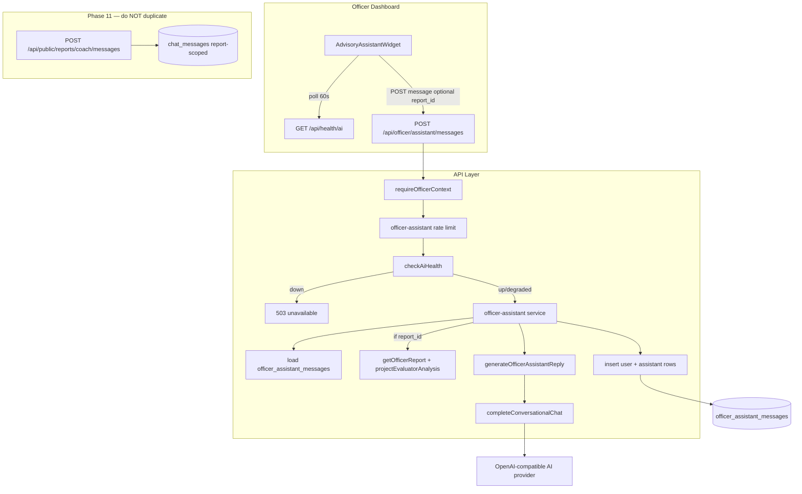

# Phase 12: Dashboard Advisory Assistant — Research

**Researched:** 2026-07-22
**Domain:** Officer dashboard conversational AI widget, authenticated advisory API, health gating, optional report grounding, persistence, bilingual UI
**Confidence:** HIGH

## Summary

Phase 12 productionizes an **MVP that already landed ahead of planning**: `AdvisoryAssistantWidget` in the dashboard insights rail, `POST /api/officer/assistant/messages`, `officer-assistant.ts` service + prompt, health polling, and basic Vitest coverage. [VERIFIED: `src/components/dashboard/widgets/AdvisoryAssistantWidget.tsx`, `src/server/services/officer-assistant.ts`, `src/server/ai/officer-assistant.ts`, `src/app/api/officer/assistant/messages/route.ts`]

The gap to production-ready is not greenfield chat plumbing — it is **hardening and completing** what the MVP deferred: **server-authoritative persistence** (today history is client-only and client-sent), **optional report context attach** (UI button exists but disabled), **full rate-limit and degraded-health contract tests**, **officer-scoped storage separate from citizen coach**, **UI-SPEC for widget chat UX**, and **formal DASH-10 traceability** in `REQUIREMENTS.md`. Phase 11 delivers the shared infrastructure this phase must reuse without duplicating: `checkAiHealth()` + `GET /api/health/ai`, `completeConversationalChat()`, evaluator projection (`projectEvaluatorAnalysis`), and the citizen coach pattern as a **negative reference** (token-scoped, report-bound, self-help only). [VERIFIED: Phase 11 `11-RESEARCH.md`, `src/server/health/ai-readiness.ts`, `src/server/services/citizen-coach.ts`]

**Primary recommendation:** Treat Phase 12 as a **productionization wave** on existing files — add `officer_assistant_messages` (officer-scoped, not `chat_messages`), server-load history + optional `report_id` grounding via `getOfficerReport`, wire attach UI from dashboard/report context, extend tests + SQL contract, write `12-UI-SPEC.md`, and add **DASH-10** to requirements. Do not fork a second chat stack or reuse citizen `chat_messages` (wrong principal and retention model).

## Architectural Responsibility Map

| Capability | Primary Tier | Secondary Tier | Rationale |
|------------|-------------|----------------|-----------|
| Widget chat UI (thread, send, health banner) | Browser / Client (`AdvisoryAssistantWidget`) | Dashboard layout (`NextIntlClientProvider`) | Interactive chat belongs in client component; dashboard already provides i18n |
| Officer assistant API | API route (`/api/officer/assistant/messages`) | Service (`officer-assistant.ts`) | Auth, validation, rate limits, persistence at API boundary |
| Officer session auth | API / Backend (`requireOfficerContext`) | Supabase SSR `getClaims()` | Officers authenticated via JWT; no access tokens |
| AI inference | API / Backend (`generateOfficerAssistantReply`) | `completeConversationalChat` | Provider-neutral; distinct system prompt from coach/triage |
| AI health gating | API + Client | `checkAiHealth()` TTL cache | Shared Phase 11 probe; widget polls `/api/health/ai` |
| Message persistence | Database + repository | Service role inserts | Officer threads are not citizen report-scoped |
| Optional report grounding | API / Backend | `getOfficerReport` + `projectEvaluatorAnalysis` | Officer RLS/read path; inject context block in system prompt |
| Rate limiting | API / security | `SlidingWindowLimiter` | Per-officer key; separate from coach IP+report limits |
| Bilingual copy | Message catalogs | `messages/en.json`, `messages/vi.json` | Dashboard uses `dashboard.widgets.*` keys (already present) |

<user_constraints>
## User Constraints (from CONTEXT.md)

**No `12-CONTEXT.md` exists yet.** `/gsd-discuss-phase 12` should lock the items below before execution. Until then, planner should treat **Phase 11 coach constraints (D-06, D-07, D-08)** and **project advisory-only principle** as inherited defaults, not citizen-coach UX rules (D-01–D-05).

### Inherited defaults (from project + Phase 11 — not yet Phase-12-locked)

| Topic | Inherited rule | Source |
|-------|----------------|--------|
| Provider config | Same `AI_MODEL`, `AI_BASE_URL`, `THIRD_PARTY_API_KEY` for all roles | Phase 11 D-06 |
| Advisory only | AI cannot change status, routing, or resolve reports | Phase 11 D-07, PROJECT.md |
| Health route | Separate `GET /api/health/ai`; lightweight probe | Phase 11 D-08 |
| Officer auth | `requireOfficerContext()` on all officer assistant routes | AUTH-03 pattern |
| No citizen tokens | Officer assistant never accepts `access_token` | Phase 12 boundary |

### Recommended locked decisions (propose in discuss-phase)

| ID | Recommendation | Rationale |
|----|----------------|-----------|
| P12-D-01 | **Persist officer assistant messages in Postgres** per `officer_user_id` (not client-sent history) | MVP trusts client `history` — tamper risk; coach loads from DB [VERIFIED: `officer-assistant.ts` accepts client history] |
| P12-D-02 | **Separate table** `officer_assistant_messages` — do **not** extend `chat_messages` | `chat_messages` is `report_id` FK for citizen coach; officer thread is officer-scoped [VERIFIED: `20260722160003_chat_messages.sql`] |
| P12-D-03 | **Optional `report_id` attach** per message or per session context | UI already has disabled attach button; prompt forbids inventing report facts without context [VERIFIED: `AdvisoryAssistantWidget.tsx`, `OFFICER_ASSISTANT_SYSTEM_PROMPT`] |
| P12-D-04 | **Disable send when health is `down`**; allow `degraded` with disclaimer (align coach) | Widget currently blocks `unknown` too; coach only blocks `down` [VERIFIED: widget vs `CoachPanel.tsx`] |
| P12-D-05 | **Defer voice input** — keep disabled with “coming soon” | MVP already defers; no STT stack in project |
| P12-D-06 | **No WebSocket/SSE streaming** — request/response like coach | ROADMAP out-of-scope for citizen coach applies here |

### Claude's Discretion (until discuss-phase)

- Exact `officer_assistant_messages` schema (single global thread vs per-report side threads).
- Daily message cap per officer (coach uses 50/24h per report).
- Whether attach is available only on report detail page or also from dashboard table selection.
- EN/VI copy tone refinements beyond existing `dashboard.widgets.assistant*` keys.

### Deferred Ideas (OUT OF SCOPE)

- **Voice input / STT** — button present but disabled in MVP.
- **WebSocket streaming** — use poll + POST response (Phase 11 deferred).
- **Separate officer model** (`AI_OFFICER_MODEL`) — inherit D-06 same endpoint unless discuss overrides.
- **Citizen coach reuse** — do not expose coach API to officers or merge prompts.
- **Auto status changes** — assistant must never mutate reports.
</user_constraints>

<phase_requirements>
## Phase Requirements (Proposed — add to REQUIREMENTS.md)

| ID | Description | Research Support |
|----|-------------|------------------|
| **DASH-10** | Officer dashboard **advisory assistant widget** — conversational chat in insights rail; authenticated officer session; AI advisory-only disclaimer; bilingual EN/VI; disabled when `/api/health/ai` is `down` | MVP widget + `messages/en.json`/`vi.json` keys; extend health/degraded contract |
| **DASH-10a** *(sub-behaviors, same ID in traceability)* | **`POST /api/officer/assistant/messages`** — Zod validation, `requireOfficerContext`, per-officer rate limit, generic errors, 503 when AI down | `officer-assistant.ts` exists; add 429 test + persistence |
| **DASH-10b** | **Distinct officer system prompt** — workflow/triage field guidance; must not claim to resolve/reject or invent report facts | `OFFICER_ASSISTANT_SYSTEM_PROMPT` shipped; add context injection tests |
| **DASH-10c** | **Persist officer assistant thread** in Postgres (`officer_assistant_messages`); server loads history; survives refresh | Gap vs MVP client-only state |
| **DASH-10d** | **Optional report context attach** — when `report_id` provided, ground reply in officer-visible triage fields via `getOfficerReport` + evaluator projection | Mirror coach `buildCoachReportContext` pattern for officers |
| **DASH-10e** | **Automated tests** — service auth/health/validation/rate limit; prompt context unit test; SQL contract for officer message table RLS | Nyquist map below; `phase12:gate` script pattern from Phase 11 |

**Planner action:** Add `DASH-10` to `REQUIREMENTS.md` Dashboard section and traceability row `Phase 12 | Pending`.
</phase_requirements>

## Standard Stack

### Core

| Library | Version | Purpose | Why Standard |
|---------|---------|---------|--------------|
| Next.js | 16.2.10 (lockfile) / 16.2.11 (registry) | App Router API + dashboard UI | Project stack [VERIFIED: `package.json`, `npm view next`] |
| TypeScript | 5.x | Services, widget, Zod schemas | Existing `src/server/*` |
| Zod | 4.4.3 | Request body validation | Already in `officer-assistant.ts` [VERIFIED: `npm view zod`] |
| `next-intl` | 4.13.2 | `dashboard.widgets.assistant*` strings EN/VI | Dashboard layout provides provider [VERIFIED: `dashboard/layout.tsx`] |
| Supabase Postgres + service role | `@supabase/supabase-js` 2.110.7 | Officer message persistence | Matches coach repository pattern |
| Vitest | 4.1.10 | Service + AI unit tests | `npm run test:unit` [VERIFIED: `package.json`] |
| In-repo `openai-compatible.ts` | — | `completeConversationalChat` | Shared with coach + health probe |
| In-repo `ai-readiness.ts` | — | `checkAiHealth()` | Phase 11 OPS-01 consumer |
| lucide-react + shadcn `Button`/`Input` | existing | Widget chrome | Matches dashboard widgets |

### Supporting

| Library | Version | Purpose | When to Use |
|---------|---------|---------|-------------|
| `projectEvaluatorAnalysis` | in-repo | Map 11-key + legacy columns for context block | Report attach grounding |
| `getOfficerReport` | in-repo | Load report for attach | Officer-authenticated read |
| `SlidingWindowLimiter` | in-repo | Per-officer rate limit | Already used in MVP service |
| `globals.css` `.assistant-*` | in-repo | Empty-state sphere animation | Widget idle state; `prefers-reduced-motion` handled |

### Alternatives Considered

| Instead of | Could Use | Tradeoff |
|------------|-----------|----------|
| New `officer_assistant_messages` table | Reuse `chat_messages` with nullable `officer_id` | Mixes citizen PII retention model with officer ops chat; complicates RLS |
| Client-sent `history` (MVP) | Server-loaded persisted history | MVP simpler but tamperable; production must switch |
| Separate `AI_OFFICER_MODEL` | Same `AI_MODEL` (D-06) | Cost/latency tuning deferred |
| SSE streaming | POST JSON response | Out of scope; coach uses same pattern |
| `officerFetch` wrapper in widget | Raw `fetch` to same-origin API | MVP uses `fetch`; acceptable for same-origin cookie session |

**Installation:** None — no new external packages.

**Version verification:**

```bash
npm view zod version      # 4.4.3
npm view next version     # 16.2.11
npm view vitest version   # 4.1.10
node --version            # v25.2.1 on dev machine
```

## Package Legitimacy Audit

> No new external packages recommended. slopcheck v0.6.1 installed but `slopcheck install --json` unsupported; no packages to audit.

| Package | Registry | slopcheck | Disposition |
|---------|----------|-----------|-------------|
| (none new) | — | — | Phase 12 uses in-repo stack only |

**Packages removed due to slopcheck [SLOP] verdict:** none  
**Packages flagged as suspicious [SUS]:** none

## Architecture Patterns

### System Architecture Diagram



### Recommended Project Structure

```
src/
├── components/dashboard/widgets/
│   └── AdvisoryAssistantWidget.tsx    # extend: load history, attach report_id
├── app/api/officer/assistant/
│   ├── messages/route.ts              # add GET for history (optional)
│   └── messages/route.ts              # POST (exists)
├── server/
│   ├── ai/officer-assistant.ts        # add buildOfficerReportContext
│   ├── services/officer-assistant.ts  # persistence + report attach
│   └── repositories/officer-assistant-messages.ts
supabase/migrations/
│   └── YYYYMMDD_officer_assistant_messages.sql
supabase/tests/
│   └── 12_phase12_contract.sql
messages/
│   ├── en.json                        # dashboard.widgets.assistant*
│   └── vi.json
```

### Pattern 1: Officer assistant vs citizen coach (differentiation)

**What:** Two conversational AI surfaces sharing provider plumbing but **separate auth, storage, prompts, and eligibility**.

| Dimension | Citizen coach (Phase 11) | Officer assistant (Phase 12) |
|-----------|--------------------------|------------------------------|
| Auth | `report_id` + `access_token` hash | Supabase officer JWT (`requireOfficerContext`) |
| API | `/api/public/reports/coach/messages` | `/api/officer/assistant/messages` |
| Storage | `chat_messages` keyed by `report_id` | `officer_assistant_messages` keyed by `officer_user_id` |
| Eligibility | `triage_status=completed` AND `routing_destination=self_help` | Any authenticated officer |
| Prompt focus | Self-help playbook steps for citizens | Triage field interpretation, review workflow |
| Context | `buildCoachReportContext` + playbook id | `buildOfficerReportContext` — severity, priority, routing, status, evaluator fields |
| Rate limit key | `coach:{reportId}:{ip}` | `officer-assistant:{officerId}` (MVP) |
| UI location | Success/status pages (`CoachPanel`) | Dashboard insights rail widget |

**When to use:** Never call coach APIs from dashboard or share `chat_messages` rows between principals.

### Pattern 2: Server-authoritative chat history

**What:** Server loads persisted turns; client sends only new `message` (+ optional `report_id`).  
**When to use:** Production (replace MVP client `history` in POST body).  
**Example:**

```typescript
// Source: mirror citizen-coach.ts sendCoachMessage pattern [VERIFIED: src/server/services/citizen-coach.ts]
const history = await listOfficerAssistantMessages(client, officerUserId);
await insertOfficerAssistantMessage(client, { officerUserId, role: "user", content: message, reportId });
const reply = await generateOfficerAssistantReply(env, {
  message,
  history,
  reportContext: reportId ? await buildOfficerReportContext(client, reportId) : null,
});
await insertOfficerAssistantMessage(client, { officerUserId, role: "assistant", content: reply, model, latencyMs });
```

### Pattern 3: Health-gated send (shared with Phase 11)

**What:** API returns 503 when `checkAiHealth().body.status === "down"`; widget disables input.  
**When to use:** All conversational AI send paths.  
**Example:**

```typescript
// Source: [VERIFIED: src/server/services/officer-assistant.ts]
const health = await checkAiHealth(env);
if (health.body.status === "down") {
  return Response.json({ detail: "AI assistant is temporarily unavailable." }, { status: 503 });
}
```

### Pattern 4: Report context injection (officer attach)

**What:** Optional `report_id` in request; verify officer can read report; inject structured context into system prompt (like coach, but officer fields).  
**When to use:** Attach button or auto-context from report detail page.  
**Example:**

```typescript
// Source: adapt coach buildCoachContextBlock [VERIFIED: src/server/ai/coach.ts]
const row = await getOfficerReport(client, reportId);
if (!row) return Response.json({ detail: "Report not found" }, { status: 404 });
const evaluator = projectEvaluatorAnalysis(row);
const contextBlock = [
  `report_id: ${row.report_id}`,
  `status: ${row.status}`,
  `triage_status: ${row.triage_status}`,
  `routing_destination: ${row.routing_destination ?? "unknown"}`,
  `category: ${evaluator.category}`,
  `severity: ${evaluator.severity}`,
  `priority: ${evaluator.priority}`,
  "observed_facts:",
  evaluator.observed_facts.map((f) => `- ${f}`).join("\n") || "- none",
].join("\n");
// Append to OFFICER_ASSISTANT_SYSTEM_PROMPT for this request only
```

### Anti-Patterns to Avoid

- **Reusing `chat_messages` for officers:** Wrong retention boundary and couples citizen token scope to officer UX.
- **Trusting client `history`:** Allows prompt injection via forged assistant turns.
- **Calling coach endpoints from dashboard:** Different auth principal and eligibility rules.
- **Letting assistant mutate reports:** Violates advisory-only; no write RPCs from assistant service.
- **Blocking on `degraded` health without copy:** Phase 11 allows degraded triage/coach paths; align UX intentionally in discuss-phase.

## Don't Hand-Roll

| Problem | Don't Build | Use Instead | Why |
|---------|-------------|-------------|-----|
| OpenAI-compatible chat | Custom HTTP client | `completeConversationalChat` | SSE edge cases, timeout, lineage already handled |
| Officer authentication | Custom session parser | `requireOfficerContext` | Matches all officer APIs |
| AI readiness probe | Per-request smoke script | `checkAiHealth()` + TTL cache | OPS-01 contract |
| Rate limiting | Ad-hoc counters | `SlidingWindowLimiter` | Consistent with coach/status |
| Evaluator field projection | Manual field picks | `projectEvaluatorAnalysis` | Dual-read 11-key adapter |
| Chat UI primitives | New design system | shadcn `Button`, `Input`, `WidgetCard` | Dashboard consistency |
| i18n | Inline strings | `next-intl` `dashboard.widgets.*` | EN/VI already wired |

**Key insight:** Phase 12 is integration and hardening — the risky AI and auth plumbing already exists from Phase 7–11.

## Common Pitfalls

### Pitfall 1: Client-authoritative history (MVP debt)

**What goes wrong:** Officer (or compromised browser extension) sends crafted `history` to manipulate assistant behavior.  
**Why it happens:** MVP POST accepts `history` array from client for speed.  
**How to avoid:** Persist messages; server loads last N turns; ignore client history in production.  
**Warning signs:** `OfficerAssistantRequestSchema` still has client `history` field without DB load.

### Pitfall 2: Mixing coach and officer message stores

**What goes wrong:** Officer messages under citizen `report_id` leak retention/policy assumptions; RLS tests break.  
**Why it happens:** `chat_messages` table name sounds generic.  
**How to avoid:** New `officer_assistant_messages` with `officer_user_id UUID NOT NULL`.  
**Warning signs:** Migration adds `officer_id` to `chat_messages`.

### Pitfall 3: Report attach without officer read check

**What goes wrong:** IDOR — guessing `report_id` exposes triage content across officers if service role bypasses care.  
**Why it happens:** Using admin client without verifying report read policy.  
**How to avoid:** Load via officer's Supabase client (`auth.context.client`) or explicit `getOfficerReport` after auth.  
**Warning signs:** `getAdminClient()` used for attach path without auth binding.

### Pitfall 4: Health `unknown` blocks dashboard on first paint

**What goes wrong:** Widget shows unavailable until first health poll completes.  
**Why it happens:** `aiUnavailable = status === "down" || status === "unknown"`.  
**How to avoid:** Treat `unknown` as loading skeleton; only block on confirmed `down` (discuss P12-D-04).  
**Warning signs:** Officers cannot type while health fetch in flight.

### Pitfall 5: Inventing report facts without attach

**What goes wrong:** Officer asks “what about report X?” and model hallucinates triage details.  
**Why it happens:** Prompt says “direct to dashboard” but model may still confabulate.  
**How to avoid:** Require `report_id` for report-specific questions; strengthen prompt + tests.  
**Warning signs:** No `report_id` validation tests; attach button stays disabled permanently.

### Pitfall 6: Missing rate-limit test coverage

**What goes wrong:** Regression allows assistant spam against AI provider.  
**Why it happens:** MVP limiter exists but no Vitest for 429.  
**How to avoid:** Add test mirroring `citizen-coach.test.ts` rate patterns.  
**Warning signs:** `officer-assistant.test.ts` has no 429 case.

## Code Examples

### MVP widget send (current — to be updated)

```typescript
// Source: [VERIFIED: src/components/dashboard/widgets/AdvisoryAssistantWidget.tsx]
const res = await fetch("/api/officer/assistant/messages", {
  method: "POST",
  headers: { "Content-Type": "application/json" },
  body: JSON.stringify({ message, history }), // history should be removed after persistence
});
```

### Officer system prompt (distinct from coach)

```typescript
// Source: [VERIFIED: src/server/ai/officer-assistant.ts]
export const OFFICER_ASSISTANT_SYSTEM_PROMPT = `You are CityMind's advisory assistant for municipal officers...
You must NOT:
- Claim to approve, reject, or change report status...
- Invent report-specific facts ... you were not given.`;
```

### Conversational completion (shared infrastructure)

```typescript
// Source: [VERIFIED: src/server/ai/openai-compatible.ts]
export async function completeConversationalChat(
  options: OpenAiCompatibleOptions,
  messages: ConversationalChatMessage[],
): Promise<{ content: string; lineage: AnalysisLineage }> {
  // POST { model, temperature: 0.3, max_tokens: 800, messages }
}
```

## UI-SPEC Needs (for `/gsd-ui-phase 12`)

Phase 3 `03-UI-SPEC.md` covers table/detail chrome but **not** the insights-rail assistant widget. Phase 12 should produce **`12-UI-SPEC.md`** with:

| Area | Contract |
|------|----------|
| Placement | Third card in `DashboardInsightsRail`; min-height ~280px; product register density |
| Empty state | Centered `.assistant-sphere` + `.assistant-orbit` animation; `prefers-reduced-motion` static [VERIFIED: `globals.css`] |
| Thread | User bubbles `ml-6 bg-primary/10`; assistant `mr-4 bg-muted`; `max-h-40` scroll; `aria-live="polite"` |
| Input bar | Rounded pill: attach (disabled v1), text field, voice (disabled), send; 44px touch targets |
| Health down | Replace disclaimer with `assistantUnavailable`; disable input; keep card readable |
| Health degraded | *(discuss)* allow send with amber hint — align P12-D-04 |
| Attach (v1.1) | Enable paperclip → pick report from current filter context or detail `reportId` prop |
| i18n | All strings via `dashboard.widgets.assistant*` (EN/VI parity) [VERIFIED: `messages/en.json`, `messages/vi.json`] |
| Advisory | Persistent disclaimer: “AI suggestions stay advisory…” |
| Error | `role="alert"` destructive text for send failures; restore draft on error (MVP pattern) |

**ui_safety_gate:** Config has `ui_phase: true` and `ui_safety_gate: true` — planner should schedule UI-SPEC before widget attach work.

## State of the Art

| Old Approach | Current Approach | When Changed | Impact |
|--------------|------------------|--------------|--------|
| Placeholder “coming soon” widget | Live POST chat MVP | Pre-Phase 12 commit | Planning starts from working code |
| No officer chat API | `/api/officer/assistant/messages` | MVP | Phase 12 hardens don’t rewrite |
| Citizen-only conversational AI | Coach (Phase 11) + Officer assistant (Phase 12) | 2026-07-22 | Two prompts, two stores |
| Client-only chat history | Should move to Postgres | Phase 12 target | Primary production gap |

**Deprecated/outdated:**

- `assistantComingSoon` string in catalogs — widget is live; consider removing or repurposing in cleanup task.

## Assumptions Log

| # | Claim | Section | Risk if Wrong |
|---|-------|---------|---------------|
| A1 | Phase 11 `checkAiHealth` and coach patterns are stable interfaces | Summary | Rework if Phase 11 changes health shape |
| A2 | Officer reads use authenticated Supabase client with RLS | Report attach | IDOR if admin client used incorrectly |
| A3 | Single global thread per officer is sufficient for v1 | User Constraints | UX rework if per-report threads required |
| A4 | `degraded` health should allow send (coach pattern) | Pitfall 4 | UX mismatch if users want hard block |
| A5 | No new npm packages required | Standard Stack | Rare if persistence needs UUID helper beyond existing |

## Open Questions (RESOLVED)

1. **Thread scope: one global officer thread vs per-report threads?** → **RESOLVED:** One thread per officer (P12-D-01); optional `report_id` per message for audit.
2. **Attach UX: dashboard-only vs report detail embed?** → **RESOLVED:** Manual attach in Phase 12; optional `contextReportId` prop for detail embed (P12-D-03).
3. **Should `GET /api/officer/assistant/messages` load history?** → **RESOLVED:** Yes — plan 12-02 adds GET for widget mount.
4. **Formalize DASH-10 before or during plan-phase?** → **RESOLVED:** Added in plan 12-01 Wave 0 task.

## Environment Availability

| Dependency | Required By | Available | Version | Fallback |
|------------|------------|-----------|---------|----------|
| Node.js | API + Vitest | ✓ | v25.2.1 | Requires 22+ per AGENTS.md |
| Supabase Postgres | Message persistence | ✓ (project) | — | Migration + `run-supabase-sql.mjs` |
| AI provider (`AI_BASE_URL`, `AI_MODEL`, `THIRD_PARTY_API_KEY`) | Chat + health | ✓ (configured) | — | Widget/API return 503 when down |
| Vitest | Unit tests | ✓ | 4.1.10 | `npm run test:unit` |
| next-intl catalogs | Widget copy | ✓ | 4.13.2 | EN/VI keys exist |

**Missing dependencies with no fallback:** none for code-only hardening.

**Missing dependencies with fallback:** none.

## Validation Architecture

### Test Framework

| Property | Value |
|----------|-------|
| Framework | Vitest 4.1.10 + node:test legacy |
| Config file | `vitest.config.ts` (project root) |
| Quick run command | `npm run test:unit -- src/server/services/officer-assistant.test.ts src/server/ai/officer-assistant.test.ts` |
| Full suite command | `npm run test` |

### Phase Requirements → Test Map

| Req ID | Behavior | Test Type | Automated Command | File Exists? |
|--------|----------|-----------|-------------------|-------------|
| DASH-10 | 401 without officer session | unit | `npm run test:unit -- src/server/services/officer-assistant.test.ts -t "401"` | ✅ |
| DASH-10 | 503 when AI health down | unit | `... -t "503"` | ✅ |
| DASH-10 | 422 empty message | unit | `... -t "422"` | ✅ |
| DASH-10a | 429 rate limit exceeded | unit | `npm run test:unit -- src/server/services/officer-assistant.test.ts -t "429"` | ❌ Wave 0 |
| DASH-10b | Prompt includes report context when attached | unit | `npm run test:unit -- src/server/ai/officer-assistant.test.ts` | ❌ Wave 0 |
| DASH-10c | Persist + reload history | unit/integration | `officer-assistant-messages` repository test | ❌ Wave 0 |
| DASH-10c | SQL RLS service_role only | contract | `node scripts/run-supabase-sql.mjs -f supabase/tests/12_phase12_contract.sql` | ❌ Wave 0 |
| DASH-10d | 404 on attach invalid report_id | unit | service test with mock repo | ❌ Wave 0 |
| DASH-10e | Widget i18n keys present | manual/grep | grep `assistantTitle` in en.json + vi.json | ✅ |

### Sampling Rate

- **Per task commit:** `npm run test:unit -- src/server/services/officer-assistant.test.ts`
- **Per wave merge:** `npm run test:unit` (server services + ai)
- **Phase gate:** Propose `npm run phase12:gate` = unit paths + `12_phase12_contract.sql` (mirror `phase11:gate` in `package.json`)

### Wave 0 Gaps

- [ ] `src/server/repositories/officer-assistant-messages.ts` — list/insert/count
- [ ] `supabase/migrations/*_officer_assistant_messages.sql` — table + RLS revoke pattern
- [ ] `supabase/tests/12_phase12_contract.sql` — anon cannot read officer messages
- [ ] `src/server/ai/officer-assistant.test.ts` — context injection + provider message shape
- [ ] `officer-assistant.test.ts` — 429 rate limit + persistence integration
- [ ] `12-UI-SPEC.md` — widget chat contract for ui-checker
- [ ] `REQUIREMENTS.md` — add DASH-10 + traceability row
- [ ] `package.json` — optional `phase12:gate` script

## Security Domain

### Applicable ASVS Categories

| ASVS Category | Applies | Standard Control |
|---------------|---------|------------------|
| V2 Authentication | yes | `requireOfficerContext` / Supabase `getClaims()` |
| V3 Session Management | yes | Supabase SSR session cookies; dashboard proxy gate |
| V4 Access Control | yes | Officer-only route; report attach via officer read path |
| V5 Input Validation | yes | Zod schemas; max message length 2000; history turn cap |
| V6 Cryptography | no new | No new tokens; reuse existing session crypto |

### Known Threat Patterns

| Pattern | STRIDE | Standard Mitigation |
|---------|--------|---------------------|
| Unauthenticated assistant use | Spoofing | `requireOfficerContext` → 401 |
| Cross-officer message read | Information disclosure | `officer_user_id` filter on all queries; RLS service_role only |
| Report IDOR on attach | Information disclosure | `getOfficerReport` with officer client; 404 uniform |
| Prompt injection via history | Tampering | Server-side persisted history only |
| AI provider abuse / cost | Denial of service | Per-officer sliding window rate limit |
| Provider error leakage | Information disclosure | Generic 502/503 messages (DATA-10) |

## Project Constraints (from .cursor/rules/)

No `.cursor/rules/` directory found. Enforced via `AGENTS.md`:

- Next.js 16 + Node 22 monorepo; Supabase for persistence
- AI advisory only — officers retain decision authority
- Provider-neutral AI via `THIRD_PARTY_API_KEY` + `AI_BASE_URL` / `AI_MODEL`
- Bilingual EN/VI for user-facing strings
- GSD workflow: plan before execute (`/gsd-plan-phase` consumer)

## Sources

### Primary (HIGH confidence)

- `src/components/dashboard/widgets/AdvisoryAssistantWidget.tsx` — widget UX, health poll, MVP send
- `src/server/services/officer-assistant.ts` — auth, rate limit, health gate, Zod
- `src/server/ai/officer-assistant.ts` — system prompt, `generateOfficerAssistantReply`
- `src/server/services/citizen-coach.ts` — persistence + auth pattern to mirror (not reuse)
- `src/server/health/ai-readiness.ts` — health probe contract
- `src/server/ai/openai-compatible.ts` — `completeConversationalChat`
- `supabase/migrations/20260722160003_chat_messages.sql` — coach table shape (contrast)
- `.planning/phases/11-triage-evaluator-spec-conformance/11-RESEARCH.md` — coach/health patterns
- `.planning/REQUIREMENTS.md`, `.planning/ROADMAP.md` — phase placement, DASH-09 precedent

### Secondary (MEDIUM confidence)

- `.planning/phases/03-dashboard-polish/03-UI-SPEC.md` — dashboard design inheritance
- `messages/en.json`, `messages/vi.json` — assistant i18n keys
- `npm view` / `node --version` — package versions on 2026-07-22

### Tertiary (LOW confidence)

- None critical — MVP code inspected directly.

## Metadata

**Confidence breakdown:**

- Standard stack: **HIGH** — no new packages; patterns copied from Phase 11 coach
- Architecture: **HIGH** — MVP + coach differentiation verified in source
- Pitfalls: **HIGH** — gaps explicit in MVP (client history, no persistence, disabled attach)

**Research date:** 2026-07-22  
**Valid until:** 2026-08-22 (stable domain; revise if Phase 11 health API changes)

## RESEARCH COMPLETE

**Phase:** 12 - Dashboard advisory assistant — conversational officer chat widget  
**Confidence:** HIGH

### Key Findings

- **MVP already ships** widget + `POST /api/officer/assistant/messages` + distinct officer prompt + basic tests — Phase 12 is hardening, not greenfield.
- **Primary production gaps:** server-persisted history (`officer_assistant_messages`), optional `report_id` grounding, rate-limit/attach tests, SQL contract, `12-UI-SPEC.md`, formal **DASH-10** in REQUIREMENTS.
- **Do not reuse** citizen `chat_messages` or coach API — separate principal (officer JWT vs access token), prompt, and storage.
- **Reuse Phase 11** `checkAiHealth`, `completeConversationalChat`, and `projectEvaluatorAnalysis` for attach context.
- **No `12-CONTEXT.md` yet** — discuss-phase should lock persistence scope, degraded vs down UX, and attach UX.

### File Created

`.planning/phases/12-dashboard-advisory-assistant-conversational-officer-chat-wid/12-RESEARCH.md`

### Confidence Assessment

| Area | Level | Reason |
|------|-------|--------|
| Standard Stack | HIGH | In-repo only; versions verified |
| Architecture | HIGH | MVP + coach code inspected |
| Pitfalls | HIGH | MVP limitations explicit in source |

### Open Questions

- One global officer thread vs per-report threads
- Manual attach only vs report-detail auto-context
- Whether `degraded` health blocks send or shows warning only

### Ready for Planning

Research complete. Planner can create PLAN.md files and should run `/gsd-discuss-phase 12` to lock P12-D-01…D-06 before execution.
