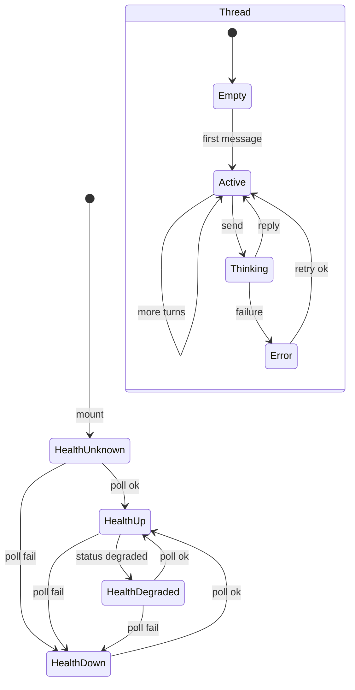

# Phase 12 — UI Design Contract

> Visual and interaction contract for the **Dashboard Advisory Assistant** — conversational officer chat widget in the insights rail.
> Scope: `AdvisoryAssistantWidget` thread UX, send form, health gating (`up` / `degraded` / `down`), optional report attach, bilingual copy, accessibility.
> Out of scope: voice input (deferred), SSE streaming, citizen coach UI, auto status changes.

---

## Design System

| Property | Value |
|----------|-------|
| Tool | shadcn (initialized — `components.json`) |
| Preset | `style: radix-nova`, `baseColor: neutral`, CSS variables; `--primary` = `#3b71f7` |
| Component library | Radix (via shadcn) |
| Icon library | lucide-react (`Paperclip`, `Mic`, `ArrowUp`, `Loader2`, `X`) |
| Font | Google Sans / Google Sans Text (400 / 600) — inherits dashboard |
| Register | **product** (officer ops tool) |

**Widget primitives (reuse, do not reinvent):**

| Primitive | Usage |
|-----------|-------|
| `WidgetCard` | Outer chrome: title, `surface-card`, `rounded-2xl`, header padding |
| shadcn `Button` | Attach, voice (disabled), send |
| shadcn `Input` | Message field inside pill bar |
| shadcn `Alert` | Degraded health banner (amber); optional history load error |
| shadcn `Popover` or `Dialog` | Report attach picker (when attach enabled) |
| shadcn `Badge` | Attached report chip |
| `cn()` | Bubble alignment classes |

**Registry:** shadcn official only — `registries: {}`. No third-party blocks.

---

## Placement & Shell

| Property | Contract |
|----------|----------|
| Location | Third card in `DashboardInsightsRail` (`dash-rise-delay-3`) |
| Layout contexts | `layout="rail"` (sidebar column on map view) and `layout="grid"` (dashboard home) |
| Card min-height | `min-h-[280px]` on inner flex column |
| Card title | `dashboard.widgets.assistantTitle` via `WidgetCard` |
| Rail gap | `gap-4` between insight widgets (inherits rail) |
| Animation | Card entry: `dash-rise dash-rise-delay-3` (220ms); honor `prefers-reduced-motion` |

---

## Spacing Scale

Inherits Phase 3 8-point scale:

| Token | Value | Widget usage |
|-------|-------|--------------|
| xs | 4px | Bubble inner gap; icon-to-label in thinking row |
| sm | 8px | Thread message stack (`gap-2`); form icon gaps |
| md | 16px | Card inner column (`gap-4`); bubble padding `px-3 py-2` |
| lg | 24px | — |
| xl | 32px | — |

**Exceptions:**
- **44px** min touch height: send button `size-10` (40px) → use `min-h-11` / `size-11` if audit fails; attach/voice `size-9` acceptable only when paired with `min-h-11` hit padding on form row
- Empty-state sphere container: `h-24` (96px)
- Thread scroll region: `min-h-24` (96px), `max-h-40` (160px)

---

## Typography

Product register — 4 sizes, 2 weights (inherits Phase 3):

| Role | Size | Weight | Line Height | Widget usage |
|------|------|--------|-------------|--------------|
| Caption | 12px (`text-xs`) | 400 | 1.625 (`leading-relaxed`) | Disclaimer, error text, bubble body, thinking label |
| Label | 14px (`text-sm`) | 400 | 1.4 | Attach chip, degraded alert body |
| Heading | 16px (`text-base`) | 600 | 1.2 | `WidgetCard` title only |
| Body | 16px (`text-base`) | 400 | 1.5 | Not used inside widget body — widget stays compact at Caption |

**Rules:**
- Message bubbles use **Caption 12px** for density in narrow rail.
- No Display size in widget.
- `font-heading` on card title only.

---

## Color

60 / 30 / 10 — live tokens from `globals.css`:

| Role | Token / Value | Widget usage |
|------|---------------|--------------|
| Dominant (60%) | `--background` `#f5f7fb` | Page canvas behind card |
| Secondary (30%) | `--card` `#ffffff`, `--muted` `#f0f3f9` | Card surface; assistant bubbles; form bar `bg-muted/50` |
| Accent (10%) | `--primary` `#3b71f7` | Send button fill; sphere gradient; user bubble tint `bg-primary/10` |
| Destructive | `--destructive` `#dc2626` | Send error text (`text-destructive`) |
| Amber (semantic) | `border-amber-500/40 bg-amber-50 text-amber-900` | Degraded health alert — matches `AiHealthChip` |

**Accent reserved for (widget only):**
1. Primary send button (`bg-primary`)
2. User message bubble wash (`bg-primary/10`)
3. Empty-state sphere gradient (decorative; `aria-hidden`)
4. Focus rings on input and icon buttons

**Not accent:** assistant bubbles (`bg-muted`), disclaimer text (`text-muted-foreground`), disabled attach/voice icons.

---

## Widget States Overview

| Health status | Input | Disclaimer area | Banner |
|---------------|-------|-----------------|--------|
| `unknown` (initial) | **Enabled** (optimistic) | `assistantDisclaimer` | None; optional subtle skeleton on disclaimer only |
| `up` | Enabled | `assistantDisclaimer` | None |
| `degraded` | Enabled | `assistantDegradedWarning` (replaces disclaimer) | Amber `Alert` above thread |
| `down` | **Disabled** | `assistantUnavailable` | None (copy is the banner) |

**P12-D-04 (auto default):** Block send only on confirmed `down`. Do **not** block on `unknown` or `degraded`.

---

## Chat Thread Layout

### Structure (top → bottom inside `WidgetCard` body)

1. **Thread region** — empty state OR scrollable message list
2. **Health banner** — amber `Alert` when `degraded` only
3. **Disclaimer / status line** — single centered caption (`text-xs text-muted-foreground text-center`)
4. **Error line** — `role="alert"` destructive caption when send fails
5. **Attached report chip** — when `reportId` set (attach enabled)
6. **Send form** — pill bar pinned with `mt-auto`

### Empty state (no messages)

| Property | Contract |
|----------|----------|
| Visibility | `history.length === 0` and not loading history |
| Layout | `relative flex h-24 w-full shrink-0 items-center justify-center` |
| Orbit | `.assistant-orbit` — `size-24`, dashed `border-primary/25`, `aria-hidden` |
| Sphere | `.assistant-sphere` — `size-16`, `aria-hidden` |
| Copy | **No heading** — visual-only idle state; officers read disclaimer below |
| SR | Parent region `aria-label={t("assistantTitle")}`; sphere/orbit decorative only |

### Active thread (≥1 message)

| Property | Contract |
|----------|----------|
| Container | `flex max-h-40 min-h-24 flex-col gap-2 overflow-y-auto pr-1` |
| Scroll | Auto-scroll to bottom on new message or thinking row (`scrollTop = scrollHeight`) |
| Live region | `aria-live="polite"` `aria-relevant="additions"` on thread container |
| Keys | Stable `message_id` from server when persisted; fallback `role-index` only during MVP |

### Message bubbles

| Role | Alignment | Classes | Text |
|------|-----------|---------|------|
| User | Right-ish | `ml-6 rounded-xl px-3 py-2 text-xs leading-relaxed bg-primary/10 text-foreground` | Plain text; no markdown |
| Assistant | Left-ish | `mr-4 rounded-xl px-3 py-2 text-xs leading-relaxed bg-muted text-muted-foreground` | Plain text |
| Thinking | Left (assistant slot) | `mr-4 flex items-center gap-2 rounded-xl bg-muted px-3 py-2 text-xs text-muted-foreground` | `Loader2` spin + `assistantThinking` |

**Rules:**
- No avatars, timestamps, or role labels in bubbles (compact rail).
- Preserve whitespace; `whitespace-pre-wrap` if multiline replies.
- Max content width implied by bubble margins (`ml-6` / `mr-4`).

### History loading (production)

| Property | Contract |
|----------|----------|
| On mount | `GET /api/officer/assistant/messages` loads persisted turns |
| Loading UI | Replace thread with `Loader2` + `assistantLoading` centered in thread region (`min-h-24`) |
| Load error | Amber or muted caption `assistantLoadError`; thread stays empty; send still allowed if health ≠ down |
| Empty after load | Show sphere empty state |

---

## Send Form (Pill Bar)

| Property | Contract |
|----------|----------|
| Element | `<form>` with `onSubmit` |
| Shape | `rounded-full border border-border bg-muted/50 p-1.5 pl-3` |
| Layout | `flex w-full items-center gap-2 mt-auto` |
| Field | shadcn `Input` — `border-0 bg-transparent shadow-none focus-visible:ring-0`, `min-h-9 flex-1` |
| Placeholder | `assistantPlaceholder` |
| Submit | Icon-only primary circle — `ArrowUp` default, `Loader2` spin when `isSending` |
| Disabled send | `!canSend` where `canSend = trimmedQuery && !isSending && health !== "down"` |
| Draft restore | On send error, restore `query` to failed message and roll back optimistic user bubble |

### Attach button — two modes

| Mode | When | Button | Behavior |
|------|------|--------|----------|
| **Coming soon** | Feature flag off / Wave 0 | `disabled`, `title={assistantAttachSoon}` | `Paperclip` ghost icon, `aria-label={assistantAttach}` |
| **Enabled** | Phase 12 attach shipped | Enabled when health ≠ `down` | Opens `Popover` with report picker; sets `reportId` on selection |

**When attach enabled:**
- Selected report shown as `Badge` row above form: `assistantAttachedReport` with `{reportId}` truncated (8 chars + ellipsis)
- Detach: `X` icon button `aria-label={assistantDetach}` clears `reportId`
- Send body includes `report_id` when attached
- Attach icon: `text-primary` when report selected; `text-muted-foreground` when not

### Voice button (deferred)

| Property | Contract |
|----------|----------|
| State | Always `disabled` Phase 12 |
| Icon | `Mic` ghost `size-9` |
| Tooltip | `title={assistantVoiceSoon}` |
| `aria-label` | `assistantVoice` |

---

## Health & Availability UX

### Unavailable (`down`)

| Property | Contract |
|----------|----------|
| Input | `disabled` |
| Attach / voice | `disabled` |
| Send | `disabled` |
| Disclaimer | Replace with `assistantUnavailable` (centered caption) |
| Thread | **Remain visible** — officers can read prior messages |
| SR hint | `#assistant-hint` sr-only reads `assistantUnavailable` |

### Degraded (`degraded`)

| Property | Contract |
|----------|----------|
| Input | Enabled |
| Send | Enabled |
| Banner | shadcn `Alert` with `border-amber-500/40 bg-amber-50 text-amber-900` above disclaimer |
| Alert copy | `assistantDegradedWarning` |
| Disclaimer line | Hidden while degraded banner shown (avoid duplicate) |
| Pattern | Align `AiHealthChip` amber semantics; do not copy coach `aiDownWarning` verbatim |

### Unknown (initial poll)

| Property | Contract |
|----------|----------|
| Input | **Enabled** (fix MVP pitfall — do not treat `unknown` as down) |
| Disclaimer | `assistantDisclaimer` |
| Optional | Disclaimer `opacity-70` until first successful health response |

### Health polling

| Property | Contract |
|----------|----------|
| Endpoint | `GET /api/health/ai` |
| Interval | 60s |
| Failure | Set status `down` |

---

## Loading / Thinking State

| State | UI |
|-------|-----|
| `isSending` | Optimistic user bubble appended immediately; thinking row below with `Loader2 size-3.5 animate-spin` + `assistantThinking` |
| Send button | Shows `Loader2` instead of `ArrowUp`; `disabled` via `isSending` |
| Input | `disabled` while sending |
| Thread | Stays visible; `aria-live` announces thinking row when added |

---

## Error State

| Property | Contract |
|----------|----------|
| Trigger | Non-OK POST, empty reply, network error |
| Display | `
` |
| Copy | Server `detail` when safe; else `assistantError` |
| Recovery | Restore draft message; remove optimistic user turn |
| Persistence | Error clears on next successful send or new input focus (optional) |

No destructive `Alert` component for inline send errors — caption is sufficient in compact widget.

---

## Copywriting Contract

Namespace: `dashboard.widgets` in `messages/en.json` and `messages/vi.json`. All user-visible strings via `useTranslations("dashboard.widgets")`.

### Existing keys (keep)

| Key | EN | VI |
|-----|----|----|
| `assistantTitle` | Advisory assistant | Trợ lý tư vấn |
| `assistantDisclaimer` | AI suggestions stay advisory. Open a report to review structured analysis before deciding. | Gợi ý AI chỉ mang tính tham khảo. Mở báo cáo để xem phân tích trước khi quyết định. |
| `assistantPlaceholder` | Ask me anything… | Hỏi tôi bất cứ điều gì… |
| `assistantAttach` | Attach context | Đính kèm ngữ cảnh |
| `assistantVoice` | Voice input | Nhập giọng nói |
| `assistantSend` | Send message | Gửi tin nhắn |
| `assistantThinking` | Thinking… | Đang suy nghĩ… |
| `assistantError` | Could not reach the assistant. Try again. | Không thể kết nối trợ lý. Vui lòng thử lại. |
| `assistantUnavailable` | AI assistant is unavailable. Check AI health or try again later. | Trợ lý AI tạm thời không khả dụng. Kiểm tra trạng thái AI hoặc thử lại sau. |
| `assistantHint` | Ask about triage fields, dashboard workflow, or review practices. | Hỏi về trường phân loại, quy trình bảng điều khiển hoặc thực hành rà soát. |
| `assistantAttachSoon` | Attach report context — coming soon | Đính kèm ngữ cảnh báo cáo — sắp ra mắt |
| `assistantVoiceSoon` | Voice input — coming soon | Nhập giọng nói — sắp ra mắt |

### New keys (add in implementation)

| Key | EN | VI |
|-----|----|----|
| `assistantDegradedWarning` | AI is responding slowly. Replies may take longer — suggestions remain advisory. | AI đang phản hồi chậm. Có thể mất thêm thời gian — gợi ý vẫn chỉ mang tính tham khảo. |
| `assistantLoading` | Loading conversation… | Đang tải hội thoại… |
| `assistantLoadError` | Could not load earlier messages. You can still send a new message. | Không thể tải tin nhắn trước đó. Bạn vẫn có thể gửi tin nhắn mới. |
| `assistantAttachedReport` | Attached: {reportId} | Đã đính kèm: {reportId} |
| `assistantDetach` | Remove attached report | Gỡ báo cáo đính kèm |
| `assistantAttachPick` | Attach a report for context | Đính kèm báo cáo làm ngữ cảnh |
| `assistantAttachEmpty` | No report selected | Chưa chọn báo cáo |

### CTA summary

| Element | Copy |
|---------|------|
| Primary CTA | **Send message** / **Gửi tin nhắn** (`assistantSend`) |
| Empty state | Visual sphere only — no CTA text |
| Error state | `assistantError` + restored draft |
| Destructive actions | **None** — advisory chat has no destructive officer actions in widget |

**Cleanup (optional):** `assistantComingSoon` is stale — remove or repurpose; widget is live.

---

## Accessibility

| Requirement | Contract |
|-------------|----------|
| Standard | WCAG 2.2 AA |
| Thread updates | `aria-live="polite"` `aria-relevant="additions"` on scroll container when messages exist |
| Input hint | `aria-describedby="assistant-hint"` on `Input` |
| SR-only hint | `#assistant-hint.sr-only` — `assistantHint` when available; `assistantUnavailable` when down |
| Icon buttons | `aria-label` from i18n (`assistantAttach`, `assistantVoice`, `assistantSend`, `assistantDetach`) |
| Decorative motion | Sphere/orbit `aria-hidden="true"` |
| Error | `role="alert"` on error caption |
| Degraded | `Alert` role implicit via shadcn; text in `AlertDescription` |
| Focus | Visible `--ring` on input and buttons; send button disabled state still focusable for SR |
| Touch | Send ≥44px; form row min-height 44px |
| Reduced motion | `@media (prefers-reduced-motion: reduce)` — `.assistant-orbit, .assistant-sphere { animation: none !important }` (already in `globals.css`) |
| Keyboard | Enter submits form; Shift+Enter not required (single-line input) |
| Color | Degraded/down never color-only — always paired text |

---

## Motion

| Element | Motion | Reduced motion |
|---------|--------|----------------|
| Card entry | `dash-rise` 220ms | Instant per globals |
| Sphere float | `assistant-float` 4s alternate | Static |
| Orbit spin | `assistant-spin` 18s linear | Static |
| Thinking | `Loader2` spin | OK — functional |
| Send button | Spin while sending | OK — functional |

No decorative motion beyond empty-state sphere. No bubble entrance animations.

---

## Interaction Flow

1. Officer opens dashboard → widget mounts in insights rail.
2. Widget polls `/api/health/ai`; loads history via GET (production).
3. **Empty:** sphere idle + disclaimer.
4. Officer types → Send enabled when trimmed text and health ≠ `down`.
5. **Optional attach:** pick report → chip appears → POST includes `report_id`.
6. Optimistic user bubble → thinking row → assistant bubble on success.
7. On error: rollback optimistic turn, restore draft, show `role="alert"` error.
8. Health transitions update banner/input disabled state without clearing thread.

---

## Anti-patterns

| Anti-pattern | Why banned |
|--------------|------------|
| Block input on `unknown` health | False unavailable on first paint (Pitfall 4) |
| Block input on `degraded` | Violates P12-D-04 / coach pattern |
| Clear thread when AI down | Officers lose context |
| Client-sent `history` in production UI | Tamper risk — server loads persisted turns |
| Inline English strings | Violates bilingual requirement |
| Streaming partial tokens | Out of scope (P12-D-06) |
| Voice STT enabled without stack | Deferred P12-D-05 |
| Assistant styled as decision authority | Primary flood / “Resolve” language forbidden |
| Coach API or UI reuse | Wrong auth principal |
| Timestamps on every bubble in rail | Clutter at 280px width |

---

## Registry Safety

| Registry | Blocks Used | Safety Gate |
|----------|-------------|-------------|
| shadcn official | `button`, `input`, `alert`, `badge`, `popover` (if attach enabled) | not required |
| Third-party | none | n/a |

---

## Checker Sign-Off

- [ ] Dimension 1 Copywriting: PASS
- [ ] Dimension 2 Visuals: PASS
- [ ] Dimension 3 Color: PASS
- [ ] Dimension 4 Typography: PASS
- [ ] Dimension 5 Spacing: PASS
- [ ] Dimension 6 Registry Safety: PASS

**Approval:** pending

---

## UI-SPEC COMPLETE

**Phase:** 12 — Dashboard advisory assistant — conversational officer chat widget  
**Design System:** shadcn radix-nova + CityMind Blue tokens

### Contract Summary
- Spacing: 8-point scale; widget uses 4/8/16px; 44px touch targets on send row
- Typography: 4 roles; bubbles at 12px Caption; card title 16px semibold
- Color: 60% canvas, 30% card/muted bubbles, 10% primary on send + user bubbles; amber degraded; red destructive errors
- Copywriting: 12 existing + 7 new bilingual keys; CTA “Send message”
- Registry: shadcn official only

### File Created
`.planning/phases/12-dashboard-advisory-assistant-conversational-officer-chat-wid/12-UI-SPEC.md`

### Pre-Populated From
| Source | Decisions Used |
|--------|---------------|
| 12-RESEARCH.md | 18 (placement, health, attach, persistence, coach differentiation) |
| AdvisoryAssistantWidget.tsx | 12 (live class names, structure, MVP behavior) |
| 03-UI-SPEC.md | 8 (spacing, typography, product register, a11y baseline) |
| CoachPanel.tsx | 3 (down-only block, error restore pattern) |
| components.json | 6 (shadcn preset, icons, primitives) |
| messages/en.json + vi.json | 12 (existing assistant keys) |
| User input | 0 (--auto defaults) |

### Ready for Verification
UI-SPEC complete. Checker can now validate.
