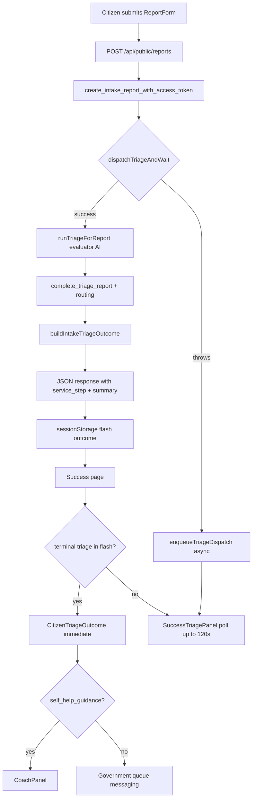

# Phase 13: Immediate Citizen Triage on Submit — Research

**Researched:** 2026-07-22  
**Domain:** Synchronous citizen intake triage, evaluator-spec AI output, success-page self-help vs government UX  
**Confidence:** HIGH (implementation verified in repo); MEDIUM (timeout/UAT edge cases need human confirmation)

## Summary

Phase 13 shifts the citizen submit path from **push-primary async triage** (Phase 11 D-09) to **synchronous evaluator triage during `POST /api/public/reports`**, then renders immediate routing guidance on a redesigned success page. The core implementation is **already present in the working tree** — this phase is predominantly **verification, contract testing, documentation alignment, and UI-SPEC hardening**, not greenfield feature build.

Verified implementation chain:

1. `submitReport` persists intake, calls `dispatchTriageAndWait`, builds outcome via `projectCitizenTriageView`, returns extended `ReportSubmissionResponse` with `service_step` and AI summary fields. [VERIFIED: `src/server/services/report-service.ts`]
2. `dispatchTriageAndWait` forces claim + awaits `runTriageForReport` (evaluator prompt path in `src/server/triage/service.ts`). On throw, `enqueueTriageDispatch` fires async fallback. [VERIFIED: `src/server/triage/dispatch.ts`, `report-service.test.ts`]
3. `ReportForm` stores flash payload including `outcome` object; success page shows `CitizenTriageOutcome` when terminal triage is present, else `SuccessTriagePanel` poll fallback (120s timeout). [VERIFIED: `ReportForm.tsx`, `success/page.tsx`, `CitizenTriageOutcome.tsx`, `SuccessTriagePanel.tsx`]
4. Migration `20260722170002_reports_triage_status_retry.sql` adds `retry` status and updates `claim_triage_report` — user reports applied. [VERIFIED: migration file; retry contract partially covered in `11_phase11_contract.sql`]

**Primary recommendation:** Plan Phase 13 as **3 waves of hardening** — (W0) UI-SPEC + contract tests + fix stale legacy assertions, (W1) dispatch wait-mode tests + `phase13:gate`, (W2) REQUIREMENTS/ROADMAP/`ai-logic.md` traceability + human UAT checklist. Do **not** re-implement triage or coach APIs from Phase 11.

<phase_requirements>
## Phase Requirements

| ID | Description | Research Support |
|----|-------------|------------------|
| SHELP-01 | Success page branches after triage — self_help opens coach; government shows queue messaging | **DONE** — `CitizenTriageOutcome` + flash `outcome`; coach embedded for `self_help_guidance` |
| SHELP-02 | Token-scoped coach chat API | **DONE (Phase 11)** — `/api/public/reports/coach/messages`; Phase 13 consumes on success page |
| SHELP-03 | Coach uses distinct prompt from triage | **DONE (Phase 11)** — `src/server/ai/coach.ts` vs evaluator prompt |
| SHELP-04 | Escalate CTA always available | **DONE** — `CoachPanel` escalate + government path status link |
| SHELP-05 | Bilingual EN/VI, loading/error, triage progress on success | **PARTIAL** — `public.successOutcome` + `formAnalyzing`; sync path shows immediate outcome; poll fallback retains Phase 11 behavior; **needs UI-SPEC + contract tests** |
| TRIAGE-09..11 | 11-key evaluator schema, prompt, policy | **DONE (Phase 11)** — consumed by sync `runTriageForReport`; no Phase 13 schema work |
| TRIAGE-12 | Push dispatch on intake | **SUPERSEDED for citizen path** — sync `dispatchTriageAndWait` is primary; `enqueueTriageDispatch` is failure fallback only; officer/internal push unchanged |
| TRIAGE-13 | UX contracts (failed copy, officer elevation) | **DONE (Phase 11)** — `citizen-status-contract.test.mjs`; Phase 13 adds success-page branching contracts |
| TRIAGE-14 | Eval 11-key alignment | **DONE (Phase 11)** — `phase11:gate` |
| CIT-01..04 | Token status lookup | **UNCHANGED** — `projectCitizenTriageView` already exposes AI fields for self_help |
| PUB-03 | RHF + Zod report form | **DONE** — unchanged |
| PUB-04 | Success shows report_id + token + status link | **EXTENDED** — now includes immediate triage outcome block |
| PUB-06 | Mobile-responsive, accessible | **PARTIAL** — component uses shadcn Alert/Badge; **needs 13-UI-SPEC audit** |
</phase_requirements>

## Architectural Responsibility Map

| Capability | Primary Tier | Secondary Tier | Rationale |
|------------|-------------|----------------|-----------|
| Synchronous evaluator triage on submit | API / Backend | — | `submitReport` blocks on `dispatchTriageAndWait` before JSON response |
| Triage claim + AI call + routing | API / Backend | Database | `runTriageForReport` + `complete_triage_report` RPC |
| Async triage fallback | API / Backend | Background worker | `enqueueTriageDispatch` → internal route; worker still claims `retry` rows |
| Outcome projection (hide AI when pending/failed) | API / Backend | — | `projectCitizenTriageView` enforces citizen-safe fields |
| Submit loading UX | Browser / Client | — | `ReportForm` `isSubmitting` + `formAnalyzing` copy during long POST |
| Immediate success outcome UI | Browser / Client | — | `CitizenTriageOutcome` from sessionStorage flash |
| Poll fallback when sync incomplete | Browser / Client | API | `SuccessTriagePanel` polls `/api/public/reports/status` up to 120s |
| Coach chat on self_help path | Browser / Client | API | `CoachPanel` → coach messages API (Phase 11) |
| Retry status + worker claim | Database / Storage | API | Migration `20260722170002`; `claim_triage_report` |

## Gap Analysis: Done vs Remaining

| Area | Status | Evidence | Remaining for Phase 13 plans |
|------|--------|----------|------------------------------|
| `submitReport` → sync triage | **DONE** | `report-service.ts:222-237` | Extend tests for government-path outcome projection |
| `dispatchTriageAndWait` | **DONE** | `dispatch.ts:129-135` | Add `wait`/`force` unit tests (not in `dispatch.test.ts`) |
| Async fallback on sync failure | **DONE** | `report-service.test.ts` enqueue tests | Document in UI-SPEC as degraded path |
| `CitizenTriageOutcome` component | **DONE** | `CitizenTriageOutcome.tsx` | Contract test file; EN/VI key parity for `successOutcome` |
| Success page branching | **DONE** | `success/page.tsx:120-155` | Legacy `report-form.test.mjs` does not assert `CitizenTriageOutcome` |
| Flash `outcome` payload | **DONE** | `ReportForm.tsx:151-168` | Contract: outcome fields match API response shape |
| Evaluator prompt runtime | **DONE (P11)** | `openai-compatible.ts`, evaluator JSON | None — verify only |
| `retry` migration | **DONE (applied)** | `20260722170002_*.sql` | Optional: `13_phase13_contract.sql` smoke for dispatch eligibility includes `retry` |
| `citizen-status` AI fields | **DONE** | `citizen-status.ts:101-117` | None |
| Submit timeout UX | **PARTIAL** | `AI_TIMEOUT_MS` default 60s; `formAnalyzing` copy | UI-SPEC: max wait copy, no provider leakage on slow submit; consider fetch timeout guidance |
| Poll timeout UX (fallback) | **DONE** | `SuccessTriagePanel` 120s → `coach.pollTimeout` | Document as secondary path only |
| `13-UI-SPEC.md` | **MISSING** | No file in phase dir | **Required** (`workflow.ui_safety_gate: true`) |
| `phase13:gate` script | **MISSING** | `package.json` has `phase11:gate`, `phase12:gate` only | Add composite gate per Validation Architecture |
| `13_phase13_contract.sql` | **MISSING** | — | Optional SQL gate for sync-intake + retry claim integration |
| REQUIREMENTS traceability | **STALE** | SHELP/TRIAGE still "Phase 11 Pending" | Remap closed items to Phase 13; note TRIAGE-12 citizen-path override |
| ROADMAP Phase 13 requirements | **TBD** | `ROADMAP.md:431` | Fill requirement IDs after plan lock |
| `ai-logic.md` | **STALE** | Still describes push-primary intake | Update executive summary for sync citizen path |
| Legacy test drift | **STALE** | `report-form.test.mjs` expects old `successBody` / `analyzing` keys | Update assertions to match `messages/en.json` |
| Phase 11 CONTEXT D-02 | **SUPERSEDED** | "Poll on success until terminal" | Primary path is sync; poll is fallback only — document override |

## Recommended Plan Waves

| Wave | Focus | Net-new build? |
|------|-------|----------------|
| **W0 — Contracts & UI-SPEC** | `13-UI-SPEC.md`, extend `report-form.test.mjs` / new `citizen-success-triage.test.mjs`, fix stale catalog assertions, EN/VI `successOutcome` parity test | No — tests + spec only |
| **W1 — Service hardening** | `dispatchTriageAndWait` tests (`wait`/`force`), government vs self_help outcome in `report-service.test.ts`, `phase13:gate` npm script | Minimal code only if tests expose bugs |
| **W2 — Traceability & gate** | Update `REQUIREMENTS.md` mapping, `ROADMAP.md` requirement list, `ai-logic.md` sync flow, `13-VALIDATION.md`, human UAT checklist (submit → immediate coach vs government) | Docs + verification |

**Do not plan:** Rebuilding coach API, evaluator schema, or dashboard triage actions (Phase 11/12 scope).

## Standard Stack

### Core

| Library | Version | Purpose | Why Standard |
|---------|---------|---------|--------------|
| next | 16.2.10 | App Router API + success page | Project stack [VERIFIED: `package.json`] |
| @supabase/supabase-js | 2.110.7 | Intake + triage persistence | Existing data layer |
| zod | 4.4.3 | Evaluator output validation | Phase 11 evaluator conformance |
| next-intl | 4.13.2 | EN/VI success outcome copy | Bilingual citizen UX |
| vitest | (dev) | Unit tests | `npm run test:unit` |

### Supporting

| Library | Version | Purpose | When to Use |
|---------|---------|---------|-------------|
| react-hook-form | 7.82.0 | Submit form state | `isSubmitting` during sync triage wait |
| lucide-react | 1.25.0 | Success outcome icons | `CitizenTriageOutcome` |

**No new packages required for Phase 13.** Installation step: none.

## Package Legitimacy Audit

No external packages are introduced in this phase. Existing dependencies only.

**Packages removed due to slopcheck [SLOP] verdict:** none  
**Packages flagged as suspicious [SUS]:** none

## Architecture Patterns

### System Architecture Diagram



### Pattern 1: Sync triage with async safety net

**What:** Block intake response until triage completes or errors; never fail intake on AI errors.  
**When to use:** Citizen submit path only (officer push dispatch unchanged).  
**Example:**

```typescript
// Source: src/server/services/report-service.ts (verified in repo)
const runTriage = deps.dispatchTriageAndWait ?? dispatchTriageAndWait;
try {
  await runTriage(reportId, { client: deps.client });
} catch (triageError) {
  console.error(`submitReport: synchronous triage failed for ${reportId}`, triageError);
  enqueueTriageDispatch(reportId);
}
const outcome = await buildIntakeTriageOutcome(deps.client, reportId);
```

### Pattern 2: Immediate vs poll success UI

**What:** Prefer flash `outcome` from sync response; fall back to status polling when `triage_status` is `pending`/`processing`.  
**When to use:** Success page render decision.  
**Example:**

```typescript
// Source: src/app/[locale]/report/success/page.tsx (verified in repo)
const showImmediateOutcome =
  outcome &&
  outcome.service_step !== "ai_review_pending" &&
  outcome.triage_status !== "pending" &&
  outcome.triage_status !== "processing";
```

### Anti-Patterns to Avoid

- **Calling `provider.analyze` in intake:** Legacy `/analyze` path; violates evaluator triage pipeline.
- **Putting access token in URL:** Flash/sessionStorage only (D-11/D-18).
- **Showing provider errors on success:** Use `automated_review_unavailable` / calm copy only.
- **Removing poll fallback:** Still needed when sync fails and async dispatch runs.

## Don't Hand-Roll

| Problem | Don't Build | Use Instead | Why |
|---------|-------------|-------------|-----|
| Evaluator JSON schema | Custom parser | `EvaluatorAnalysisSchema` + evaluator prompt JSON | 11-key policy assertions |
| Triage lifecycle | Ad-hoc status updates | `dispatchTriage` + `complete_triage_report` RPC | Idempotent claim, audit tables |
| Citizen routing | Second AI call | `applyRoutingForReport` + `projectCitizenTriageView` | Deterministic policy |
| Coach conversation | Inline triage prompt | `citizen-coach.ts` + `CoachPanel` | Role separation (SHELP-03) |

## Common Pitfalls

### Pitfall 1: Long submit blocking UX

**What goes wrong:** Citizen waits up to `AI_TIMEOUT_MS` (default 60s) on POST with only button disabled.  
**Why it happens:** Sync triage blocks HTTP response.  
**How to avoid:** Keep `formAnalyzing` copy; UI-SPEC loading state; fallback panel if response returns `pending`.  
**Warning signs:** User abandons form; gateway timeouts in non-loopback deploys.

### Pitfall 2: Stale Phase 11 docs contradict Phase 13

**What goes wrong:** Planner re-implements push-on-intake per `ai-logic.md` / D-09.  
**Why it happens:** Documentation not updated when sync path shipped.  
**How to avoid:** Wave 2 doc updates; mark TRIAGE-12 citizen intake as sync-primary in REQUIREMENTS.

### Pitfall 3: Legacy contract tests fail on copy changes

**What goes wrong:** `report-form.test.mjs` hard-codes old `successBody` string.  
**Why it happens:** Success page redesign updated `messages/en.json` without test update.  
**How to avoid:** Wave 0 update tests to read catalog or match new copy.

### Pitfall 4: Assuming sync always returns terminal triage

**What goes wrong:** Success page always shows `CitizenTriageOutcome` with empty AI fields.  
**Why it happens:** Race or dispatch failure leaves `pending`.  
**How to avoid:** Keep `SuccessTriagePanel` branch; test `showImmediateOutcome` conditions.

## Code Examples

### dispatchTriageAndWait entry point

```typescript
// Source: src/server/triage/dispatch.ts
export async function dispatchTriageAndWait(
  reportId: string,
  deps: DispatchDeps = { client: getAdminClient() },
): Promise<void> {
  await dispatchTriage(reportId, { ...deps, force: true, wait: true });
}
```

### Citizen-safe outcome projection

```typescript
// Source: src/server/services/citizen-status.ts
if (row.routing_destination === "self_help" && row.status !== "resolved" && row.status !== "rejected") {
  return {
    ...base,
    service_step: "self_help_guidance",
    category: row.category,
    summary: row.summary,
    recommendation: row.recommendation,
    playbook_id: resolvePlaybookId(row.category),
    can_escalate: true,
  };
}
```

## State of the Art

| Old Approach | Current Approach | When Changed | Impact |
|--------------|------------------|--------------|--------|
| Push triage on intake (Phase 11 D-09) | Sync `dispatchTriageAndWait` on intake | Phase 13 (pre-planned implementation) | Success page gets immediate outcome |
| Success page poll-only (Phase 11 D-02) | Immediate outcome + poll fallback | Phase 13 | `SuccessTriagePanel` secondary |
| Legacy 9-field analysis | 11-key evaluator via `analyzeStructured` | Phase 11 | Sync path uses same runner |

**Deprecated/outdated:**
- `.planning/codebase/ai-logic.md` intake diagram — still shows push-primary; needs Phase 13 update.

## Assumptions Log

| # | Claim | Section | Risk if Wrong |
|---|-------|---------|---------------|
| A1 | Migration `20260722170002` applied on target Supabase | Gap analysis | `retry` dispatch/worker failures |
| A2 | 60s `AI_TIMEOUT_MS` acceptable for citizen submit wait | Pitfall 1 | UX abandonment; proxy timeouts |
| A3 | Phase 13 does not change officer/async worker primary behavior | Summary | Accidental regression if planner modifies worker-only paths |

## Open Questions

1. **Should `phase13:gate` include live AI submit smoke?**
   - What we know: Phase 11/12 gates are mostly unit + SQL + legacy contracts.
   - What's unclear: Whether human UAT is sufficient vs automated slow-path test with mock provider.
   - Recommendation: Mock-provider integration test in gate; live AI in human UAT only.

2. **HTTP proxy / reverse-proxy timeout for sync submit**
   - What we know: Self-hosted loopback-first; `AI_TIMEOUT_MS` max 120s.
   - What's unclear: Production edge timeout if deployed beyond laptop.
   - Recommendation: Document in UI-SPEC; flag if `AI_TIMEOUT_MS` > proxy limit.

## Environment Availability

| Dependency | Required By | Available | Version | Fallback |
|------------|------------|-----------|---------|----------|
| Node.js | Next.js runtime | ✓ | v25.2.1 (detected) | — |
| npm | test/gate scripts | ✓ | 11.6.2 | — |
| Supabase Postgres | intake + triage RPCs | ✓ (user applied migrations) | — | SQL gates skip if `SUPABASE_DB_URL` missing |
| AI provider (`THIRD_PARTY_API_KEY`) | sync triage on submit | ✓ (dev `.env.local`) | — | Async fallback + calm unavailable UX |
| `INTERNAL_TRIAGE_SECRET` | async enqueue fallback | ✓ if configured | — | Enqueue no-ops when secret < 32 chars |

**Missing dependencies with no fallback:** None for code-only waves.  
**Missing dependencies with fallback:** Supabase URL absent → SQL contract tasks marked BLOCKING per GSD convention.

## Validation Architecture

### Test Framework

| Property | Value |
|----------|-------|
| Framework | Vitest + node:test (`package.json`) |
| Config file | `vitest.config.mts` |
| Quick run command | `npm run test:unit -- src/server/services/report-service.test.ts src/server/triage/dispatch.test.ts` |
| Full suite command | `npm run test` |

### Phase Requirements → Test Map

| Req ID | Behavior | Test Type | Automated Command | File Exists? |
|--------|----------|-----------|-------------------|-------------|
| SHELP-01 | Success branches self_help vs government | legacy contract | `npm run test:legacy -- tests/citizen-success-triage.test.mjs` | ❌ Wave 0 |
| SHELP-01 | Flash stores `outcome` from API | legacy contract | same | ❌ Wave 0 |
| SHELP-05 | EN/VI `successOutcome` keys parity | legacy | `npm run test:legacy -- tests/report-form.test.mjs` | ✅ extend |
| SHELP-05 | Poll timeout fallback copy | unit/legacy | extend `SuccessTriagePanel` or contract | ❌ Wave 0 |
| TRIAGE-12 (citizen) | Sync triage on submit | unit | `npm run test:unit -- src/server/services/report-service.test.ts -t submit` | ✅ |
| TRIAGE-12 (citizen) | Async fallback on sync throw | unit | same `-t fallback` | ✅ |
| TRIAGE-12 | `dispatchTriageAndWait` forces wait | unit | `npm run test:unit -- src/server/triage/dispatch.test.ts` | ❌ Wave 1 |
| CIT-02 | Self_help exposes summary on status | unit | `npm run test:unit -- src/server/services/citizen-status.test.ts` | ✅ extend |
| PUB-04 | Success flash ID/token/outcome | legacy | `tests/report-form.test.mjs` | ✅ extend |
| DB retry | `retry` in claim eligibility | SQL | `node scripts/run-supabase-sql.mjs -f supabase/tests/13_phase13_contract.sql` | ❌ Wave 1 optional |

### Sampling Rate

- **Per task commit:** `npm run test:unit -- src/server/services/report-service.test.ts src/server/triage/dispatch.test.ts`
- **Per wave merge:** `npm run phase13:gate` (to be added)
- **Phase gate:** Full `npm run test` + SQL contract + human UAT (sync submit both paths)

### Wave 0 Gaps

- [ ] `tests/citizen-success-triage.test.mjs` — SHELP-01 success branching contracts
- [ ] `13-UI-SPEC.md` — success page layout, loading, timeout, advisory disclaimer
- [ ] Fix `tests/report-form.test.mjs` stale `successBody` / analyzing key assertions
- [ ] `phase13:gate` script in `package.json`
- [ ] `13-VALIDATION.md` — gate command documentation

## Security Domain

### Applicable ASVS Categories

| ASVS Category | Applies | Standard Control |
|---------------|---------|------------------|
| V2 Authentication | no | Citizen path is token-scoped, not account auth |
| V3 Session Management | yes | Access token in sessionStorage flash only; hashed at rest |
| V4 Access Control | yes | Coach/status APIs require report_id + token binding |
| V5 Input Validation | yes | Zod on status/coach; FormData bounds on submit |
| V6 Cryptography | yes | SHA-256 token hash via `issueAccessToken` |

### Known Threat Patterns

| Pattern | STRIDE | Standard Mitigation |
|---------|--------|---------------------|
| Token leakage via URL | Information disclosure | sessionStorage flash; no query token |
| AI provider error leakage | Information disclosure | `projectCitizenTriageView` nulls AI fields on failed |
| Report enumeration | Information disclosure | Uniform 401 on status lookup |
| Slowloris on sync submit | DoS | Rate limit on POST; `AI_TIMEOUT_MS` bound |

## Project Constraints (from .cursor/rules/)

- GSD workflow: plan via `/gsd-plan-phase` before execution commits.
- Next.js 16 + Node 22+ only; Supabase for persistence.
- AI advisory only; officers retain authority.
- Bilingual EN/VI via next-intl.
- Access tokens hashed at rest; citizen lookup token-scoped.
- No direct repo edits outside GSD workflow unless user bypasses.

## Sources

### Primary (HIGH confidence)

- `src/server/services/report-service.ts` — sync intake + outcome build
- `src/server/triage/dispatch.ts` — `dispatchTriageAndWait`, enqueue fallback
- `src/components/coach/CitizenTriageOutcome.tsx` — success branching UI
- `src/app/[locale]/report/success/page.tsx` — immediate vs poll render
- `prompt/citymind_ai_triage_structured_output_evaluator.json` — evaluator spec
- `.planning/phases/11-triage-evaluator-spec-conformance/11-04-SUMMARY.md` — coach/success baseline

### Secondary (MEDIUM confidence)

- `.planning/REQUIREMENTS.md` — SHELP/TRIAGE/CIT/PUB IDs (traceability stale)
- `.planning/phases/11-triage-evaluator-spec-conformance/11-CONTEXT.md` — D-02 superseded for primary path
- `src/server/config/env.ts` — `AI_TIMEOUT_MS` default 60_000

### Tertiary (LOW confidence)

- Production reverse-proxy timeout limits for 60s+ POST — not verified in this session

## Metadata

**Confidence breakdown:**
- Standard stack: HIGH — no new packages; verified `package.json`
- Architecture: HIGH — implementation read in full
- Pitfalls: MEDIUM — timeout/proxy edge needs UAT

**Research date:** 2026-07-22  
**Valid until:** 2026-08-21 (stable domain; update if intake flow changes again)
