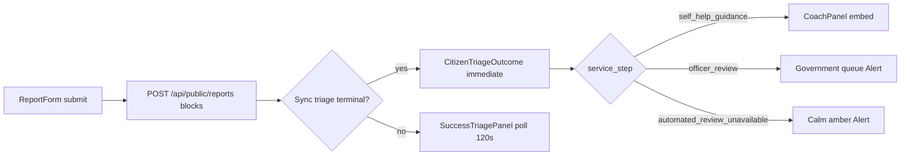

# Phase 13 — UI Design Contract

> Visual and interaction contract for **immediate citizen triage on submit** — sync submit loading, success-page outcome branches, and poll fallback.
> Scope: `ReportForm` analyzing state, `CitizenTriageOutcome`, `SuccessTriagePanel` fallback, success page flash handoff.
> Out of scope: Officer dashboard triage actions, evaluator schema changes, new coach API endpoints.

---

## User Journey

---

## Design System

| Property | Value |
|----------|-------|
| Tool | shadcn (initialized) |
| Preset | `radix-nova`, `neutral`, CSS variables; `--primary` = `#3b71f7` |
| Icon library | lucide-react (`Sparkles`, `Wrench`, `Building2`, `CheckCircle2`, `AlertTriangle`) |
| Font | Google Sans / Google Sans Text — inherits public pages |
| Register | **citizen** (public, calm, advisory) |

**Primitives:**

| Primitive | Usage |
|-----------|-------|
| shadcn `Button` | Submit (disabled while analyzing); copy actions on success |
| shadcn `Alert` | Government path, calm unavailable, token warning |
| shadcn `Badge` | Category / severity chips in outcome card |
| `CoachPanel` | Self-help path only — unchanged from Phase 11 |
| `cn()` | Card spacing, responsive flex |

---

## ReportForm — Submit Loading (D-13-01)

| Property | Contract |
|----------|----------|
| Submit label idle | `public.submitReport` |
| Submit label loading | `public.formAnalyzing` ("Reviewing your report…") — **not** legacy `public.analyzing` |
| Button state | `disabled={isSubmitting}` — entire form locked during sync triage wait |
| Max wait (server) | Bounded by `AI_TIMEOUT_MS` (default 60s) — no client-side fetch abort required in Phase 13 |
| Flash key | `citymind:report-success` — shared with success page |
| Flash payload | `{ reportId, accessToken, outcome: { service_step, triage_status, routing_destination, category, severity, priority, summary, recommendation, playbook_id, can_escalate } }` |
| Token in URL | **Forbidden** — sessionStorage only (D-11/D-18) |
| Legacy analyze path | **Forbidden** — must POST `/api/public/reports` only |

**Accessibility:**
- Submit button exposes loading via label change (not spinner-only)
- `aria-busy` on form optional; label change is minimum contract

---

## Success Page — Layout

| Property | Contract |
|----------|----------|
| Container | `max-w-2xl` centered card on `bg-background` |
| Heading | `public.successHeading` ("Report received") |
| Subcopy | `public.successBody` — "Your report is saved. Review the AI guidance below…" (`mt-2 text-sm text-muted-foreground`) |
| Outcome region | Below subcopy, above token warning |
| Token warning | Amber `Alert` — `public.tokenWarning` always visible |
| Copy fields | Report ID, access token, status link prep — unchanged PUB-04 |
| Redirect guard | Missing flash → `router.replace("/report")` |
| Live region | `aria-live` for copy confirmations |

---

## Branch Decision — Immediate vs Poll (D-13-02)

Render `CitizenTriageOutcome` when **all** true:

1. Flash `outcome` exists
2. `outcome.service_step !== "ai_review_pending"`
3. `outcome.triage_status` not in `pending` | `processing`

Otherwise render `SuccessTriagePanel` (poll fallback).

| Path | When | Component |
|------|------|-----------|
| **Primary** | Sync triage returned terminal outcome | `CitizenTriageOutcome` |
| **Fallback** | Sync failed, still pending/processing, or missing outcome fields | `SuccessTriagePanel` |

---

## CitizenTriageOutcome — Service Step Branches (SHELP-01)

### `automated_review_unavailable`

| Element | Contract |
|---------|----------|
| Component | Amber `Alert` with `AlertTriangle` |
| Copy | `public.triage.calmNoticeTitle` + `calmNoticeBody` |
| AI fields | No summary/recommendation shown |
| Provider leakage | **Forbidden** — no model names, API keys, stack traces |

### `ai_review_pending` (edge — should be rare on immediate path)

| Element | Contract |
|---------|----------|
| Copy | `public.coach.pollTimeout` |
| Note | Success page should prefer `SuccessTriagePanel` for true pending; this branch is defensive inside component |

### `self_help_guidance` (SHELP-01 self_help branch)

| Element | Contract |
|---------|----------|
| Card header | `public.successOutcome.eyebrow` + `title` |
| Advisory | `public.successOutcome.advisoryNote` — always visible |
| Path badge | `pathSelfHelp` with `Wrench` icon |
| Summary | `summary` or `recommendation` or `summaryFallback` |
| Coach | **Embed `CoachPanel`** — full chat, escalate CTA (SHELP-04) |
| Category | Localized via `public.category*` keys |

### `officer_review` / government path (SHELP-01 government branch)

| Element | Contract |
|---------|----------|
| Path badge | `pathGovernment` with `Building2` icon |
| Card body | `governmentNext` — queue messaging in summary card |
| Coach | **No CoachPanel** — government-first per Phase 11 D-04 |
| Escalate region | `Alert` with `public.routing.escalateTitle` + `public.coach.governmentPathBody` + `coach.openStatusPage` link (SHELP-04) |
| Status link | `/status?reportId=…&token=…` in escalate Alert only (not coach embed) |

---

## SuccessTriagePanel — Poll Fallback

| Property | Contract |
|----------|----------|
| Endpoint | `POST /api/public/reports/status` |
| Interval | 2s until 30s elapsed, then 5s |
| Timeout | 120s → `public.coach.pollTimeout` |
| Terminal statuses | `completed`, `failed`, `manual_review` |
| After terminal | Re-render branches same as status page (self_help → coach) |

---

## i18n Contract (SHELP-05, PUB-06)

### Required keys — `public.successOutcome` (EN/VI parity)

| Key | EN reference |
|-----|--------------|
| `eyebrow` | "AI review" |
| `title` | "What we found" |
| `advisoryNote` | "Advisory only — a city officer makes the final decision." |
| `summaryLabel` | "Summary" |
| `summaryFallback` | "Your report was reviewed. Follow the recommended steps below." |
| `pathSelfHelp` | "Try these steps first" |
| `pathGovernment` | "Sent to city officers" |
| `selfHelpNext` | Safe steps + escalate mention |
| `governmentNext` | Officer queue messaging |

### Submit loading

| Key | EN reference |
|-----|--------------|
| `formAnalyzing` | "Reviewing your report…" |

### Parity rule

`walkKeys(en.public)` must equal `walkKeys(vi.public)` — entire `public` namespace, not only successOutcome.

---

## Spacing & Typography

Inherits public page scale:

| Token | Usage |
|-------|-------|
| `mt-6` | Outcome section top margin from success subcopy |
| `space-y-5` | Outcome card internal stack |
| `rounded-xl border bg-card p-5 shadow-sm` | Outcome summary card |
| `text-2xl font-bold` | Success heading |
| `text-sm text-muted-foreground` | Success subcopy, advisory note |

**Touch targets:** Copy buttons `min-h-11` where present on success page.

---

## Color

| Role | Usage |
|------|-------|
| `--primary` | Brand header link, self-help accent |
| Amber alert | `automated_review_unavailable`, token warning |
| `--muted-foreground` | Subcopy, labels |
| Government badge | Neutral/muted — not primary accent |

---

## Accessibility Checklist (PUB-06)

- [ ] Success heading is `h1`
- [ ] Outcome section has `aria-labelledby` pointing to visible title
- [ ] Copy actions announce via `aria-live` region
- [ ] Alert icons `aria-hidden`
- [ ] Focus visible on header link and copy buttons
- [ ] Coach panel inherits Phase 11 a11y (message list, send form)
- [ ] No information conveyed by color alone for path badges (icon + text)

---

## Security / Privacy UI

| Rule | Contract |
|------|----------|
| Access token display | Once on success — token warning alert |
| Flash consumption | `removeItem` after read — one-shot |
| Failed triage | Calm copy only — no provider errors |
| Rate limit | Generic network error on submit — `formErrorNetwork` |

---

## Contract Test Mapping

| UI-SPEC section | Test file |
|-----------------|-----------|
| ReportForm flash + formAnalyzing | `tests/report-form.test.mjs` |
| Success branch decision | `tests/citizen-success-triage.test.mjs` |
| CitizenTriageOutcome branches | `tests/citizen-success-triage.test.mjs` |
| EN/VI successOutcome parity | `tests/report-form.test.mjs` or citizen-success-triage |

---

## Out of Scope

- Dashboard officer triage dispatch UI
- Evaluator prompt / 11-key schema changes
- SSE streaming for submit progress
- Client-side submit timeout shorter than server (future deploy concern)
