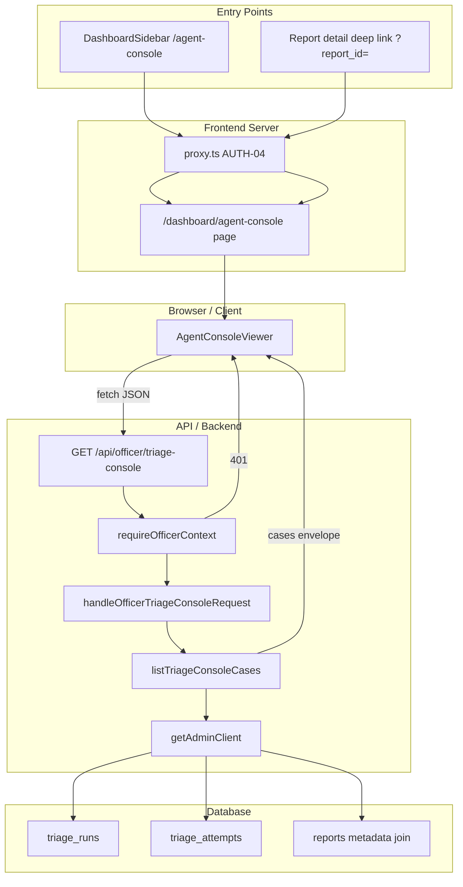

# Phase 14: Officer agent console — per-case triage run and attempt log viewer - Research

**Researched:** 2026-07-22
**Domain:** Officer dashboard read-only audit UI + API gate hardening (existing implementation)
**Confidence:** HIGH

## Summary

Phase 14 is **hardening and sign-off**, not greenfield. The full read path already ships: `AgentConsoleViewer` UI, `listTriageConsoleCases` repository, `handleOfficerTriageConsoleRequest` service, `GET /api/officer/triage-console`, `/dashboard/agent-console` page, sidebar nav, and report-detail deep link. Implementation aligns with locked decisions D-14-01 through D-14-16 in CONTEXT.md [VERIFIED: codebase grep].

Gaps are **process and contract artifacts**, not core features: no `phase14:gate`, no `14_phase14_contract.sql`, no legacy contract test for wiring, no `officer-triage-console.test.ts` for 401/502 paths, no `14-UI-SPEC.md` / `14-VALIDATION.md`, no REQUIREMENTS traceability row, and one UI polish gap — **50-run truncation notice** (D-14-15) is missing from the viewer [VERIFIED: `AgentConsoleViewer.tsx` + `messages/en.json`].

Mirror Phase 12/13 gate composition: **vitest slice → legacy static contract → SQL contract**. Phase 12 SQL contract asserts `anon`/`authenticated` cannot read service-role-only tables [VERIFIED: `supabase/tests/12_phase12_contract.sql`]; Phase 14 should apply the same pattern to `triage_runs` and `triage_attempts` (privileges already revoked in migration `20260722120002_async_triage_audit.sql` [VERIFIED: migration file]). FK integrity smoke for audit tables is **already covered** in Phase 8 contract [VERIFIED: `supabase/tests/08_async_triage_contract.sql` §6] — planner discretion (D-14 Claude's Discretion) can reference Phase 8 instead of duplicating.

Security model is correct and locked: **admin client + officer API gate**, no officer RLS on audit tables (D-14-14). Page shell uses `requireOfficerSession()`; API uses `requireOfficerContext()` returning 401 JSON; `proxy.ts` gates all `/dashboard/*` routes [VERIFIED: `src/lib/auth.ts`, `src/server/officer/guard.ts`, `src/proxy.ts`].

**Primary recommendation:** Three-plan wave — (1) gates/tests/SQL contract + service auth tests, (2) UI-SPEC polish (truncation notice + empty-state copy), (3) docs/traceability/UAT — with **DASH-11** as the new requirement ID mapping officer audit console to TRIAGE-06 viewer surface.

## Architectural Responsibility Map

| Capability | Primary Tier | Secondary Tier | Rationale |
|------------|-------------|----------------|-----------|
| Officer session gate (page) | Frontend Server (SSR) | — | `requireOfficerSession()` redirect in `agent-console/page.tsx` |
| Officer auth gate (API) | API / Backend | — | `requireOfficerContext()` on `GET /api/officer/triage-console` |
| Audit data reads | API / Backend | Database / Storage | `getAdminClient()` service-role queries; tables are service_role-only |
| Case/run/attempt grouping | API / Backend | — | `listTriageConsoleCases` repository logic |
| Log presentation (raw output, expand) | Browser / Client | — | `AgentConsoleViewer` client component |
| Truncation cap (50 runs) | API / Backend | Browser / Client | `DEFAULT_RUN_LIMIT` in repository; UI must disclose cap |
| Entry points (sidebar, detail link) | Browser / Client | Frontend Server | Static nav + deep link `?report_id=` |
| SQL privilege contract | Database / Storage | — | `14_phase14_contract.sql` asserts anon/authenticated denied |

<user_constraints>
## User Constraints (from CONTEXT.md)

### Locked Decisions

#### Phase scope
- **D-14-01:** **Hardening only** — no new officer actions (no re-run triage, export/download, shadow diff panel, or embedded log on report detail).
- **D-14-02:** **Full phase gate** — mirror Phase 12/13: vitest + legacy contract tests + SQL contract via `phase14:gate` in `package.json`.
- **D-14-03:** **Standalone console** at `/dashboard/agent-console`; report detail keeps deep-link `?report_id=…` only.
- **D-14-04:** **Desktop-first** — officer laptop workflow; mobile layout best-effort, not a gate.

#### Log presentation
- **D-14-05:** **Raw output primary** — `raw_output` monospace is the source of truth; no structured 11-key field parser in the UI.
- **D-14-06:** **Prominent validation_errors** — policy/schema failures shown in a visible warn block before raw output (current pattern).
- **D-14-07:** **Truncated preview** — ~320 char preview with expand/collapse for full output (current pattern).
- **D-14-08:** **Current attempt metadata** — timestamp, attempt number, model, latency_ms, disposition badge in the attempt header (no extra prompt_version row).

#### Case discovery
- **D-14-09:** **Report ID filter + recent feed** — optional `report_id` query; unfiltered loads latest runs (50-run cap).
- **D-14-10:** **Recent cases on load** — landing without filter shows recent activity, not an empty “enter ID first” state.
- **D-14-11:** **Entry points unchanged** — sidebar nav + report detail “View agent console log” link only (no table context menu or quick-preview tab).
- **D-14-12:** **Truncated case list IDs** — short UUID prefix in left rail; full ID + link to report detail in log header.

#### Audit depth & data access
- **D-14-13:** **Triage runs/attempts only** — no `triage_shadow_comparisons` panel in Phase 14.
- **D-14-14:** **Admin client + officer API gate** — keep `getAdminClient()` reads behind `requireOfficerContext()`; no new officer RLS on audit tables.
- **D-14-15:** **50-run cap retained** — `DEFAULT_RUN_LIMIT = 50`; UI copy must note results may be truncated.
- **D-14-16:** **Separate from Phase 12 assistant** — triage audit console only; officer assistant chat stays in `AdvisoryAssistantWidget`.

### Claude's Discretion

- Exact `14-UI-SPEC.md` polish deltas within existing `AgentConsoleViewer` (spacing, truncation notice, empty states).
- REQUIREMENTS traceability ID (propose `DASH-11` or extend `DASH-10` pattern).
- Human UAT checklist structure in `14-VALIDATION.md` (mirror Phase 13 UAT-1..N pattern).
- Whether `phase14:gate` SQL contract asserts officer API wiring only or also FK integrity smoke (no schema changes expected).

### Deferred Ideas (OUT OF SCOPE)

- **Shadow comparison panel** — baseline vs candidate diff from `triage_shadow_comparisons` (Phase 10 data; future phase).
- **Re-run triage from console** — officer action; belongs with DASH-09 dispatch patterns, not read-only audit.
- **Export/download audit logs** — new capability; separate phase.
- **Embedded agent log on report detail** — convenience UX; deferred per D-14-03.
- **Reports table context menu / quick-preview tab** — extra entry points; deferred per D-14-11.
- **Pagination beyond 50 runs** — API/UI cursor pagination; deferred per D-14-15.
- **Officer RLS on audit tables** — data-layer change; deferred per D-14-14.
- **Unified triage + assistant activity page** — deferred per D-14-16.
</user_constraints>

<phase_requirements>
## Phase Requirements

| ID | Description | Research Support |
|----|-------------|------------------|
| TRIAGE-06 (viewer) | Officers can inspect `triage_runs` / `triage_attempts` audit data per case | Existing repository + UI; gate + UAT sign-off |
| DASH-11 (proposed) | Officer agent console — per-case triage run and attempt log viewer | New traceability row; mirrors DASH-10 gate pattern |
| AUTH-03 (partial) | Officer endpoints require auth | `requireOfficerContext` + page `requireOfficerSession`; add 401 unit test |
| AUTH-04 (partial) | Dashboard routes gated via `proxy.ts` | `/dashboard/agent-console` covered by existing matcher |
| DASH-07 (partial) | Loading, empty, and error states | Present; polish empty/truncation copy in UI-SPEC wave |
</phase_requirements>

## Standard Stack

### Core

| Library | Version | Purpose | Why Standard |
|---------|---------|---------|--------------|
| Next.js | 16.2.10 | App Router page + API route | Project stack [VERIFIED: `package.json`] |
| Vitest | (project devDep) | Repository + service unit tests | Phase 11–13 gate pattern [VERIFIED: `vitest.config.mts`] |
| node:test | Node 22+ | Legacy static contract tests | `tests/*.test.mjs` in phase gates [VERIFIED: `package.json`] |
| @supabase/supabase-js | 2.110.7 | Admin client reads | Existing `getAdminClient()` [VERIFIED: `src/lib/supabase/admin.ts`] |
| next-intl | 4.13.2 | Bilingual EN/VI console copy | Keys exist under `dashboard.agentConsole` [VERIFIED: `messages/en.json`] |

### Supporting

| Library | Version | Purpose | When to Use |
|---------|---------|---------|-------------|
| lucide-react | 1.25.0 | Icons in viewer | Already used (`ScrollText`, `RefreshCw`, etc.) |
| shadcn/ui primitives | radix-ui 1.6.4 | Badge, Button, Input | Existing dashboard pattern |

### Alternatives Considered

| Instead of | Could Use | Tradeoff |
|------------|-----------|----------|
| Admin client + API gate (locked) | Officer RLS on audit tables | Deferred D-14-14; would require migration + policy design |
| Legacy static contract | Playwright e2e | Heavier; Phase 12/13 use static grep contracts for wiring |
| New packages | — | None needed for Phase 14 scope |

**Installation:** None — no new packages.

**Version verification:** All dependencies already in `package.json`; no installs required.

## Package Legitimacy Audit

Phase 14 installs **no external packages**. Audit skipped per protocol — nothing to slopcheck.

| Package | Disposition |
|---------|-------------|
| (none) | N/A |

## Architecture Patterns

### System Architecture Diagram



### Recommended Project Structure

```
src/
├── app/dashboard/agent-console/page.tsx       # SSR officer gate + shell
├── app/api/officer/triage-console/route.ts    # GET handler
├── components/dashboard/AgentConsoleViewer.tsx # Client UI (polish here)
├── server/services/officer-triage-console.ts  # Auth + load + 502 envelope
├── server/repositories/triage-console.ts      # Grouping + 50-run cap
supabase/tests/14_phase14_contract.sql          # anon/authenticated deny reads
tests/agent-console-contract.test.mjs          # Static wiring contract (new)
```

### Pattern 1: Phase N Gate Script (mirror Phase 12/13)

**What:** Single npm script chaining vitest slice, legacy contract, SQL contract.
**When to use:** Every phase gate per D-14-02.

```json
"phase14:gate": "npm run test:unit -- src/server/repositories/triage-console.test.ts src/server/services/officer-triage-console.test.ts && npm run test:legacy -- tests/agent-console-contract.test.mjs && node scripts/run-supabase-sql.mjs -f supabase/tests/14_phase14_contract.sql"
```

Source: [VERIFIED: `package.json` `phase12:gate`, `phase13:gate`]

### Pattern 2: Officer API Gate + Admin Reads

**What:** `requireOfficerContext()` before any service-role query; generic 502 on DB errors.
**When to use:** All officer audit/read endpoints (locked D-14-14).

```typescript
// Source: src/server/services/officer-triage-console.ts (existing)
export async function handleOfficerTriageConsoleRequest(request: Request): Promise<Response> {
  const auth = await requireOfficerContext();
  if (!auth.ok) return auth.response;
  // ...
  try {
    const payload = await loadOfficerTriageConsole(reportId);
    return Response.json(payload, { status: 200 });
  } catch {
    return Response.json({ detail: "Triage console lookup failed" }, { status: 502 });
  }
}
```

### Pattern 3: Legacy Static Contract Test (mirror Phase 12 widget test)

**What:** `node:test` reads source files; asserts routes, fetch paths, nav, deep links without browser.
**When to use:** Wiring regression for dashboard features.

Assertions to include (from gap analysis):

- `AgentConsoleViewer.tsx` fetches `/api/officer/triage-console`
- 320-char preview + expand/collapse controls
- `validation_errors` warn block before raw output
- `DashboardSidebar.tsx` links `/dashboard/agent-console`
- Report detail page links `agent-console?report_id=`
- `agent-console/page.tsx` uses `requireOfficerSession`
- EN/VI keys exist for proposed `truncationNotice` (new)

Source: [VERIFIED: `tests/advisory-assistant-widget.test.mjs` pattern]

### Pattern 4: SQL Privilege Contract (mirror Phase 12)

**What:** Insert fixture as service_role; assert `SET LOCAL ROLE anon` and `authenticated` cannot `SELECT`.
**When to use:** Service-role-only tables without officer RLS.

```sql
-- Source: supabase/tests/12_phase12_contract.sql (adapt for triage_runs + triage_attempts)
BEGIN
    SET LOCAL ROLE anon;
    PERFORM 1 FROM public.triage_runs LIMIT 1;
    RAISE EXCEPTION 'anon must not read triage_runs';
EXCEPTION
    WHEN insufficient_privilege THEN NULL;
END;
```

FK join smoke **not required** in Phase 14 SQL — already in `08_async_triage_contract.sql` §6.

### Anti-Patterns to Avoid

- **Adding officer RLS on audit tables:** Contradicts D-14-14; use API gate only.
- **Parsing 11-key JSON in UI:** Contradicts D-14-05; keep raw_output primary.
- **Embedding console on report detail:** Contradicts D-14-03.
- **Exposing audit API without officer gate:** Would leak model output cross-tenant.
- **Duplicating Phase 8 FK tests:** Wastes gate time; reference existing contract.

## Don't Hand-Roll

| Problem | Don't Build | Use Instead | Why |
|---------|-------------|-------------|-----|
| Officer authentication | Custom JWT parsing | `requireOfficerContext` / `getClaims` | AUTH-04 Supabase SSR pattern |
| Audit table access from browser | Client-side Supabase queries | Server API + admin client | Tables revoked from anon/authenticated |
| Log terminal styling | Inline styles per attempt | `.agent-console-log*` in `globals.css` | Existing design tokens |
| Phase gate orchestration | Ad-hoc scripts | `phase14:gate` npm script | Consistent with Phases 11–13 |
| Pagination UI | Cursor pagination | 50-run cap + truncation notice | Locked D-14-15 |

**Key insight:** Phase 14 value is **trust and operability** of existing code — contracts and copy matter more than new features.

## Common Pitfalls

### Pitfall 1: Missing Truncation Disclosure

**What goes wrong:** Officers assume feed is complete when >50 runs exist globally.
**Why it happens:** `DEFAULT_RUN_LIMIT = 50` is server-only; UI has no notice.
**How to avoid:** Add `truncationNotice` i18n key; show when unfiltered feed loads (always disclose cap) or when `cases.length` hits limit heuristic.
**Warning signs:** UAT officer reports "missing older runs."

### Pitfall 2: Gate Without Service Auth Tests

**What goes wrong:** Regression exposes audit JSON without session.
**Why it happens:** Only repository unit test exists today; no `officer-triage-console.test.ts`.
**How to avoid:** Add vitest cases for 401 (mock `requireOfficerContext` false) and 502 (mock `listTriageConsoleCases` throw) — mirror `officer-assistant.test.ts`.
**Warning signs:** API route change bypasses guard.

### Pitfall 3: SQL Gate Skipped Locally

**What goes wrong:** Developers merge without privilege contract; CI may not have `SUPABASE_DB_URL`.
**Why it happens:** Phase 13 VALIDATION documents skip when unset.
**How to avoid:** Document in `14-VALIDATION.md`; SUMMARY notes SQL skip; still required in CI/prod gate runs.
**Warning signs:** `SUPABASE_DB_URL=unset` on laptop (confirmed this session).

### Pitfall 4: Empty State Copy Mismatch

**What goes wrong:** Unfiltered landing shows "for this filter" when no runs exist.
**Why it happens:** Single `empty` key used for both filtered and unfiltered zero states.
**How to avoid:** Split `emptyFiltered` vs `emptyRecent` in UI-SPEC wave (Claude discretion).
**Warning signs:** Copy review in UAT.

### Pitfall 5: Confusing Agent Console with Assistant Widget

**What goes wrong:** Planner adds chat features or shared routes.
**Why it happens:** Both are "agent" surfaces in dashboard.
**How to avoid:** Enforce D-14-16 boundary; legacy test must not import assistant APIs.
**Warning signs:** Cross-links to `/api/officer/assistant/messages`.

## UI Polish Gap Analysis (vs D-14 Decisions)

| Decision | Current State | Gap |
|----------|---------------|-----|
| D-14-05 raw primary | `raw_output` in `<pre>` | ✅ Done |
| D-14-06 validation_errors | `.agent-console-log-warn` block | ✅ Done |
| D-14-07 320 preview | `raw.slice(0, 320)` + expand | ✅ Done |
| D-14-08 metadata row | timestamp, attempt #, model, latency, disposition | ✅ Done |
| D-14-09 filter + feed | filter input + unfiltered load | ✅ Done |
| D-14-10 recent on load | `load()` on mount without filter | ✅ Done |
| D-14-11 entry points | sidebar + detail link | ✅ Done; needs legacy contract |
| D-14-12 truncated IDs | `slice(0,8)…` in list; full ID in header | ✅ Done |
| D-14-15 truncation notice | **Not in UI** | ❌ **Ship in 14-02** |
| D-14-04 desktop-first | `lg:grid-cols` + mobile back button | ✅ Acceptable best-effort |
| Empty states | Single `empty` key | ⚠️ Minor copy polish |
| Advisory disclaimer | `pageSubtitle` only | ✅ Sufficient per CONTEXT |

## Recommended Plan Wave Breakdown

### Wave 1 — Plan 14-01: Gates, tests, SQL contract

| Task area | Deliverables |
|-----------|--------------|
| Service tests | `src/server/services/officer-triage-console.test.ts` — 401, 200 envelope, 502 |
| Repository tests | Extend `triage-console.test.ts` — `reportId` filter, empty runs |
| Legacy contract | `tests/agent-console-contract.test.mjs` — wiring assertions |
| SQL contract | `supabase/tests/14_phase14_contract.sql` — anon/authenticated deny on audit tables |
| Gate script | `phase14:gate` in `package.json` |

**Exit criteria:** `npm run phase14:gate` green (SQL skip documented if no DB URL).

### Wave 2 — Plan 14-02: UI-SPEC + polish

| Task area | Deliverables |
|-----------|--------------|
| UI-SPEC | `14-UI-SPEC.md` — inherits Phase 3 dashboard tokens + `.agent-console-log` |
| Truncation notice | New `truncationNotice` EN/VI keys + visible banner in viewer |
| Empty states | Optional split filtered vs unfiltered empty copy |
| Legacy test update | Assert truncation notice key usage |

**Exit criteria:** UI-SPEC checker pass; legacy contract includes truncation key.

### Wave 3 — Plan 14-03: Docs, traceability, UAT

| Task area | Deliverables |
|-----------|--------------|
| REQUIREMENTS | Add **DASH-11** + traceability row Phase 14 |
| ROADMAP | Phase 14 goal, requirements, success criteria |
| VALIDATION | `14-VALIDATION.md` — gate commands + UAT-1..N |
| Human UAT | Officer laptop checklist (filter, deep link, expand, validation block, EN/VI) |

**Exit criteria:** REQUIREMENTS grep `DASH-11`; UAT checklist mirrors Phase 13 structure.

## Code Examples

### Service 401 Test (mirror officer-assistant)

```typescript
// Source: src/server/services/officer-assistant.test.ts pattern
it("returns 401 when unauthenticated", async () => {
  requireOfficerContext.mockResolvedValue({
    ok: false,
    response: Response.json({ detail: "Unauthorized" }, { status: 401 }),
  });
  const response = await handleOfficerTriageConsoleRequest(
    new Request("http://localhost/api/officer/triage-console"),
  );
  expect(response.status).toBe(401);
});
```

### Legacy Contract Fetch Path

```javascript
// Source: tests/advisory-assistant-widget.test.mjs pattern
test("AgentConsoleViewer fetches officer triage console API", () => {
  const src = read("src/components/dashboard/AgentConsoleViewer.tsx");
  assert.ok(src.includes('fetch(`/api/officer/triage-console'),'));
});
```

### Truncation Notice (proposed UI delta)

```tsx
// Proposed for AgentConsoleViewer — D-14-15
{!filter.trim() ? (
  <p className="text-sm text-muted-foreground" role="note">
    {t("truncationNotice")}
  </p>
) : null}
```

```json
"truncationNotice": "Showing the latest 50 triage runs. Older activity may not appear."
```

## State of the Art

| Old Approach | Current Approach | When Changed | Impact |
|--------------|------------------|--------------|--------|
| Audit UI deferred (Phase 8) | Live console code in repo | Pre-Phase 14 impl | Phase 14 = harden only |
| No phase gate | `phase12:gate` / `phase13:gate` | Phase 12–13 | Phase 14 must add `phase14:gate` |
| Intake-only audit writes | Officer read path via admin client | Phase 8 + current service | D-14-14 locked |

**Deprecated/outdated:**

- Phase 8 UI-SPEC "audit viewer out of MVP" — superseded by shipped console; Phase 14 signs off.

## Assumptions Log

| # | Claim | Section | Risk if Wrong |
|---|-------|---------|---------------|
| A1 | **DASH-11** is the preferred new requirement ID (not extending DASH-10) | Phase Requirements | Traceability confusion if user prefers sub-requirement |
| A2 | SQL contract should assert privilege deny only (not duplicate FK smoke) | Pattern 4 | Gate gap if team wants redundant FK assert |
| A3 | Truncation notice shown whenever unfiltered (not only at exactly 50 cases) | UI Polish | Under-disclosure if heuristic is wrong |
| A4 | `generated_at` from API need not display in UI | UI Polish | Officers may want timestamp — low risk |

## Open Questions (RESOLVED)

1. **DASH-11 vs DASH-10 sub-requirement** — **RESOLVED:** Use **DASH-11** as sibling Dashboard requirement (separate from DASH-10 assistant per D-14-16). Sub-bullets DASH-11a–11e mirror DASH-10 pattern; locked in 14-03 Task 1.

2. **Truncation notice trigger** — **RESOLVED:** Always show on unfiltered load (safer disclosure); copy references "latest 50 triage runs". Implemented in 14-02 Task 2 per D-14-15.

3. **SQL gate when `SUPABASE_DB_URL` unset** — **RESOLVED:** Mirror Phase 13 pattern — gate script still invokes SQL when URL present; document skip in SUMMARY when unset (14-03 Task 3).

## Environment Availability

| Dependency | Required By | Available | Version | Fallback |
|------------|------------|-----------|---------|----------|
| Node.js | vitest, legacy tests, next | ✓ | v25.2.1 (≥22 ok) | — |
| npm | scripts | ✓ | 11.6.2 | — |
| SUPABASE_DB_URL | SQL contract | ✗ | — | Skip locally; document in VALIDATION |
| Supabase migrations applied | SQL contract prerequisites | ? | — | Run `supabase db push` before gate |
| Officer auth session | Human UAT | ? | — | Manual login for UAT |

**Missing dependencies with no fallback:**

- None for automated unit/legacy tests.

**Missing dependencies with fallback:**

- `SUPABASE_DB_URL` — SQL contract skipped locally; required for full phase sign-off.

## Validation Architecture

### Test Framework

| Property | Value |
|----------|-------|
| Framework | Vitest (node env) + node:test legacy |
| Config file | `vitest.config.mts` |
| Quick run command | `npm run test:unit -- src/server/repositories/triage-console.test.ts src/server/services/officer-triage-console.test.ts` |
| Full suite command | `npm run phase14:gate` |

### Phase Requirements → Test Map

| Req ID | Behavior | Test Type | Automated Command | File Exists? |
|--------|----------|-----------|-------------------|-------------|
| DASH-11 | API returns grouped cases JSON | unit | vitest `officer-triage-console.test.ts` | ❌ Wave 1 |
| DASH-11 | Repository groups runs/attempts | unit | vitest `triage-console.test.ts` | ✅ |
| DASH-11 | Sidebar + detail deep link wiring | legacy | `tests/agent-console-contract.test.mjs` | ❌ Wave 1 |
| DASH-11 | Raw output preview + validation block | legacy | same contract file | ❌ Wave 1 |
| AUTH-03 | Unauthenticated API → 401 | unit | vitest `officer-triage-console.test.ts` | ❌ Wave 1 |
| D-14-14 | anon/authenticated cannot read audit tables | SQL | `14_phase14_contract.sql` | ❌ Wave 1 |
| D-14-15 | Truncation notice visible | legacy + manual | contract + UAT-3 | ❌ Wave 2 |
| D-14-05..08 | Log presentation | manual UAT | UAT-2 | — |
| D-14-09..12 | Filter + recent feed | manual UAT | UAT-1, UAT-4 | — |
| TRIAGE-06 | Audit tables populated (data layer) | consumed | Phase 8/11 contracts | ✅ |

### Sampling Rate

- **Per task commit:** `npm run test:unit -- src/server/...triage-console...`
- **Per wave merge:** `npm run phase14:gate`
- **Phase gate:** Full `phase14:gate` green before `/gsd-verify-work`

### Wave 0 Gaps

- [ ] `src/server/services/officer-triage-console.test.ts` — 401/200/502
- [ ] `tests/agent-console-contract.test.mjs` — wiring + presentation asserts
- [ ] `supabase/tests/14_phase14_contract.sql` — privilege deny
- [ ] `package.json` `phase14:gate` script
- [ ] `14-UI-SPEC.md` — UI safety gate (config `ui_safety_gate: true`)
- [ ] `14-VALIDATION.md` — Nyquist + human UAT

### Proposed Human UAT (14-VALIDATION.md)

**UAT-1 — Recent feed landing:** Open `/dashboard/agent-console` unfiltered → cases list populates → select case → runs/attempts visible.

**UAT-2 — Raw log inspection:** Expand truncated output → validation_errors attempt shows warn block before raw JSON.

**UAT-3 — Truncation notice:** Unfiltered view shows "latest 50 runs" notice per D-14-15.

**UAT-4 — Deep link:** From report detail "View agent console log" → filtered to that `report_id`.

**UAT-5 — Bilingual:** Switch dashboard locale VI → console strings render Vietnamese.

**UAT-6 — Auth boundary:** Logged-out `/dashboard/agent-console` redirects to login (AUTH-04).

## Security Domain

### Applicable ASVS Categories

| ASVS Category | Applies | Standard Control |
|---------------|---------|------------------|
| V2 Authentication | yes | Supabase `getClaims` via `requireOfficerContext` |
| V3 Session Management | yes | Cookie session; dashboard proxy gate |
| V4 Access Control | yes | Officer-only API; service-role DB reads server-side only |
| V5 Input Validation | partial | `report_id` trim only; no write paths |
| V6 Cryptography | no | Read-only audit viewer |

### Known Threat Patterns

| Pattern | STRIDE | Standard Mitigation |
|---------|--------|---------------------|
| Unauthenticated audit read | Information disclosure | `requireOfficerContext` → 401 |
| Direct Supabase client read of audit tables | Information disclosure | REVOKE from anon/authenticated; SQL contract |
| Cross-report enumeration via API | Information disclosure | Officer role required; no citizen token path |
| Provider error leakage in UI | Information disclosure | Generic `loadError` string only (no stack/detail) |
| SQL injection via report_id | Tampering | Supabase parameterized `.eq()` filter |

## Project Constraints (from .cursor/rules/)

No `.cursor/rules/` directory found in workspace. Constraints sourced from `AGENTS.md` / GSD workflow:

- GSD workflow entry points required before implementation (`/gsd-execute-phase`, `/gsd-quick`, `/gsd-debug`)
- Next.js 16 + Node 22 only; Supabase for persistence
- AI advisory only; officers retain decision authority
- Bilingual EN/VI for dashboard surfaces
- Officer auth via `getClaims` + `proxy.ts` dashboard gate (AUTH-04)

## Sources

### Primary (HIGH confidence)

- `14-CONTEXT.md` — locked decisions D-14-01..16
- `package.json` — phase12/13 gate composition
- `src/components/dashboard/AgentConsoleViewer.tsx` — live UI behavior
- `src/server/repositories/triage-console.ts` — DEFAULT_RUN_LIMIT = 50
- `src/server/services/officer-triage-console.ts` — auth + admin reads
- `supabase/migrations/20260722120002_async_triage_audit.sql` — table grants
- `supabase/tests/12_phase12_contract.sql` — privilege deny pattern
- `supabase/tests/08_async_triage_contract.sql` — FK audit smoke (existing)
- `tests/advisory-assistant-widget.test.mjs` — legacy contract pattern
- `.planning/phases/13-immediate-citizen-triage-on-submit-with-evaluator-prompt-and/13-VALIDATION.md` — UAT format

### Secondary (MEDIUM confidence)

- `src/server/services/officer-assistant.test.ts` — 401 test pattern for officer APIs

### Tertiary (LOW confidence)

- None requiring validation

## Metadata

**Confidence breakdown:**

- Standard stack: **HIGH** — no new packages; patterns copied from Phases 12–13
- Architecture: **HIGH** — code exists and matches CONTEXT decisions
- Pitfalls: **HIGH** — truncation notice gap verified in source
- Security: **HIGH** — migration grants + guard pattern verified

**Research date:** 2026-07-22
**Valid until:** 2026-08-21 (stable hardening phase)
