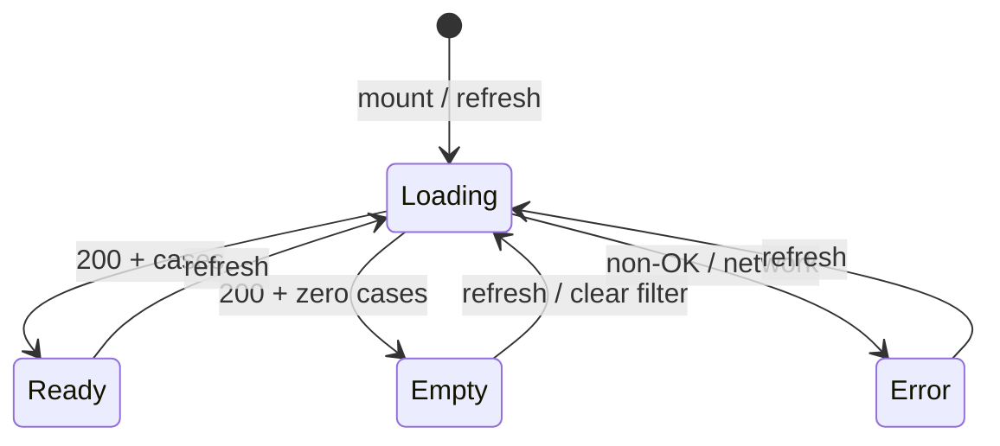

# Phase 14 — UI Design Contract

> Visual and interaction contract for the **Officer Agent Console** — read-only triage audit viewer at `/dashboard/agent-console`.
> Scope: polish deltas on existing `AgentConsoleViewer` — truncation notice (D-14-15), empty-state copy split, a11y hardening. **Not a redesign.**
> Out of scope: shadow comparison panel, re-run triage, export/download, embedded log on report detail, assistant chat merge, pagination beyond 50 runs.

---

## Design System

| Property | Value |
|----------|-------|
| Tool | shadcn (initialized — `components.json`) |
| Preset | `style: radix-nova`, `baseColor: neutral`, CSS variables; `--primary` = `#3b71f7` |
| Component library | Radix (via shadcn) |
| Icon library | lucide-react (`ScrollText`, `RefreshCw`, `Loader2`, `ChevronLeft`) |
| Font | Google Sans / Google Sans Text (400 / 600) — inherits dashboard; `var(--font-code)` in log terminal |
| Register | **product** (officer ops tool) |

**Console primitives (reuse, do not reinvent):**

| Primitive | Usage |
|-----------|-------|
| `surface-card` | Filter bar, stats context, case list rail, log panel chrome |
| shadcn `Button` | Refresh, Clear filter, mobile Back to cases |
| shadcn `Input` | Report ID filter (`font-mono text-sm`) |
| shadcn `Badge` | Attempt count, triage_status, category, disposition |
| `.agent-console-log*` | Terminal block for attempts (see Log Panel section) |
| `cn()` | Selected case highlight, mobile visibility toggles |
| `dash-rise` / `dash-rise-delay-*` | Staggered page entry (220ms; honor `prefers-reduced-motion`) |

**Registry:** shadcn official only — `registries: {}`. No third-party blocks.

---

## Placement & Shell

| Property | Contract |
|----------|----------|
| Route | `/dashboard/agent-console` (standalone; D-14-03) |
| Deep link | `?report_id={uuid}` — pre-fills filter and selects matching case |
| Page gate | `requireOfficerSession()` server-side; `proxy.ts` AUTH-04 |
| Layout | Full-width dashboard content (`max-w-none`); desktop-first (D-14-04) |
| Page header | `pageTitle` (Display 24px) + `pageSubtitle` (Body 16px muted advisory disclaimer) |
| Entry points | Sidebar `agentConsole` nav + report detail “View agent console log” link only (D-14-11) |
| Mobile | Best-effort: case list / log panel toggle via `mobileShowLog`; not a gate |

**Must-not-include (locked D-14-01, D-14-13, D-14-16):**

| Excluded | Reason |
|----------|--------|
| Shadow comparison panel | `triage_shadow_comparisons` — deferred |
| Re-run triage action | Write path; not read-only audit |
| Export / download logs | New capability; deferred |
| Embedded agent log on report detail | D-14-03 — deep link only |
| Assistant chat merge / shared route | D-14-16 — separate from `AdvisoryAssistantWidget` |
| Reports table context menu / quick-preview tab | D-14-11 |
| Structured 11-key field parser | D-14-05 — raw_output primary |

---

## Page Layout (top → bottom)

```mermaid
flowchart TD
  H[Page header: title + subtitle]
  F[Filter bar: report ID + Refresh + Clear]
  N[Truncation notice — unfiltered only]
  S[Stats strip: cases + attempts]
  E[Error alert — when load fails]
  L[Loading card — initial fetch]
  Z[Empty state — zero cases]
  M[Master-detail grid: case list | log panel]

  H --> F --> N --> S --> E
  S --> L
  S --> Z
  S --> M
```

| Section | Desktop | Mobile |
|---------|---------|--------|
| Filter bar | `lg:flex-row` — input left, actions right | Stacked column |
| Truncation notice | Below filter bar, above stats | Same |
| Stats strip | Inline flex wrap | Same |
| Case list | Left rail `minmax(280px, 320px)` | Full width until case selected |
| Log panel | Right column `minmax(0, 1fr)` | Full width after selection; Back button |

Grid: `lg:grid-cols-[minmax(280px,320px)_minmax(0,1fr)] gap-5`.

---

## Spacing Scale

Inherits Phase 3 8-point scale:

| Token | Value | Console usage |
|-------|-------|---------------|
| xs | 4px | Badge gaps (`gap-1.5`); inline meta separators |
| sm | 8px | Filter action row gaps (`gap-2`); stats strip (`gap-3`) |
| md | 16px | Filter card padding (`p-4 sm:p-5`); log panel padding (`p-4 sm:p-5`) |
| lg | 24px | Page section stack (`space-y-6` header; `space-y-5` viewer) |
| xl | 32px | — |

**Exceptions:**
- Case list max height: `min(52vh, 28rem)` mobile; `calc(100vh - 18rem)` desktop scroll
- Log terminal inner pad: `p-3 sm:p-4`
- Stats pill padding: `px-3.5 py-2`
- Touch: Refresh / Clear / case list buttons — min hit area **44px** height via padding (`py-3.5` on case rows satisfies)

---

## Typography

Product register — 4 sizes, 2 weights (inherits Phase 3):

| Role | Size | Weight | Line Height | Console usage |
|------|------|--------|-------------|---------------|
| Caption | 12px (`text-xs`) | 400 | 1.55 | Truncation notice; attempt meta; case ID prefix; expand/collapse action |
| Label | 14px (`text-sm`) | 400 / 600 | 1.4 | Filter label; stats labels; case description; log header meta |
| Heading | 16–20px (`text-base` / `text-lg`) | 600 | 1.2 | Cases heading (`text-base`); log heading (`text-lg`); page title (`text-2xl` = Display) |
| Body | 16px (`text-base`) | 400 | 1.5 | Page subtitle; empty state; select-case prompt |
| Mono log | 13px (`0.8125rem`) | 400 | 1.55 / relaxed | `raw_output` in `<pre>`; filter input; full report ID link |

**Rules:**
- `font-heading` on page title, section headings, stat numerals only.
- `font-mono` for report IDs, run IDs, model name — not for prose description.
- No fourth weight. No fluid clamps on console chrome.

---

## Color

60 / 30 / 10 — live tokens from `globals.css`:

| Role | Token / Value | Console usage |
|------|---------------|--------------|
| Dominant (60%) | `--background` `#f5f7fb` | Page canvas |
| Secondary (30%) | `--card` `#ffffff`, `surface-card` | Filter bar, case rail, log chrome |
| Accent (10%) | `--primary` `#3b71f7` | Primary stat pill (`bg-primary/10`); report ID link; focus rings |
| Destructive | `--destructive` `#dc2626` | Load error alert border/text; `failed` disposition badge |
| Muted | `--muted-foreground` | Subtitles, hints, empty states, loading text |
| Terminal (scoped) | `--console-*` tokens | Log panel only — not page-wide |

**Console terminal tokens (`globals.css`):**

| Token | Role |
|-------|------|
| `--console-surface` | `.agent-console-log` background |
| `--console-surface-raised` | `.agent-console-log-warn` background |
| `--console-ink` | Primary log text |
| `--console-muted` | `.agent-console-log-meta` |
| `--console-meta` | `.agent-console-log-ts` timestamps |
| `--console-warn` | Validation errors block text |
| `--console-accent` | Expand/collapse action link |

**Accent reserved for (console only):**
1. Cases stat pill wash (`bg-primary/10` + primary numeral)
2. Report ID link to detail (`text-primary hover:underline`)
3. Focus rings on filter input and buttons
4. Selected case row uses `bg-accent` (shadcn semantic — not primary flood)

**Not accent:** terminal block (dark console surface), disposition badges (semantic variants), triage_status badges.

**Disposition badge variants (existing):**

| Disposition | Badge variant |
|-------------|---------------|
| `completed` | `default` |
| `failed` | `destructive` |
| `manual_review`, `retry` | `secondary` |
| other / in progress | `outline` |

---

## Filter Bar

| Property | Contract |
|----------|----------|
| Container | `surface-card dash-rise flex flex-col gap-4 p-4 sm:p-5 lg:flex-row lg:items-end lg:justify-between` |
| Label | `filterLabel` — `htmlFor="agent-console-filter"` |
| Input | shadcn `Input` — `id="agent-console-filter"`, `font-mono text-sm`, `filterPlaceholder` |
| Submit filter | **Enter** key in input calls `load(filter)` |
| Refresh | `variant="outline"` — `RefreshCw` icon; `Loader2` spin when `loading`; `refresh` label |
| Clear filter | `variant="ghost"` — visible only when `filter.trim()`; clears input and reloads unfiltered |
| Disabled refresh | `disabled={loading}` |

No debounced auto-search — explicit Enter or Refresh only (existing behavior).

---

## Truncation Notice (D-14-15) — **NEW POLISH**

| Property | Contract |
|----------|----------|
| Trigger | Show when **unfiltered** (`!filter.trim()`) after successful load (including zero-case empty state) |
| Placement | Between filter bar and stats strip |
| Element | `<p role="note" className="text-sm text-muted-foreground">` |
| Copy key | `truncationNotice` |
| Hide when | Filter has value (filtered view may return fewer cases — cap disclosure not needed) |
| Rationale | `DEFAULT_RUN_LIMIT = 50` is run-based server cap; always disclose on recent feed |

**Do not** gate notice on `cases.length === 50` — safer to always show on unfiltered load per RESEARCH recommendation.

---

## Stats Strip

| Property | Contract |
|----------|----------|
| Container | `dash-rise dash-rise-delay-1 flex flex-wrap items-center gap-3` |
| Cases pill | `rounded-xl bg-primary/10 px-3.5 py-2` — numeral `text-2xl font-semibold text-primary` + `statCases` label |
| Attempts pill | `rounded-xl border border-border bg-card px-3.5 py-2` — numeral `text-2xl font-semibold` + `statAttempts` label |
| Values | `cases.length` and sum of all attempts across cases |
| Update | Recompute on every successful `load()` |

---

## Case List (left rail)

| Property | Contract |
|----------|----------|
| Container | `<aside aria-label={t("casesHeading")}>` — `surface-card`, scrollable list |
| Header | `casesHeading` (semibold) + `casesHint` (muted caption) |
| List | `<ul>` with `divide-y divide-border`, max-height scroll |
| Item | `<button type="button">` per case — full row clickable |
| ID display | **Truncated** `report_id.slice(0, 8) + "…"` (D-14-12) — `font-mono text-xs` |
| Attempt badge | Outline badge, right-aligned, tabular count |
| Description | `line-clamp-2 text-sm` when present |
| Status badges | `triage_status` + optional `category` |
| Selected state | `bg-accent text-accent-foreground`; `aria-current="true"` |
| Unselected hover | `hover:bg-muted/60` |
| Keyboard | **Arrow Up/Down** moves selection; **Enter** selects focused case; roving `tabIndex={0}` on selected item, `-1` on others |
| Mobile | Hidden when `mobileShowLog`; Back button returns to list |

---

## Log Panel (right column)

### Header

| Property | Contract |
|----------|----------|
| Mobile back | `lg:hidden` ghost button — `ChevronLeft` + `backToCases` |
| Title | `logHeading` — `font-heading text-lg font-semibold` |
| Full report ID | **Full UUID** as `Link` to `/dashboard/reports/{id}` — `font-mono text-sm text-primary` (D-14-12) |
| Description | `max-w-prose text-sm text-muted-foreground` when present |
| Status row | `triage_status` + `category` badges top-right |

### Run blocks

Per `run` in `selectedCase.runs`:

| Property | Contract |
|----------|----------|
| Run meta | Truncated `run_id` (8 chars), `·`, `<time>` formatted timestamp, disposition badge or `runInProgress` |
| Terminal container | `<div className="agent-console-log p-3 sm:p-4">` |

### Attempt rows (inside terminal)

| Property | Contract |
|----------|----------|
| Order | **validation_errors block first** (D-14-06), then **raw_output** (D-14-05), then expand control |
| Meta row | `.agent-console-log-meta` — timestamp (`.agent-console-log-ts`), `attemptLabel`, model, `latency_ms` + `ms`, disposition badge |
| Validation errors | When `Array.isArray(validation_errors) && length > 0`: `<pre className="agent-console-log-warn …">` with `JSON.stringify` formatted — **prominent warn styling** |
| Raw output | `<pre className="max-w-[75ch] overflow-x-auto whitespace-pre-wrap text-[0.8125rem] leading-relaxed">` |
| Preview | First **320 characters** when collapsed (D-14-07) |
| Expand | `agent-console-log-action` button — `expandOutput` / `collapseOutput`; only when `raw.length > 320` |
| Empty raw | `(no raw output)` via `noOutput` |
| No attempts on run | `noAttempts` meta text inside terminal |

**No structured field parser** — do not render 11-key evaluator JSON as labeled fields.

### agent-console-log Terminal Styling

Reuse existing `globals.css` classes — do not inline terminal colors:

```css
.agent-console-log          /* dark surface, mono font, 0.8125rem */
.agent-console-log-meta     /* muted 0.6875rem meta row */
.agent-console-log-ts       /* timestamp tabular-nums */
.agent-console-log-warn     /* raised surface + warn color — validation_errors */
.agent-console-log-action   /* accent link for expand/collapse */
```

---

## States Overview



| State | Condition | UI |
|-------|-----------|-----|
| **Loading (initial)** | `loading && !cases.length` | `surface-card` + `Loader2` spin + `loading` |
| **Loading (refresh)** | `loading && cases.length > 0` | Keep list/log visible; Refresh button shows spin; `disabled` on refresh |
| **Ready** | `cases.length > 0` | Master-detail grid |
| **Empty (filtered)** | `!loading && !cases.length && !error && filter.trim()` | `ScrollText` icon + `emptyFiltered` |
| **Empty (recent)** | `!loading && !cases.length && !error && !filter.trim()` | `ScrollText` icon + `emptyRecent` + truncation notice still visible |
| **Error** | `error` set | `role="alert"` destructive border panel + `loadError`; cases cleared |
| **No selection** | `cases.length > 0 && !selectedCase` | `selectCase` prompt in log column (edge case) |

---

## Loading State

| Property | Contract |
|----------|----------|
| Initial | Full-width card, centered row: `Loader2 size-4 animate-spin` + `loading` |
| Refresh | Inline spin in Refresh button only; do not unmount case list |
| SR | Loading text visible; no `aria-busy` on whole page required |

---

## Empty State

| Property | Contract |
|----------|----------|
| Container | `surface-card px-5 py-10 text-center` |
| Icon | `ScrollText size-8 text-muted-foreground/70` — `aria-hidden` |
| Copy | **Split keys** (polish delta — RESEARCH Pitfall 4): |
| Filtered | `emptyFiltered` — “No triage agent activity for this report ID.” |
| Unfiltered | `emptyRecent` — “No recent triage agent activity.” |
| Truncation notice | Still show `truncationNotice` above stats when unfiltered |

**Migrate:** Replace single `empty` key usage with conditional `emptyFiltered` vs `emptyRecent`. Keep `empty` as alias or remove after migration.

---

## Error State

| Property | Contract |
|----------|----------|
| Trigger | HTTP non-OK or `fetch` throw |
| Display | `role="alert"` — `rounded-xl border border-destructive/40 bg-destructive/5 px-4 py-3 text-sm text-destructive` |
| Copy | Generic `loadError` only — **no** stack traces, provider errors, or SQL detail (security) |
| Recovery | Officer clicks **Refresh**; filter state preserved |
| Cases | Cleared on error (`setCases([])`) |

---

## Copywriting Contract

Namespace: `dashboard.agentConsole` in `messages/en.json` and `messages/vi.json`. All strings via `useTranslations("dashboard.agentConsole")` / server `getTranslations`.

### Existing keys (keep)

| Key | EN | VI |
|-----|----|----|
| `pageTitle` | Agent console | Bảng điều khiển agent |
| `pageSubtitle` | Audit log for triage agent runs and attempts on each report case. Advisory output only — officers decide. | Nhật ký kiểm tra các lần chạy và thử của agent phân loại trên từng hồ sơ. Chỉ mang tính tham khảo — cán bộ quyết định. |
| `filterLabel` | Filter by report ID | Lọc theo mã báo cáo |
| `filterPlaceholder` | e.g. 1ebf8a9a-013b-4b8c-84be-12a82f4d2a83 | vd. 1ebf8a9a-013b-4b8c-84be-12a82f4d2a83 |
| `refresh` | Refresh | Làm mới |
| `clearFilter` | Clear filter | Xóa bộ lọc |
| `loading` | Loading agent activity… | Đang tải hoạt động agent… |
| `loadError` | Could not load agent console logs. Try again. | Không tải được nhật ký agent. Thử lại. |
| `statCases` | {count, plural, one {case} other {cases}} | {count, plural, one {hồ sơ} other {hồ sơ}} |
| `statAttempts` | {count, plural, one {attempt} other {attempts}} | {count, plural, one {lần thử} other {lần thử}} |
| `casesHeading` | Cases with agent activity | Hồ sơ có hoạt động agent |
| `casesHint` | Select a report to inspect runs and raw model output. | Chọn báo cáo để xem các lần chạy và đầu ra thô của mô hình. |
| `logHeading` | Triage run log | Nhật ký chạy phân loại |
| `backToCases` | All cases | Tất cả hồ sơ |
| `selectCase` | Select a case from the list to view its agent log. | Chọn một hồ sơ trong danh sách để xem nhật ký agent. |
| `attemptLabel` | Attempt {number} | Lần thử {number} |
| `runInProgress` | run in progress | đang chạy |
| `noAttempts` | No attempts recorded for this run yet. | Chưa ghi nhận lần thử cho phiên này. |
| `noOutput` | (no raw output) | (không có đầu ra thô) |
| `expandOutput` | Show full output | Xem đầy đủ |
| `collapseOutput` | Show less | Thu gọn |

### New keys (add in implementation — D-14-15 + empty split)

| Key | EN | VI |
|-----|----|----|
| `truncationNotice` | Showing the latest 50 triage runs. Older activity may not appear. | Hiển thị 50 lần chạy phân loại gần nhất. Hoạt động cũ hơn có thể không xuất hiện. |
| `emptyFiltered` | No triage agent activity for this report ID. | Không có hoạt động agent phân loại cho mã báo cáo này. |
| `emptyRecent` | No recent triage agent activity. | Không có hoạt động agent phân loại gần đây. |

### CTA summary

| Element | Copy |
|---------|------|
| Primary CTA | **Refresh** / **Làm mới** (`refresh`) |
| Filter action | Enter in input or Refresh |
| Secondary | **Clear filter** / **Xóa bộ lọc** when filtered |
| Expand log | **Show full output** / **Xem đầy đủ** |
| Destructive actions | **None** — read-only audit viewer |

---

## Accessibility

| Requirement | Contract |
|-------------|----------|
| Standard | WCAG 2.2 AA |
| Case list | `aria-label={casesHeading}` on `<aside>` |
| Log panel | `aria-label={logHeading}` on `<section>` |
| Selected case | `aria-current="true"` on active list button |
| Truncation notice | `role="note"` — announced without stealing focus |
| Load error | `role="alert"` on error panel |
| Filter | `<label htmlFor="agent-console-filter">` associated with input |
| Icons in buttons | Decorative icons `aria-hidden`; visible text on Refresh / Clear / Back |
| Keyboard — case list | **Arrow Up/Down** roving focus; **Enter** selects; list is tab-stop reachable |
| Keyboard — filter | Enter submits filter |
| Keyboard — expand | Expand/collapse buttons focusable; standard button activation |
| Color | Disposition/status never color-only — badge includes text label |
| Focus | Visible `--ring` on input, buttons, case rows, expand links |
| Touch | Case row `py-3.5` ≥ 44px effective height |
| Reduced motion | `dash-rise` instant per `globals.css` `prefers-reduced-motion` |
| Live regions | Not required — static audit log; no streaming |

---

## Motion

| Element | Motion | Reduced motion |
|---------|--------|----------------|
| Page sections | `dash-rise` 220ms stagger | Instant |
| Refresh spin | `Loader2 animate-spin` | OK — functional |
| Case hover | `transition-colors duration-150` | OK — subtle |
| Expand/collapse | Instant content swap | No animation |
| Terminal | None | — |

No decorative motion. No log typing animation.

---

## Interaction Flow

1. Officer opens `/dashboard/agent-console` (sidebar) or deep link with `?report_id=`.
2. Page SSR gate → `AgentConsoleViewer` mounts → `load(initialReportId)`.
3. **Unfiltered:** truncation notice visible → stats populate → recent cases list → first case auto-selected.
4. **Filtered:** no truncation notice → cases for that ID → prefer matching selection.
5. Officer selects case (click or keyboard) → log panel shows runs → attempts in terminal block.
6. Officer expands attempt raw output (>320 chars) → full `raw_output` visible.
7. Attempt with `validation_errors` → warn block above raw output.
8. Officer clicks report ID link → navigates to report detail (separate page).
9. Officer filters by ID → Enter/Refresh → filtered empty uses `emptyFiltered`.
10. Load failure → error alert → Refresh retries.

---

## Anti-patterns

| Anti-pattern | Why banned |
|--------------|------------|
| Shadow diff panel | D-14-13 — out of scope |
| Re-run / dispatch from console | D-14-01 — write action |
| Export audit JSON | Deferred |
| Embed full log on report detail | D-14-03 |
| Merge with assistant widget | D-14-16 |
| Parse 11-key JSON into form fields | D-14-05 |
| Hide 50-run cap | D-14-15 — officers must know feed is truncated |
| Show provider/DB errors in UI | Information disclosure |
| Single empty string for filtered vs recent | Confusing copy (RESEARCH Pitfall 4) |
| Redesign layout / new color system | Phase 14 is polish only |

---

## Registry Safety

| Registry | Blocks Used | Safety Gate |
|----------|-------------|-------------|
| shadcn official | `button`, `input`, `badge` | not required |
| Third-party | none | n/a |

---

## Polish Deltas Checklist (implementation wave)

| Delta | Source | Status |
|-------|--------|--------|
| Add `truncationNotice` EN/VI + render when unfiltered | D-14-15 | ❌ Ship |
| Split `emptyFiltered` / `emptyRecent` | RESEARCH Pitfall 4 | ❌ Ship |
| Case list arrow-key navigation | UI-SPEC a11y | ❌ Ship |
| Legacy contract asserts truncation key | D-14-02 gate | ❌ Ship |
| All other layout/log behavior | Existing `AgentConsoleViewer` | ✅ Done |

---

## Checker Sign-Off

- [ ] Dimension 1 Copywriting: PASS
- [ ] Dimension 2 Visuals: PASS
- [ ] Dimension 3 Color: PASS
- [ ] Dimension 4 Typography: PASS
- [ ] Dimension 5 Spacing: PASS
- [ ] Dimension 6 Registry Safety: PASS

**Approval:** pending

---

## UI-SPEC COMPLETE

**Phase:** 14 — Officer agent console — per-case triage run and attempt log viewer  
**Design System:** shadcn radix-nova + CityMind Blue + console terminal tokens

### Contract Summary
- Spacing: 8-point scale; filter/card 16–20px; case rows ≥44px touch
- Typography: 4 roles; mono 13px in terminal; page title 24px semibold
- Color: 60% canvas, 30% cards, 10% primary on stats pill + links; dark `--console-*` terminal; warn block for validation_errors
- Copywriting: 22 existing + 3 new bilingual keys; CTA “Refresh”; truncation notice mandatory
- Registry: shadcn official only

### File Created
`.planning/phases/14-officer-agent-console-per-case-triage-run-and-attempt-log-vi/14-UI-SPEC.md`

### Pre-Populated From
| Source | Decisions Used |
|--------|---------------|
| 14-CONTEXT.md | 16 (D-14-01..16 locked decisions) |
| 14-RESEARCH.md | 12 (gaps, truncation, empty split, gate patterns) |
| AgentConsoleViewer.tsx | 14 (live structure, 320 preview, validation block, layout) |
| globals.css | 7 (agent-console-log*, console tokens) |
| 03-UI-SPEC.md | 6 (spacing, typography, product register) |
| 12-UI-SPEC.md | 4 (format, shadcn preset, bilingual pattern) |
| messages/en.json + vi.json | 22 (existing agentConsole keys) |
| components.json | 5 (shadcn preset, icons, primitives) |
| User input | 8 (explicit must-include/must-not-include list) |

### Ready for Verification
UI-SPEC complete. Checker can now validate.
