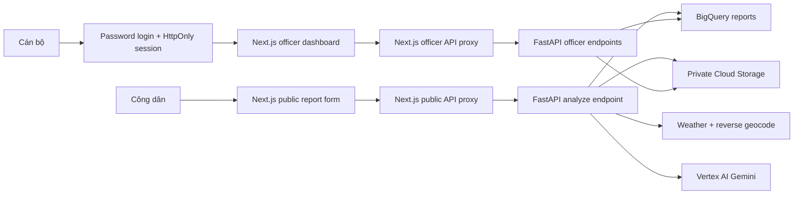

# CityMind AI — Tài liệu dự án, trạng thái triển khai và giới hạn

**Cập nhật:** 2026-07-06
**Dự án Google Cloud:** `citymind-ai-500910`
**Bối cảnh:** GenAI APAC / Google Cloud smart-community MVP
**Trạng thái:** MVP đã triển khai lên Cloud Run, có dữ liệu demo, bảo mật cơ bản và kiểm thử tự động.

---

## 1. Tóm tắt dự án

CityMind AI là nền tảng **AI-assisted Decision Intelligence** dành cho cộng đồng thông minh. Hệ thống tiếp nhận báo cáo của người dân, chuẩn hóa báo cáo bằng Gemini, bổ sung ngữ cảnh đô thị, lưu dữ liệu để phân tích và cung cấp quy trình xử lý có lịch sử cho cán bộ vận hành.

Luồng giá trị hiện tại:

```text
Báo cáo công dân
→ vị trí và ảnh bằng chứng
→ ngữ cảnh đô thị hỗ trợ
→ Gemini phân tích có cấu trúc
→ BigQuery + Cloud Storage
→ dashboard ưu tiên hóa
→ cán bộ xác minh và quyết định
```

Thông điệp sản phẩm:

> CityMind AI turns fragmented citizen reports and public data into structured, auditable, decision-ready insights for local officers.

### Giới hạn định vị bắt buộc

MVP hiện tại **không phải hệ thống dự đoán**. Sản phẩm chỉ được mô tả là:

* hỗ trợ ra quyết định;
* chuẩn hóa báo cáo;
* ưu tiên hóa sự cố;
* bổ sung ngữ cảnh đô thị;
* đề xuất hành động để cán bộ xem xét.

Không được tuyên bố:

* dự đoán sự cố tương lai;
* tự động ra quyết định thay cán bộ;
* xác nhận tuyệt đối độ chính xác của dữ liệu thời tiết, vị trí hoặc nội dung do AI tạo ra.

---

## 2. Yêu cầu gốc của đề bài

Xây dựng một **AI-powered Decision Intelligence Platform** sử dụng dữ liệu, mô hình AI và tự động hóa để giúp cộng đồng:

1. Thu thập báo cáo hoặc tín hiệu công cộng đang phân tán.
2. Phân tích sự cố đô thị.
3. Sinh thông tin có cấu trúc và insight.
4. Hỗ trợ ưu tiên xử lý.
5. Đề xuất hành động.
6. Giúp cán bộ đưa ra quyết định nhanh hơn dựa trên bằng chứng.

Tên ý tưởng:

> CityMind AI — AI-powered Decision Intelligence Platform for Smart Communities

Tagline:

> AI-powered Decision Intelligence Platform for Smarter Communities

### Người dùng mục tiêu

#### Công dân

* Gửi mô tả sự cố.
* Cung cấp vị trí.
* Đính kèm ảnh JPEG, PNG hoặc WebP.
* Nhận mã báo cáo.
* Trong tương lai: xem trạng thái xử lý của báo cáo.

#### Cán bộ

* Đăng nhập vào dashboard bảo vệ.
* Xem báo cáo gần đây.
* Xem tổng quan và mức ưu tiên.
* Lọc theo trạng thái, loại, ưu tiên và severity.
* Xem ảnh bằng chứng, ngữ cảnh đô thị, evidence và uncertainty.
* Chuyển trạng thái báo cáo.
* Xem lịch sử trạng thái append-only.

#### Hệ thống AI

* Phân loại category.
* Chấm severity từ 1 đến 5.
* Chấm confidence từ 0 đến 1.
* Sinh summary và recommendation.
* Gán priority.
* Ước lượng impact.
* Trích xuất evidence.
* Nêu uncertainty.

AI chỉ đóng vai trò tư vấn. Cán bộ là người quyết định cuối cùng.

---

## 3. Kiến trúc hiện tại



### Frontend

* Next.js 16 App Router.
* React 19 và TypeScript.
* Tailwind CSS 4.
* Server Components cho dashboard và detail.
* Client Components cho submit, geolocation và status actions.
* Server-side proxy để không đưa officer API key vào trình duyệt.
* Standalone output để chạy trong Cloud Run.

### Backend

* FastAPI.
* Python 3.12 trên Cloud Run.
* Pydantic cho schema và validation.
* `google-genai` cho Gemini trên Vertex AI.
* Google Cloud BigQuery và Cloud Storage SDK.

### Google Cloud

* Vertex AI / Gemini 2.5 Flash.
* BigQuery dataset `citymind`.
* Cloud Storage bucket riêng tư.
* Cloud Run cho API và web.
* Secret Manager cho khóa và password.
* Cloud Billing Budget cho cảnh báo chi phí.

---

## 4. Các URL production

| Thành phần             | URL                                                 |
| ---------------------- | --------------------------------------------------- |
| Web chính              | https://citymind-web-lvdth2uirq-uc.a.run.app        |
| Form báo cáo công khai | https://citymind-web-lvdth2uirq-uc.a.run.app/report |
| Officer login          | https://citymind-web-lvdth2uirq-uc.a.run.app/login  |
| Backend API            | https://citymind-api-lvdth2uirq-uc.a.run.app        |
| Health check           | https://citymind-api-lvdth2uirq-uc.a.run.app/health |

Cloud Run revisions tại thời điểm cập nhật:

* API: `citymind-api-00002-hjl`.
* Web: `citymind-web-00003-s2q`.

---

## 5. Luồng nghiệp vụ đã triển khai

### 5.1 Gửi báo cáo

1. Công dân mở `/report`.
2. Nhập mô tả tối đa 3.000 ký tự.
3. Có thể dùng browser geolocation hoặc nhập tọa độ thủ công.
4. Có thể chụp/tải ảnh JPEG, PNG hoặc WebP.
5. Next.js chuyển multipart request tới FastAPI.
6. Backend kiểm tra mô tả, file, MIME, dung lượng và tọa độ.
7. Rate limiter kiểm soát số lần gửi.
8. Ảnh được lưu vào private GCS nếu image storage bật.
9. Urban context được lấy nếu tính năng được bật.
10. Gemini trả JSON có cấu trúc theo `ReportAnalysis`.
11. Backend lưu báo cáo vào BigQuery.
12. Frontend hiển thị `report_id` sau khi thành công.

### 5.2 Xử lý của cán bộ

1. Cán bộ đăng nhập bằng password lưu trong Secret Manager.
2. Next.js tạo session cookie HttpOnly, SameSite Strict, thời hạn 8 giờ.
3. Dashboard gọi backend qua server proxy và gắn officer key ở phía server.
4. Cán bộ lọc, xem chi tiết và ảnh bằng chứng.
5. Cán bộ chuyển trạng thái sang `reviewing`, `resolved` hoặc `rejected`.
6. Backend thêm một event mới vào bảng status; không sửa lịch sử cũ.

### 5.3 Urban context degradation

OpenWeather và Nominatim là nguồn hỗ trợ, không phải nguồn quyết định. Khi timeout hoặc mất kết nối:

```json
{
  "available": false,
  "reason": "request_failed"
}
```

Báo cáo vẫn tiếp tục được phân tích và lưu. Lỗi Gemini, GCS hoặc BigQuery vẫn trả `502` vì quy trình chính không thể hoàn thành an toàn.

---

## 6. API backend

Base production URL:

```text
https://citymind-api-lvdth2uirq-uc.a.run.app
```

### Public endpoints

#### `GET /health`

Trả trạng thái dịch vụ:

```json
{"status":"ok"}
```

#### `POST /api/v1/reports/analyze`

Multipart fields:

| Field         | Kiểu   | Yêu cầu                                       |
| ------------- | ------ | --------------------------------------------- |
| `description` | string | Tối đa 3.000 ký tự; bắt buộc nếu không có ảnh |
| `latitude`    | float  | Tùy chọn; từ -90 đến 90                       |
| `longitude`   | float  | Tùy chọn; từ -180 đến 180                     |
| `image`       | file   | Tùy chọn; JPEG, PNG hoặc WebP                 |

Các mã lỗi chính:

* `413`: ảnh vượt dung lượng cấu hình.
* `415`: MIME không được hỗ trợ.
* `422`: thiếu nội dung hoặc input không hợp lệ.
* `429`: vượt rate limit.
* `502`: lỗi Gemini, GCS hoặc BigQuery.

### Officer-protected endpoints

Các endpoint sau yêu cầu header:

```http
X-CityMind-Officer-Key: <secret>
```

#### `GET /api/v1/reports/recent`

Query parameters:

* `limit`: 1–100, mặc định 20.
* `status`: `new | reviewing | resolved | rejected`.
* `category`: `pothole | flooding | waste | streetlight | obstruction | other`.
* `priority`: `low | medium | high | critical`.
* `min_severity`: 1–5.
* `max_severity`: 1–5.

Filter được thực thi bằng BigQuery parameter, không lọc giả trên dữ liệu đã tải.

#### `GET /api/v1/reports/summary`

Trả:

```json
{
  "total_reports": 0,
  "critical_reports": 0,
  "avg_severity": 0,
  "top_category": "none"
}
```

#### `GET /api/v1/reports/{report_id}`

Trả toàn bộ dữ liệu báo cáo, trạng thái mới nhất và thời điểm cập nhật trạng thái.

#### `GET /api/v1/reports/{report_id}/status-history`

Trả status events theo thứ tự mới nhất trước.

#### `PATCH /api/v1/reports/{report_id}/status`

Query parameters:

* `status`: trạng thái hợp lệ.
* `note`: ghi chú tùy chọn.

Không cho phép tạo status event cho report không tồn tại.

#### `GET /api/v1/reports/{report_id}/image`

Backend đọc ảnh từ private GCS và trả bytes đúng MIME. Bucket không public.

---

## 7. Schema AI

Gemini phải trả JSON hợp lệ theo schema:

```json
{
  "category": "pothole",
  "severity": 4,
  "confidence": 0.82,
  "summary": "...",
  "recommendation": "...",
  "priority": "high",
  "estimated_impact": "...",
  "evidence": ["..."],
  "uncertainty": ["..."]
}
```

Quy tắc:

* Severity từ 1 đến 5.
* Confidence từ 0 đến 1.
* Category và priority phải thuộc enum.
* Evidence và uncertainty tối đa 8 phần tử.
* Response rỗng hoặc sai schema bị từ chối.
* Prompt yêu cầu không phát minh dữ kiện và phải giảm confidence khi thiếu bằng chứng.

---

## 8. BigQuery và Cloud Storage

### Bảng reports

```text
citymind-ai-500910.citymind.reports
```

Các trường:

* `report_id STRING REQUIRED`
* `created_at TIMESTAMP REQUIRED`
* `description STRING`
* `latitude FLOAT`
* `longitude FLOAT`
* `category STRING`
* `severity INTEGER`
* `confidence FLOAT`
* `summary STRING`
* `recommendation STRING`
* `priority STRING`
* `estimated_impact STRING`
* `evidence STRING REPEATED`
* `uncertainty STRING REPEATED`
* `urban_context STRING`
* `image_gcs_uri STRING`

`urban_context` hiện được lưu dưới dạng JSON string.

### Bảng status events

```text
citymind-ai-500910.citymind.report_status_events
```

Các trường:

* `report_id STRING REQUIRED`
* `status STRING REQUIRED`
* `note STRING NULLABLE`
* `created_at TIMESTAMP REQUIRED`

Thiết kế append-only giúp giữ audit trail, nhưng chưa lưu danh tính người thực hiện.

### Cloud Storage

Bucket:

```text
gs://citymind-ai-500910-report-images
```

Object path:

```text
reports/{report_id}/evidence.{jpg|png|webp}
```

Bucket giữ private. Frontend lấy ảnh qua proxy được bảo vệ.

---

## 9. Bảo mật đã triển khai

### Frontend session

* Public form và officer dashboard đã tách riêng.
* Password không đưa vào client bundle.
* Session token được ký HMAC SHA-256.
* Cookie có `HttpOnly`, `SameSite=Strict` và `Secure` trong production.
* Session hết hạn sau 8 giờ.
* Next.js Proxy redirect người chưa có session khỏi dashboard.
* Server Component vẫn xác minh chữ ký session; proxy chỉ là optimistic check.

### Backend protection

* Officer endpoints yêu cầu secret header.
* Header được thêm bởi Next.js server proxy.
* Browser không nhận officer API key.
* Production từ chối officer access nếu secret chưa được cấu hình.
* Secret được so sánh bằng constant-time comparison.

### Anti-spam

* Production rate limit hiện tại: 5 report/phút/client/process.
* Ảnh bị giới hạn dung lượng.
* Mô tả bị giới hạn độ dài.
* MIME và tọa độ được validation.

### Secret Manager

Các secret production:

* `citymind-officer-api-key`
* `citymind-dashboard-password`
* `citymind-session-secret`

Không lưu giá trị secret trong repository hoặc tài liệu này.

Lấy password officer khi có quyền:

```powershell
gcloud secrets versions access latest `
  --secret=citymind-dashboard-password `
  --project=citymind-ai-500910
```

---

## 10. Dữ liệu demo

Script:

```text
scripts/seed_reports.py
```

Dataset deterministic hiện có:

* 10 báo cáo.
* 1 ảnh PNG synthetic lưu private.
* 10 báo cáo có urban context synthetic.
* 4 status events.
* Priority: 2 critical, 4 high, 3 medium, 1 low.
* Severity: 2 báo cáo mức 2, 3 mức 3, 3 mức 4, 2 mức 5.

Loại sự cố gồm:

* pothole gần trường học;
* ngập đường;
* traffic signal hỏng;
* rác tại chợ;
* streetlight hỏng;
* cây đổ;
* đổ trộm chất thải;
* open manhole;
* unsafe crossing;
* blocked drain.

Script có dry-run và dùng ID `demo-*` cố định. Chạy lại không nhân bản report hoặc status event.

```powershell
python scripts/seed_reports.py
python scripts/seed_reports.py --apply
```

---

## 11. Dashboard và trải nghiệm người dùng

### Đã hoàn thành

* Responsive desktop/mobile.
* Browser geolocation.
* Mobile camera hint qua `capture="environment"`.
* Loading skeleton.
* Error boundary.
* Network, API và form error rõ ràng.
* Success state trả report ID.
* Empty state riêng cho không có dữ liệu và không khớp filter.
* Summary cards.
* Filter status, category, priority và severity.
* Detail page.
* Evidence image.
* Evidence và uncertainty.
* Urban context.
* Status history.
* Nhãn “AI advisory”.
* Nút trạng thái hiện tại bị disable.

### Route frontend

| Route                         | Chức năng             | Quyền         |
| ----------------------------- | --------------------- | ------------- |
| `/report`                     | Form công dân         | Public        |
| `/login`                      | Officer login         | Public        |
| `/`                           | Dashboard             | Officer/Admin |
| `/reports/[reportId]`         | Chi tiết report       | Officer/Admin |
| `/api/public/reports/analyze` | Proxy gửi báo cáo     | Public        |
| `/api/officer/.../status`     | Proxy cập nhật status | Session       |
| `/api/officer/.../image`      | Proxy ảnh private     | Session       |

---

## 12. Kiểm thử và xác minh

### Backend

Hiện có **60 automated tests**, bao phủ:

* health check;
* thiếu input;
* file rỗng;
* MIME không hợp lệ;
* ảnh quá lớn;
* description quá dài;
* tọa độ ngoài phạm vi;
* analyze pipeline với và không có ảnh;
* context được đưa vào prompt và persistence;
* Gemini/GCS/BigQuery failure;
* context timeout degradation;
* Gemini valid JSON, invalid schema và empty response;
* recent limits và filters;
* summary/detail/history/status errors;
* image proxy success, 404 và 502;
* BigQuery parameterization;
* append-only status insert;
* demo dataset acceptance;
* officer authentication;
* production missing-auth protection;
* sliding-window rate limiter;
* CORS origin parsing.

Kết quả gần nhất:

```text
60 passed
```

Test backend không gọi thật Gemini, BigQuery, GCS, OpenWeather hoặc Nominatim.

### Frontend

* ESLint: pass, không warning.
* TypeScript `tsc --noEmit`: pass.
* Next.js production build: pass.
* Standalone Docker build qua Cloud Build: pass.

### Production smoke test

* Backend health: `200`.
* Backend officer endpoint không key: `401`.
* Backend officer endpoint đúng key: `200`.
* Dashboard không session: redirect `/login`.
* Public report page: `200`.
* Login đúng password: thành công.
* Dashboard sau login: `200` và có nội dung.
* Detail, history và image production đã được smoke test.

---

## 13. Deployment và kiểm soát chi phí

### Cloud Run services

#### API

* Service: `citymind-api`.
* Min instances: 0.
* Max instances: 3.
* CPU: 1.
* Memory: 512 MiB.
* Concurrency: 40.
* Timeout: 120 giây.
* Service account: `citymind-backend`.

#### Web

* Service: `citymind-web`.
* Min instances: 0.
* Max instances: 2.
* CPU: 1.
* Memory: 512 MiB.
* Concurrency: 40.
* Timeout: 60 giây.
* Service account: `citymind-frontend`.

### Budget

* Budget name: `CityMind AI MVP`.
* Giá trị: `250000 VND`.
* Threshold: 50%, 90%, 100%.
* Đây là cảnh báo chi phí, không phải hard spending cap.

### Script vận hành

```powershell
powershell -File scripts/deploy_cloudrun.ps1
powershell -File scripts/create_budget.ps1
```

Deploy script:

* bật API cần thiết;
* tạo service accounts;
* tạo secret nếu chưa có;
* gán IAM;
* deploy backend và frontend;
* cấu hình max instances;
* cập nhật production CORS origin.

---

## 14. Biến môi trường

### Backend

```env
APP_ENV=production
GOOGLE_CLOUD_PROJECT=citymind-ai-500910
GOOGLE_CLOUD_LOCATION=us-central1
GEMINI_MODEL=gemini-2.5-flash
BIGQUERY_DATASET=citymind
BIGQUERY_REPORTS_TABLE=reports
ENABLE_BIGQUERY=true
ENABLE_IMAGE_STORAGE=true
GCS_BUCKET_NAME=citymind-ai-500910-report-images
ENABLE_URBAN_CONTEXT=false
CORS_ORIGINS=https://citymind-web-lvdth2uirq-uc.a.run.app
REPORT_RATE_LIMIT_PER_MINUTE=5
OFFICER_API_KEY=<Secret Manager>
```

### Frontend

```env
BACKEND_API_URL=https://citymind-api-lvdth2uirq-uc.a.run.app
OFFICER_API_KEY=<Secret Manager>
OFFICER_DASHBOARD_PASSWORD=<Secret Manager>
ADMIN_DASHBOARD_PASSWORD=<optional>
SESSION_SECRET=<Secret Manager>
```

---

## 15. Những gì đã hoàn thành theo giai đoạn

### Giai đoạn 1 — Ổn định core MVP

* Sửa `status_history()` nằm sai ngoài class.
* Hoàn thiện detail và history endpoints.
* Thêm trạng thái mới nhất vào report detail.
* Hoàn thiện detail page.
* Xử lý 404 và 502 rõ ràng.
* Ngăn status event orphan.
* Hiển thị evidence, uncertainty, image, urban context và advisory notice.

### Giai đoạn 2 — Acceptance tests và hardening

* Sửa empty-file validation.
* Thêm graceful degradation cho context.
* Kiểm thử Gemini schema.
* Kiểm thử toàn bộ input và operational APIs.
* Kiểm thử private image proxy và BigQuery parameters.

### Giai đoạn 3 — Demo dataset

* Tạo 10 báo cáo deterministic.
* Tạo synthetic evidence PNG.
* Tạo context và status history.
* Seed thật vào cloud.
* Kiểm tra idempotency.
* Đồng bộ lại schema nguồn.

### Giai đoạn 4 — Operational UX

* Thêm server-side filters.
* Thêm geolocation.
* Cải thiện mobile UX.
* Thêm loading, error và empty states.
* Thêm AI advisory labels.

### Giai đoạn 5 — Security và deployment

* Tách public citizen form và protected officer dashboard.
* Thêm HMAC session.
* Thêm officer key backend.
* Thêm rate limit và production CORS.
* Thêm Secret Manager và dedicated service accounts.
* Thêm Docker builds.
* Deploy Cloud Run.
* Tạo budget alert.
* Chạy production smoke test.

---

## 16. Hạn chế còn tồn đọng

### 16.1 Chưa có prediction thật

Không có historical labeled dataset, target variable, baseline, train/test split, evaluation metric, calibration hoặc error analysis. Mọi tuyên bố prediction hiện tại đều không hợp lệ.

Muốn thêm prediction cần tối thiểu:

* dataset lịch sử;
* target rõ ràng;
* baseline model;
* temporal train/test split;
* precision/recall hoặc metric phù hợp;
* calibration;
* fairness và error analysis;
* monitoring model drift.

### 16.2 BigQuery đang làm operational database

BigQuery phù hợp analytics hơn CRUD/transaction. Hệ thống hiện chấp nhận đánh đổi này cho MVP.

Hướng production:

* Firestore hoặc Postgres cho operational state;
* BigQuery cho analytics warehouse;
* event/CDC để đồng bộ dữ liệu.

### 16.3 Authentication vẫn là shared-password guard

Đây chưa phải identity system hoàn chỉnh:

* không có tài khoản cá nhân;
* không có MFA;
* không có password reset;
* không có user lifecycle;
* không có per-user audit;
* role `admin` mới chỉ nằm trong session, chưa có permission khác officer.

Hướng tiếp theo: Firebase Auth hoặc Google Identity Platform với custom claims `citizen`, `officer`, `admin`.

### 16.4 Status audit chưa lưu actor

Status events chỉ có report, status, note và thời gian. Chưa có:

* `actor_id`;
* `actor_role`;
* request ID;
* nguồn thay đổi;
* reason code.

### 16.5 Rate limiter chỉ nằm trong memory

Mỗi Cloud Run instance giữ bộ đếm riêng. Với tối đa 3 API instances, giới hạn thực tế có thể cao hơn 5 lần/phút cho cùng client. Bộ đếm mất khi instance restart.

Hướng production:

* Cloud Armor rate limiting;
* Redis/Memorystore;
* API Gateway;
* CAPTCHA/reCAPTCHA cho public submission.

### 16.6 Urban context production đang tắt

Deployment hiện đặt `ENABLE_URBAN_CONTEXT=false` để tránh phụ thuộc API key, quota và Nominatim public policy. Dữ liệu demo có context synthetic; báo cáo production mới chưa lấy weather/geocode.

Muốn bật cần:

* OpenWeather API key lưu Secret Manager;
* quota và billing rõ ràng;
* cache theo vị trí/thời gian;
* geocoder production phù hợp;
* attribution và policy compliance.

### 16.7 Image privacy chưa có xử lý nội dung nhạy cảm

Bucket đã private nhưng hệ thống chưa:

* phát hiện hoặc làm mờ khuôn mặt;
* làm mờ biển số;
* quét malware;
* kiểm tra nội dung không phù hợp;
* đặt retention/lifecycle policy;
* cho phép citizen yêu cầu xóa dữ liệu.

### 16.8 Officer API key là shared secret

Key được giữ server-side và tốt hơn việc đưa key vào browser, nhưng vẫn là một secret dùng chung giữa frontend và backend. Chưa có service-to-service IAM/OIDC token.

Hướng tốt hơn:

* backend Cloud Run private;
* frontend service account có `roles/run.invoker`;
* Next.js lấy Google-signed identity token khi gọi backend;
* public ingest tách thành service riêng hoặc API Gateway.

### 16.9 IAM còn rộng

Backend service account hiện có `roles/storage.objectAdmin` ở cấp project. Nên thu hẹp xuống đúng bucket và quyền tối thiểu. BigQuery quyền cũng nên giới hạn theo dataset.

### 16.10 Không có hard cost cap

Budget chỉ gửi cảnh báo. Nó không tự dừng Gemini, BigQuery hoặc Cloud Run khi vượt ngưỡng. Cần monitoring và cơ chế kill switch riêng nếu yêu cầu kiểm soát tuyệt đối.

### 16.11 Chưa có frontend automated tests

Frontend hiện được kiểm tra bằng ESLint, TypeScript, build và production smoke. Chưa có:

* component tests;
* accessibility tests;
* Playwright end-to-end tests;
* responsive visual regression;
* geolocation permission tests.

### 16.12 Chưa có observability đầy đủ

Cloud Run có log mặc định nhưng dự án chưa cấu hình:

* structured application logging;
* trace/request correlation;
* error reporting dashboard;
* latency/error-rate SLO;
* uptime check;
* alert khi Gemini/BigQuery/GCS lỗi;
* rate-limit metrics.

### 16.13 Dashboard chưa có pagination

API có `LIMIT` nhưng chưa có cursor/page token. Dashboard chỉ hiện tối đa 20 report theo filter. Summary cards là toàn cục, chưa thay đổi theo filter.

### 16.14 Citizen status tracking chưa có

Công dân nhận report ID nhưng chưa có trang tra cứu trạng thái. Nếu triển khai cần cơ chế access token riêng để tránh lộ report và ảnh cho người không liên quan.

### 16.15 Chưa có localization

Giao diện và demo content chủ yếu bằng tiếng Anh. Chưa có i18n tiếng Việt/Anh, timezone display chuẩn theo người dùng hoặc localization cho category/status.

### 16.16 Cold start

Cloud Run dùng `min-instances=0` để tiết kiệm chi phí. Request đầu tiên sau thời gian idle có thể chậm.

### 16.17 File thừa cần dọn

Trong repository còn file route frontend đặt nhầm tại:

```text
backend/src/app/reports/[reportId]/page.tsx
```

File này không tham gia build backend hoặc frontend nhưng nên xóa sau khi xác nhận không còn giá trị tham khảo.

### 16.18 Virtualenv local cũ bị hỏng

`backend/.venv` từng trỏ tới Python 3.11 trong WindowsApps không còn tồn tại. Test hiện đã chạy bằng virtualenv Python 3.12 tạm. Nên tạo lại `.venv` local từ đầu.

---

## 17. Backlog đề xuất

### Ưu tiên P0

1. Thay shared-password bằng Firebase Auth/Identity Platform.
2. Lưu actor vào status event.
3. Thêm Cloud Armor hoặc distributed rate limiter.
4. Thêm structured logging, uptime check và error alerts.
5. Thêm lifecycle/retention policy cho evidence images.

### Ưu tiên P1

1. Citizen status tracking với access token riêng.
2. Cursor pagination.
3. Filtered summary metrics.
4. Playwright E2E cho login, submit, filter, detail và status update.
5. Bật urban context bằng nguồn production và cache.
6. Chuyển operational state sang Firestore/Postgres.

### Ưu tiên P2

1. Vietnamese/English localization.
2. Map view và geospatial clustering.
3. Duplicate incident detection.
4. SLA/time-to-resolution analytics.
5. Image redaction.
6. Notification cho citizen và officer.

### Prediction chỉ thực hiện sau cùng

Chỉ triển khai khi có dữ liệu và quy trình đánh giá hợp lệ. Target khả thi:

* time-to-resolution;
* escalation risk;
* repeat incident probability;
* flooding risk sau mưa.

---

## 18. Demo flow đề xuất

1. Mở public report form.
2. Gửi mô tả, tọa độ và ảnh.
3. Giải thích Gemini tạo structured decision support.
4. Đăng nhập officer dashboard.
5. Xem summary cards và filters.
6. Mở báo cáo chi tiết.
7. Chỉ ra evidence, uncertainty và urban context.
8. Nhấn `reviewing`.
9. Xem status history append-only.
10. Kết thúc bằng thông điệp: AI tư vấn, cán bộ quyết định.

---

## 19. Lệnh phát triển và vận hành

### Tạo lại backend virtualenv

```powershell
cd D:\Projects\CityMindAI-starter\backend
py -3.12 -m venv .venv
.venv\Scripts\Activate.ps1
python -m pip install -r requirements.txt
pytest -q
```

### Chạy backend

```powershell
cd D:\Projects\CityMindAI-starter\backend
.venv\Scripts\Activate.ps1
uvicorn app.main:app --reload
```

### Chạy frontend

```powershell
cd D:\Projects\CityMindAI-starter\frontend
npm install
npm run dev
```

Backend và frontend phải chạy ở hai terminal riêng.

### Kiểm tra frontend

```powershell
npm run lint
npx tsc --noEmit --incremental false
npm run build
```

### Deploy

```powershell
cd D:\Projects\CityMindAI-starter
powershell -ExecutionPolicy Bypass -File scripts\deploy_cloudrun.ps1
```

### Budget

```powershell
powershell -ExecutionPolicy Bypass -File scripts\create_budget.ps1
```

---

## 20. Acceptance criteria hiện tại

| Tiêu chí                              | Trạng thái                                               |
| ------------------------------------- | -------------------------------------------------------- |
| Submit text, location, optional image | Hoàn thành                                               |
| Gemini structured JSON                | Hoàn thành                                               |
| BigQuery persistence                  | Hoàn thành                                               |
| Private GCS evidence                  | Hoàn thành                                               |
| Dashboard reports và summary          | Hoàn thành                                               |
| Officer status update                 | Hoàn thành                                               |
| Status history                        | Hoàn thành                                               |
| Urban context lưu và hiển thị         | Hoàn thành cho demo; production đang tắt enrichment live |
| Empty-image safety                    | Hoàn thành                                               |
| Bounded BigQuery queries              | Hoàn thành                                               |
| Local/runtime error handling          | Hoàn thành mức MVP                                       |
| At least 8 seeded reports             | Hoàn thành: 10                                           |
| At least 1 image                      | Hoàn thành                                               |
| At least 1 status history             | Hoàn thành                                               |
| Auth guard                            | Hoàn thành mức shared-password MVP                       |
| Production deployment                 | Hoàn thành                                               |
| Budget alert                          | Hoàn thành                                               |
| True prediction                       | Chưa triển khai, chủ động loại khỏi MVP                  |

---

## 21. Kết luận

CityMind AI hiện là một MVP hoạt động end-to-end: công dân gửi sự cố, AI tạo phân tích có cấu trúc, dữ liệu và ảnh được lưu trên Google Cloud, cán bộ đăng nhập để lọc, xem, cập nhật và kiểm tra lịch sử. Hệ thống đã có dữ liệu demo, test backend, production build, bảo mật cơ bản, giới hạn chi phí và triển khai Cloud Run.

Khoảng cách lớn nhất để đi từ hackathon MVP tới production là identity thực, operational database phù hợp, distributed abuse protection, observability, privacy processing cho ảnh và đánh giá AI bằng dữ liệu thực. Prediction chưa phải năng lực hiện tại và không nên được đưa vào pitch như một tính năng đã hoàn thành.
